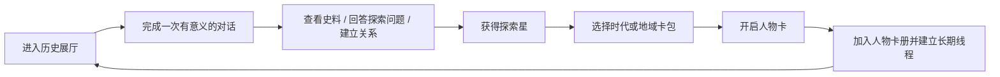

# PRD Amendment — 人物卡册与探索积分

- 日期：2026-07-16
- 状态：Approved v3 — experience integrity remediation
- v3 批准日期：2026-07-16
- 本轮修订：[02-prd-remediation-v3.md](./02-prd-remediation-v3.md)
- 批准日期：2026-07-16
- 影响阶段：Stage 2 PRD 与 Stage 3 Design
- 原因：引入人物收集、探索积分和主题卡包，改变已批准 PRD 中“不过度依赖积分”和“首发少量人物”的假设。

## 1. 产品目标变化

在可信人物对话与历史展厅之外，增加一个轻量收藏循环：用户通过有证据的学习行为获得不可购买的“探索星”，使用探索星开启按时代、地点或关系组织的人物卡包，获得新的可对话人物。卡牌不是独立虚拟商品，而是已发布人物包的收藏入口。

目标是让用户更愿意沿人物关系继续探索，而不是最大化在线时长、消息数量或付费转化。

## 2. 核心循环

## 3. 探索星

### 可以获得积分的行为

- 首次完成一个策展主题的有效对话；
- 主动查看并理解一条史料依据；
- 回答一个适龄探索问题或用自己的话复述关键概念；
- 完成一条跨人物关系路径；
- 发现并纠正一条记忆或知识误解。

### 不发积分的行为

- 单纯保持页面在线；
- 重复发送短消息或无意义问题；
- 无限重复同一个任务；
- 连续签到、制造回访焦虑或延长使用时间。

探索星不能购买、转赠、兑换现金或过期。每日只对首批有效学习事件发放，以防刷分；达到上限后仍可正常学习。

## 4. 卡包与抽取

卡包按照历史时期与该时期内部的明确历史联系组织。公开 MVP 固定为：

- 盛唐与东亚交流（618–907），12人；
- 欧洲文艺复兴与早期科学革命（约1450–1650），12人；
- 现代物理革命（1895–1969），12人。

36人完整名单和发布门槛见 `02-character-roster-v2.md`。后续新增历史时期必须形成新的完整人物组，不能把不同时期的零散人物仅为凑数放入同一卡包。

每个卡包必须展示：人物清单范围、已拥有数量、抽取成本、各颜色概率、保底进度和内容版本。未发布或证据不足的人物不能进入可抽取池。

### 公平规则

- 首次有效历史相遇后提供一次免费且保证未拥有人物的开包；
- 不提供付费抽取、充值、限时付费加速或付费概率提升；
- 单抽和十连使用同一公开概率；
- 前若干次保证获得未拥有角色；
- 达到保底次数时保证获得该池尚未拥有的最高可用层级人物；
- 重复卡自动转化为明确数量的“史料碎片”，可定向兑换未拥有人物；
- 卡包下架不清除积分、人物、对话或保底记录；
- 抽取动画可跳过，并尊重减少动态效果设置。
- 抽取结果在动画前完成服务端持久化；关闭、刷新或断线只影响展示，不改变结果。

## 5. 人物层级

保留用户提出的白、蓝、紫、橙、金五档视觉层级，但层级含义是“该人物在当前卡包主题中的策展中心度、资料完整度和可探索深度”，不是道德评价或全历史统一排名。同一人物在不同主题中的视觉层级可以不同，但人物包身份始终唯一。

| 层级 | 建议名称 | 含义 |
|---|---|---|
| 白 | 线索人物 | 提供一个重要切面 |
| 蓝 | 关键人物 | 与多个正式关系相连 |
| 紫 | 核心人物 | 支撑主题主要矛盾或变化 |
| 橙 | 时代人物 | 能串联多个展厅和阶段 |
| 金 | 典藏人物 | 史料、关系、评测和媒体最完整 |

颜色不能影响人物回答的事实质量、安全标准或人格尊严。

## 6. 解锁边界

- 所有已发布人物的基本生平、来源和所在展厅都可以浏览，历史知识不被隐藏。
- 获得人物卡后解锁该人物的长期私人线程、关系记忆、收藏展示和专属探索任务。
- 未获得人物仍可进行一次受限“展厅问候”，用于判断是否感兴趣。
- 已经存在长期线程的人物自动视为已拥有，不能因新系统上线被重新锁定。

## 7. 内容供给要求

五档抽取要成立，公开版本不能只有 4–5 个完整人物。内容可以分阶段制作，但公开 MVP 必须同时满足：

- 3 个按历史时期划分的卡包；
- 每包 12 个达到人物发布门槛的可对话人物；
- 共至少 36 个唯一人物，不用重复人物凑足组内数量；
- 每包至少包含 1 个核心问题、3 个完整历史展厅和足够支撑关系搜索的已审核 Claim。

人物可以跨卡包出现，但用户只需获得一次。重复出现提高关系发现机会，不创建人物副本。

## 8. 主要需求

- FR-C01：系统记录探索星余额和每笔不可变账本事件。
- FR-C02：奖励事件必须幂等，并关联线程、消息、Claim、展厅或学习证据。
- FR-C03：抽取由服务端执行，客户端不能决定结果。
- FR-C04：卡包、概率、保底和人物范围均版本化并可审计。
- FR-C05：人物进入卡池前必须为已发布版本并通过适龄评测。
- FR-C06：搜索结果可以显示未拥有人物，但必须明确解锁状态和可用动作。
- FR-C07：监护人或用户可关闭奖励动画与整个收藏激励层；关闭后对话和历史探索功能不受影响。
- FR-C08：系统不得使用倒计时、损失厌恶文案、连续签到惩罚或人物情感施压诱导抽取。
- FR-C09：同一人物只对应一个长期线程；获得人物卡不会创建重复线程。
- FR-C10：人物层级变化不删除已获得人物，不降低其对话能力。

## 9. 新增验收标准

- 无付费入口也能完成完整获得积分、开包、解锁人物的循环；
- 重复消息和挂机不能产生探索星；
- 奖励事件重试不会重复发分；
- 抽取结果、概率版本和保底进度可追溯；
- 已拥有人物不会再次造成无补偿的空结果；
- 关闭收藏激励后，所有教育内容和基础对话仍然可用；
- 9–12 岁用户能解释积分从哪里来、抽取可能得到什么，以及关闭动画的方法。

## 10. 待批准决策

1. 人物卡解锁长期对话，但不锁基础史料与一次展厅问候。
2. 探索星不能付费购买，当前版本不设置商业化抽卡。
3. 公开 MVP 目标提升为3个历史时期组、每组12人，共至少36个完整人物包。
4. 五档颜色代表主题内策展层级，不代表人物的道德或绝对历史价值。
