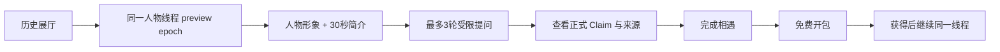
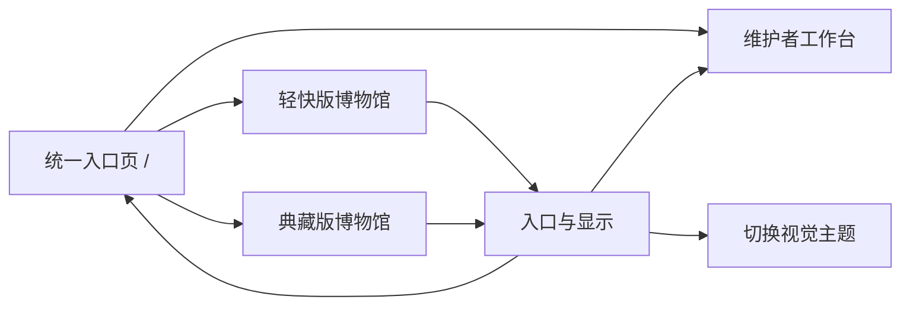
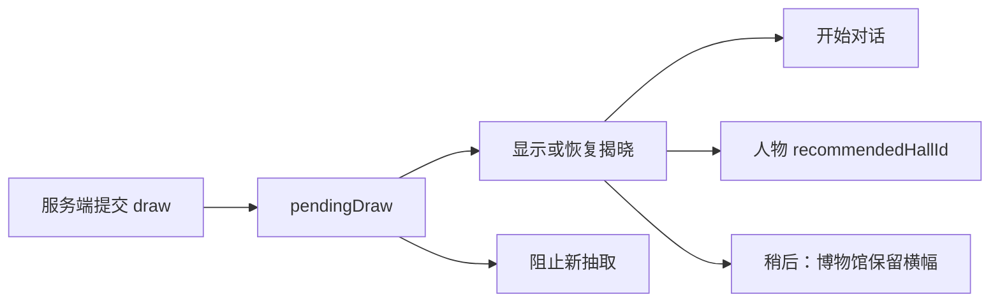

# Stage 2 — post-stage-5-remediation PRD 修订

- 日期：2026-07-16
- 状态：Ready for approval
- 证据：[05-browser-review.md](./05-browser-review.md)
- 基线：[02-prd-remediation-v3.md](./02-prd-remediation-v3.md)
- Cycle：`post-stage-5-remediation`（唯一一次强制回路）

## 1. 修订目标

保留“好用、好玩、有教育意义”的历史探索与人物收藏方向，修复首次 Browser 深测发现的导航、抽取恢复、相关展厅和引导相遇问题。人物页从“只有聊天记录”升级为有形象、有历史定位、有对话入口的“人物会面室”。收藏不能破坏历史逻辑；任何公开人物仍必须满足内容发布门槛。

本轮统一将两套纯视觉主题对外命名为“轻快版”和“典藏版”。两套主题功能、数据、安全策略和内容范围完全一致；年龄适配是独立设置，不再通过“儿童版/成人版”暗示内容差异。内部兼容字段可暂时保留 `child | adult`，但不得直接显示给用户。

## 2. 优先级

### P0：公开发布门禁

1. 只有达到人物发布门槛的角色才能进入可抽取卡池和公开对话；本地样例必须标记为 `preview`，不能显示为已发布。
2. 发布门禁继续要求至少3个可靠来源、20条已审核 Claim、5条正式关系和12项评测；不足时人物可出现在展厅预告，但不可抽取。

### P1：本轮必须修复

1. 360px以上窄屏必须始终可见主页、探索历史和我的博物馆三个一级入口。推荐固定底部导航。
2. 每位人物配置 `recommendedHallId`；“相关历史”必须进入实际包含该人物的展厅。
3. 揭晓结果卡为纯展示，不得修改底层路由；只有三个明确动作可以关闭揭晓。
4. 任一页面发现未确认 `pendingDraw` 时显示恢复入口；卡包在处理该结果前禁止再次抽取。
5. 未获得人物的引导相遇支持最多3轮受限 LLM/规则提问，使用同一 `userId + characterId` 线程的 preview epoch。获得人物后继续原线程，不创建副本。
6. 引导相遇消息可以归档，但未获得前不生成长期关系 Memory；获得后再由异步任务评估记忆候选。
7. AI Museum 品牌标识必须返回模式选择入口 `/`，馆内“主页”继续负责返回访客首页；任何访客页面最多两次操作可以到达维护者工作台，并明确提示“将离开参观区”。
8. 模式选择入口是访问者与维护者的统一切换页：提供“轻快版”“典藏版”和“维护者工作台”。访客页的次级“入口与显示”菜单提供切换主题、返回入口页和进入维护者工作台，不把维护工具混入儿童主要导航。
9. 人物相遇和长期对话页改为三个注意区块：人物形象舞台、“30秒认识我”、对话区。首访时前两块展开；消息变多后可折叠为人物摘要栏，并可随时重新打开。
10. 人物形象支持卡面翻转切换卡通版和写实版：轻快版默认卡通，典藏版默认写实；点击选择按用户与人物持久化。减少动态效果设置下改为无旋转的淡入切换，并提供完整键盘和屏幕阅读器操作。

### P2：体验完善

1. 页面首载即显示 `rules | cloud-model | local-model`，不使用“正在检测”占位。
2. 积分不足点击后直接展示差额和一个真实历史任务，不进入扣费确认。
3. 典藏版主页最多显示2个最近人物；轻快版主页仍只突出1个继续目标。
4. 人物会面室按需展示“为什么我在这个展厅”、时间地点锚点、最多2个关系入口、1件代表物和“上次聊到”；首屏仍不得同时出现超过3个主要注意点。
5. 未配置双版本形象时使用明确的剪影或字母占位，不伪造人物样貌；推测复原或艺术创作必须标注，不能让儿童误认为真实照片。

## 3. 修订后的主流程

### 人物相遇

### 入口与模式切换

### 抽取恢复

## 4. 人物形象与会面室数据约束

- `portraitVariants.cartoon` 与 `portraitVariants.realistic` 分别保存资产 ID、来源、许可、替代文本和表现性质；表现性质只允许 `historical_portrait | evidence_based_reconstruction | artistic_interpretation`。
- `CharacterPresence` 预留 `portrait | bust-3d | full-3d | video-avatar` 渲染模式，MVP 只实现 `portrait`，其余显示稳定占位，不在本轮引入 3D 或视频依赖。
- 目录卡片不再把整张卡实现成单一按钮：人物形象是独立的翻转按钮，姓名/简介区域负责进入人物页；翻转不得误触导航，进入人物页也不得被迫先翻转。
- 展示、动画、形象生成、声音合成和训练授权分别记录；拥有展示权不等于拥有生成或动画权。
- 人物简介必须来自已发布人物包；时间、地点、关系与代表物必须可追溯到正式 Claim 或来源。形象资产的出处与复原性质可从信息按钮查看。
- 会面室返回用户至少显示人物姓名、生卒年/活动时期、身份一句话、两句以内简介和3个建议问题；不得用一整屏人物资料阻塞对话。

## 5. 成功指标与验收标准

- 360/390/768/1280px 均可在一次点击内进入三个一级入口；
- 任意访客页点击品牌标识一次返回 `/`；通过“入口与显示”最多两次操作进入维护者工作台；移动端同样可达；
- 用户可见界面不再出现“成人版/儿童版”作为视觉主题名称，只显示“轻快版/典藏版”；
- 进入人物页首屏能看到人物形象、快速简介和对话入口，且主要注意区块不超过3个；
- 轻快版默认卡通形象、典藏版默认写实形象；手动切换刷新后保持，缺失资产时显示有标识的占位；
- 目录卡片点击形象只切换形象，点击姓名/简介才进入人物页，两种操作在鼠标、触控与键盘下互不冲突；
- 翻转按钮支持键盘、可读标签和 `prefers-reduced-motion`，艺术复原不会被标为真实史料照片；
- 对36个人物执行 related-history 映射测试，目标展厅100%包含该人物；
- 揭晓层中央卡点击不会改变 URL、route 或 selected character；
- 提交结果后在卡包、主页、时期馆和博物馆刷新，均能恢复同一 drawId；
- 存在 pendingDraw 时新的 draw API 返回 `409 DRAW_PENDING_REVEAL`；
- 引导相遇允许3轮提问，第4轮给出明确说明和“完成相遇”动作；
- 获得人物前后 threadId 不变，preview 消息不重复、不丢失；
- 未获得阶段不产生 `character_relationship` Memory；
- 首屏模式标识与服务端配置一致；
- 不满足内容门禁的人物不会出现在抽取候选中；
- focused Browser regression 覆盖 BR-01 至 BR-09，P0为0，重大P1为0。

## 6. 非目标

- 本回路不完成全部36人的史料制作；只实现可验证的内容门禁和 preview 状态。
- 不增加付费、倒计时、连续登录、排行榜或购买探索星。
- 不改变人物私聊隔离、Claim 追溯、儿童隐私和声明式人物包原则。
- 本回路不制作36人的正式卡通/写实资产，也不实现人物3D模型、数字人或仿声；只完成媒体槽位、双版本数据契约、占位与切换交互。

## 7. Gate 2

- [x] Browser findings 已转化为优先级、流程和验收标准；
- [x] 公开内容门禁与本地样例状态已区分；
- [x] 引导相遇与唯一线程不再冲突；
- [x] 抽取恢复和相关历史具备可测试不变量；
- [x] 视觉主题命名、统一入口和维护者路径已定义；
- [x] 人物会面室、双形象切换和未来3D槽位已转化为验收约束；
- [ ] 等待用户批准后进入 remediation Stage 3。
