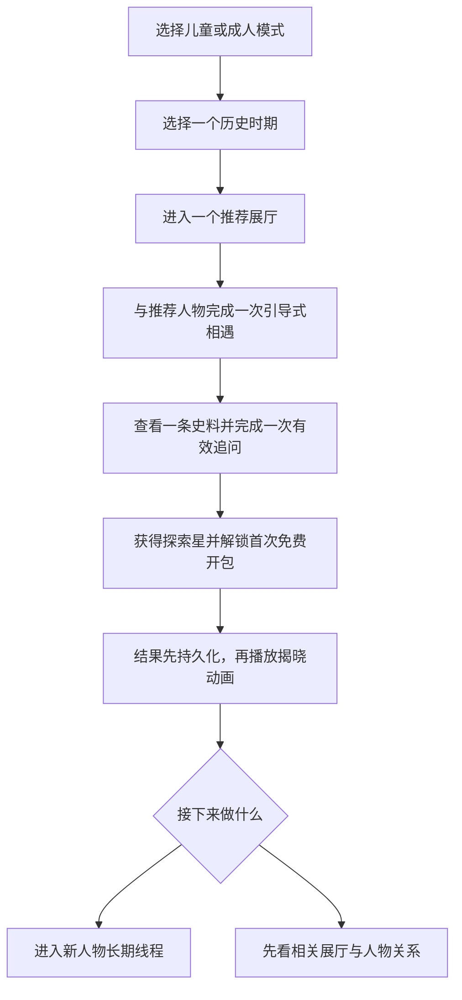

# Stage 2 v3 — 体验评审反馈修订

- 日期：2026-07-16
- 状态：Approved
- 批准日期：2026-07-16
- 基线：[02-prd.md](./02-prd.md)
- 触发原因：Stage 3 v5 深度体验审查发现可用性、抽取一致性、教育主次和无障碍问题。

## 1. 产品质量三角

MVP 必须同时满足三个目标，任何一个失败都阻止公开发布：

### 好用

- 9–12岁用户无需成人解释就能识别每屏主要动作；
- 文字、颜色、触控区和键盘语义满足儿童与基本无障碍要求；
- 刷新、返回、关闭动画、断网或重试不会丢失消息、积分、抽取结果或人物拥有状态；
- 所有按钮的文案与实际去向一致。

### 好玩

- 人物收集提供真实惊喜、清晰进度和可理解的关系发现；
- 首次体验在10分钟内完成一次历史探索和第一次免费开包；
- 随机性公开、公平、可跳过，不依靠付费、签到压力或人物情感施压；
- 获得人物后立即出现有意义的新选择，而不是只增加一个数字。

### 有教育意义

- 历史时期馆和展厅始终先于卡包成为主要入口；
- 探索星只由有效对话、来源查看、复述、关系发现或纠错产生；
- 人物回答仍受正式 Claim、来源、时代边界和适龄规则约束；
- 基本生平、来源和历史展厅不因未获得卡牌而隐藏。

## 2. 修订后的首次体验

首次免费开包只能在完成一次真实历史相遇后使用。它不消耗探索星、保证获得尚未拥有的人物，并清楚说明以后如何获得探索星。

## 3. 历史入口与卡包的主次

- 探索历史首屏只显示3个历史时期馆；
- 时期馆首个主动作必须是“进入推荐展厅”，不能是“查看卡包”；
- 时期馆默认显示3位推荐人物和当前关系链，完整12人名册需要用户主动展开；
- 卡包入口位于时期馆次级动作和“我的博物馆”，不能遮挡展厅；
- 搜索未获得人物时，首先提供生平、关系与展厅，解锁提示保持次要。

## 4. 人物访问与解锁边界

- 所有已发布人物可以查看姓名、肖像、年代、基本生平、正式来源和所在展厅；
- 未获得人物可以参与一次引导式“博物馆相遇”，用于理解其历史角色；
- 获得人物卡后解锁唯一长期线程、人物关系记忆、个人收藏状态和专属探索；
- 系统上线前已经存在长期线程的人物自动加入用户已有人物集合；
- 点击“开始长期对话”必须进入该人物的真实长期线程，不得跳回卡册或时期馆。

## 5. 拥有状态与抽取完整性

人物拥有状态必须以稳定 `characterId` 表示，不能用数组位置或“已拥有数量的前N项”推断。

抽取过程采用以下产品原子性：

1. 服务端校验余额、卡池版本、保底和幂等键；
2. 同一事务确定结果、扣除积分、更新保底、写入人物拥有状态或重复补偿；
3. 客户端收到已持久化结果后才播放动画；
4. 关闭、跳过、刷新或断线后恢复同一个结果；
5. “收入卡册”只是确认反馈，不承担真正写入动作。

任何人物在搜索、卡册、时期馆、人物页和对话入口中的拥有状态必须一致。

## 6. 儿童可用性与无障碍

### 儿童模式硬标准

- 正文默认至少18px；辅助文字至少14px；行高至少1.6；
- 主要交互触控区至少48×48px，控件间距至少8px；
- 正常文字与背景对比度至少4.5:1，大字至少3:1；
- 不能只用白/蓝/紫/橙/金颜色区分层级，同时显示文字与图形；
- 人物使用统一风格肖像与姓名，不以单字或首字母作为正式识别方式；
- 每屏默认只突出一个主动作和不超过两个次动作。

### 成人模式

功能、概率和人物数据与儿童模式一致，可以提高年代、地点、来源和关系信息密度，但仍满足44×44px触控区和基本对比度。

### 通用要求

- 所有可点击卡片具有按钮或链接语义、可见焦点和键盘操作；
- 抽取动画支持跳过与 `prefers-reduced-motion`；
- Toast 不能承载必须阅读或必须操作的信息；
- 模态框正确管理焦点，`Esc` 行为不能造成数据损失。

## 7. 奖励节奏

- 第一次真实历史相遇后提供一次免费开包；
- 常规单抽建议成本对应约3次有效学习事件，最终数值由9–12岁可用性测试校准；
- 不按在线时间、消息数量或重复任务发分；
- 当日奖励上限只停止发放积分，不阻止继续学习；
- 用户随时可以查看每笔探索星来源；
- 收齐一个时期后停止该池随机抽取，改为展厅完成度、关系发现和史料装帧奖励。

## 8. 必须覆盖的状态

- 新用户、已有历史用户和登录合并用户；
- 人物未获得、已获得、已有旧线程和人物版本升级；
- 首次免费开包、普通抽取、重复卡、保底、全部收齐；
- 积分不足、请求超时、服务端失败、扣分后断线和结果恢复；
- 卡池不足12/12、人物撤回、来源撤销和卡池版本升级；
- 儿童/成人、桌面/移动、减少动态和键盘操作；
- 搜索无结果、同名人物和关系图谱暂不可用。

## 9. 新增成功指标

| 指标 | MVP目标 |
|---|---:|
| 9–12岁首次用户在无成人提示下进入推荐展厅 | ≥ 90% |
| 首次有效人物相遇完成率 | ≥ 85% |
| 首次免费开包中位时间 | ≤ 10分钟 |
| 主要任务按钮去向与文案一致 | 100% |
| 人物拥有状态跨页面一致 | 100% |
| 关闭/刷新/断线后的抽取结果恢复 | 100% |
| 扣分成功但结果不可恢复 | 0 |
| 儿童正文、触控区和文字对比硬标准 | 100% |
| 未获得人物的基本生平和来源可访问 | 100% |
| 抽取前完成真实历史相遇的首次用户 | 100% |
| 不按挂机或重复消息发放探索星 | 100% |

## 10. Stage 3 必须解决的问题

- 重做儿童字号、触控区、对比度和人物视觉；
- 将时期馆主动作改为历史展厅；
- 默认只展示3位推荐人物，展开后显示12人；
- 补齐人物资料页、关系入口和真实长期对话跳转；
- 展示首次免费开包、普通抽取、重复、断线恢复和减少动态状态；
- 使用人物ID集合表达拥有状态，不再用数组前N项模拟；
- 让儿童与成人模式呈现真实的信息密度差异。

## 11. Stage 4 必须解决的问题

- 重新定义人物拥有状态、抽取事务、幂等键、结果恢复和保底数据；
- 明确首次免费抽取资格与探索星账本；
- 让搜索、卡册、时期馆、线程和登录合并读取同一人物拥有事实；
- 定义卡池12/12发布门禁、人物撤回和版本升级策略；
- 增加无障碍自动检查、关键状态监控和抽取一致性审计。
