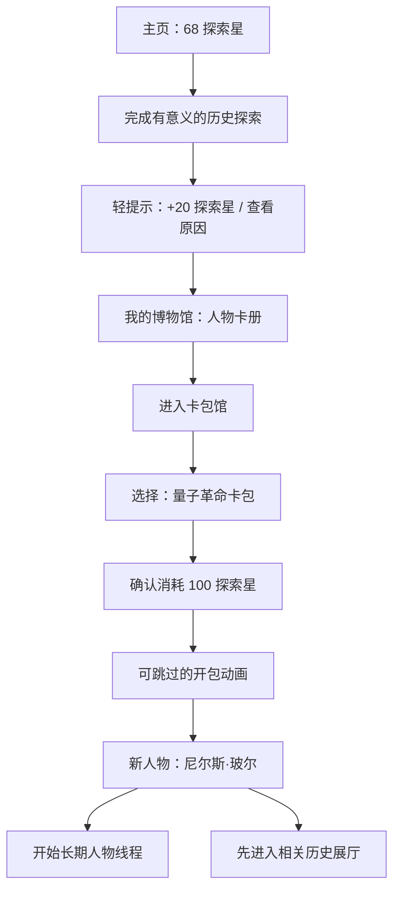

# Stage 3 Design v4 — 人物卡册与卡包馆

- 日期：2026-07-16
- 状态：Superseded by `03-design-v5-36-character.md`
- 依赖：`02-prd-amendment-character-collection.md`

## 1. 导航调整

访客端仍保持三个一级入口：

1. **主页**：继续对话、当前探索和探索星。
2. **探索历史**：历史坐标、人物关系、事件主题与展厅。
3. **我的博物馆**：人物卡册、探索路线、记忆和设置。

原“我的探索”更名为“我的博物馆”，人物卡册成为其首个标签。搜索仍是覆盖当前页面的悬浮窗口。探索星余额位于顶部，点击后进入“我的博物馆 / 获得记录”，不增加第四个主导航。

## 2. 页面与覆盖层

| ID | 名称 | 形态 | 主要焦点 |
|---|---|---|---|
| C01 | 主页奖励状态 | 页面区块 | 今天完成什么可以获得探索星 |
| C02 | 我的博物馆 | 页面 | 卡册、进度、最近解锁 |
| C03 | 卡包馆 | 页面 | 按时代/地点组织的卡包 |
| C04 | 卡包详情 | 页面 | 卡池、概率、保底、开启动作 |
| C05 | 开包确认 | 覆盖层 | 成本与公平规则确认 |
| C06 | 揭晓卡牌 | 全屏覆盖层 | 单次惊喜、可跳过 |
| C07 | 新人物欢迎 | 覆盖层 | 加入卡册、问候或进入展厅 |
| C08 | 积分记录 | 抽屉 | 每笔探索星来源 |

## 3. 核心用户流

## 4. 主页

继续对话仍是主舞台。其下只增加一个低干扰“今天的探索”卡：展示一个可完成目标、奖励数量和为什么获得积分。顶部探索星只显示余额，不闪烁、不倒计时。

奖励到账使用短暂、可忽略的轻动画；人物不得说“如果你不回来我会失望”等情感施压文案。

## 5. 我的博物馆

首屏只包含：

- 收藏进度，例如 `8 / 18`；
- 最近获得的 3 张人物卡；
- 一个主动作“去卡包馆”。

卡册可以按卡包、时代、地点和关系筛选。未拥有人物显示为带姓名的史料剪影，不用神秘轮廓隐藏真实历史身份；点击后仍能浏览基本生平和展厅。

## 6. 卡包馆

卡包不是商品货架，而是一组历史主题入口。每张卡包卡只显示：

- 主题与历史坐标；
- 已收集人数；
- 代表人物；
- 开启需要的探索星。

不使用“最后机会”“超值”“再来一次”等商业刺激语言。卡包详情必须在开启按钮附近显示概率、保底和重复补偿。

## 7. 卡牌视觉

五档卡牌共用肖像、姓名、年代、身份和来源入口。差异只来自边框、材质和很短的揭晓动效：

- 白：纸张与铅笔线；
- 蓝：档案蓝与地图线；
- 紫：展厅紫与关系节点；
- 橙：时间轴金橙与事件纹章；
- 金：博物馆藏品金与完整来源印章。

色彩不是唯一识别方式；每档同时显示文字名称和图形符号。成人模式减少光效和装饰，但规则相同。

## 8. 关键状态

- **积分不足**：说明还差多少，提供一个真实可完成的探索，不提供购买入口。
- **抽到新人物**：显示关系起点，选择“和他聊聊”或“先看看他所在的历史”。
- **抽到重复人物**：明确转化的史料碎片数量，并显示定向兑换进度。
- **卡池未加载**：不扣积分，保留确认状态，可重试。
- **扣分后中断**：服务端恢复同一抽取结果，不能再次扣分或重新随机。
- **全部收齐**：停止该池随机抽取，提供跨卡包探索或史料装帧奖励。
- **关闭激励层**：隐藏积分、卡包和动画，人物、展厅、搜索、对话保持可用。

## 9. 内容规模设计

设计原型按 18 人验证：

- 量子革命：爱因斯坦、玻尔、普朗克、居里夫人、薛定谔、海森堡；
- 盛唐长安：李白、杜甫、武则天、玄奘、颜真卿、鉴真；
- 文艺复兴意大利：达·芬奇、米开朗琪罗、拉斐尔、伽利略、马基雅维利、伊莎贝拉·德斯特。

人物最终能否进入卡池以人物包发布状态、史料完整度、许可与评测为准；名单只是内容制作优先级，不代表已完成。

## 10. 需要评审的设计决策

- “我的探索”更名为“我的博物馆”。
- 人物卡不阻断基础历史资料，只解锁长期对话与关系记忆。
- 不按使用时间直接发分，而按有意义的学习证据发分。
- 五色稀有度使用用户提出的颜色，但改用策展层级解释。
- 首个内容目标提升到 18 个可对话人物。
