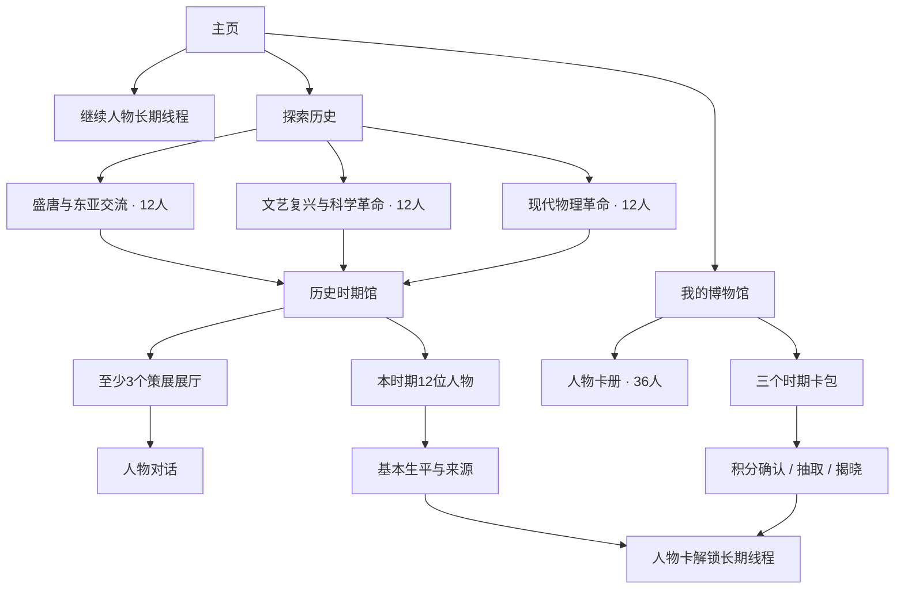

# Stage 3 Design v5 — 三个历史时期馆与36人物卡册

- 日期：2026-07-16
- 状态：Superseded by `03-design-v6-remediation.md`
- 产品基线：[02-prd.md](./02-prd.md)
- 人物基线：[02-character-roster-v2.md](./02-character-roster-v2.md)
- 可点击原型：[design/ai-museum-stage3-v5.html](./design/ai-museum-stage3-v5.html)

## 1. 设计结论

36个人物不能出现在同一个画廊中。访客先进入一个历史时期馆，再通过时期内的展厅、人物关系和卡包认识12位人物。三个时期馆同时承担内容导航和卡池边界：

1. 盛唐与东亚交流（618–907）；
2. 欧洲文艺复兴与早期科学革命（约1450–1650）；
3. 现代物理革命（1895–1969）。

人物卡册增加趣味和持续目标，但历史时期馆仍是理解人物的主要入口，抽卡不是唯一发现方式。

## 2. 一级导航

继续保持三个入口：

- **主页**：恢复对话、当前探索和一个可获得探索星的学习目标；
- **探索历史**：进入三个历史时期馆；
- **我的博物馆**：人物卡册、卡包馆、探索进度和记忆设置。

右侧保留悬浮关系搜索和探索星余额。搜索不创建独立页面，也不清空当前页面状态。

## 3. 信息架构

## 4. 页面清单

| ID | 页面/覆盖层 | 核心内容 | 主要动作 |
|---|---|---|---|
| D01 | 主页 | 继续对话、当前时期、今日探索 | 继续、进入时期馆 |
| D02 | 探索历史 | 三个时期馆，不显示36人网格 | 选择一个时期 |
| D03 | 历史时期馆 | 核心问题、3–4个展厅、代表人物 | 进入展厅、查看12人 |
| D04 | 时期人物名册 | 12人按策展角色呈现 | 查看生平、进入关系 |
| D05 | 我的博物馆 | 总进度、三个分组进度、最近人物 | 打开卡册、卡包馆 |
| D06 | 人物卡册 | 按时期筛选的36个固定槽位 | 打开已获人物、浏览未获人物生平 |
| D07 | 卡包详情 | 12人范围、五档分布、概率、保底 | 消耗探索星开启 |
| D08 | 抽取确认 | 余额、成本、概率版本 | 确认或取消 |
| D09 | 人物揭晓 | 新人物或重复补偿 | 收入卡册、进入时期馆、开始对话 |
| D10 | 悬浮搜索 | 本人优先、关系人物、拥有状态 | 查看人物、关系或时期馆 |

## 5. 探索历史

首屏只显示三个大时期馆。每个时期馆卡包含：

- 时间范围和主要地域；
- 一个适合9–12岁的核心问题；
- `已认识 x / 12`，而不是抽取销量或热度；
- 3位代表人物头像；
- 一个动作“进入这个时期”。

三个卡片使用不同历史材质语言，但不靠颜色作为唯一识别：盛唐使用纸卷与城市纹样，文艺复兴使用画布与建筑线，现代物理使用档案纸与轨迹线。

## 6. 历史时期馆

进入时期后先看到“这个时代发生了什么”，再看到人物：

1. 时间、地点和核心问题；
2. 3–4个可进入的历史展厅；
3. 3位推荐起始人物；
4. 次动作“查看本时期全部12人”。

12人名册分批呈现：默认先显示推荐3人和当前关系链；展开后才显示完整名册。卡牌层级不替代人物角色描述。

## 7. 我的博物馆与卡册

总进度使用 `已认识 8 / 36`。下方始终按三个时期分组显示：

- 盛唐与东亚交流 `2 / 12`；
- 文艺复兴与早期科学革命 `2 / 12`；
- 现代物理革命 `4 / 12`。

未获得人物不使用完全匿名剪影：显示姓名、年代、基本身份和所在时期，允许查看公开生平与来源；长期对话按钮显示解锁条件。这样卡牌不会把公共历史知识变成暗箱。

## 8. 卡包详情

卡包详情必须明确显示全部12人以及白3、蓝3、紫3、橙2、金1的组内分布。人物列表和概率都来自固定卡池版本。

主要动作附近同时显示：

- 本次消耗与当前余额；
- 五档概率；
- 保底进度；
- 重复卡补偿；
- “探索星不能购买”；
- 卡池版本与12/12内容就绪状态。

如果组内人物未达到12/12发布状态，整个卡包显示“策展中”，不能部分开放抽取，但时期馆中已经发布的基础史料仍可浏览。

## 9. 搜索与关系

悬浮搜索继续保持当前页面。搜索爱因斯坦时：

1. 爱因斯坦本人固定第一，显示“已拥有/未拥有”和所属时期；
2. 玻尔、奥本海默等关系人物按正式 Claim 相关性排序；
3. 推荐原因显示“共同参加索尔维会议”“同在普林斯顿高等研究院”等；
4. 结果可以进入人物生平、关系网络或所属时期馆；
5. 未获得人物仍可浏览，不把搜索变成卡包广告。

## 10. 抽取反馈

- **新人物**：先说明人物是谁、为什么属于这个时期，再给“开始长期对话”和“先看相关历史”两个选择；
- **重复人物**：直接显示转换的史料碎片与定向兑换进度；
- **积分不足**：说明还差多少，推荐一个真实学习目标，不提供购买；
- **中断恢复**：恢复同一个服务端结果，不重复扣分或重新随机；
- **全部收齐**：停止该时期随机抽取，转向展厅完成度和关系发现；
- **关闭激励层**：隐藏积分和卡包，但三个时期馆、人物生平和对话入口仍可使用。

## 11. 儿童与成人模式

功能、数据、概率和人物内容完全相同：

- 儿童模式使用较大的时期卡片、简短核心问题和有节制的揭晓动效；
- 成人模式减少装饰与光效，提高年代、地点和来源信息密度；
- 两者均不使用倒计时、红点轰炸、连续签到、人物情感施压或付费入口；
- 减少动态效果设置可跳过所有开包动画。

## 12. 内容未就绪状态

36人目标不能通过占位卡伪装完成：

- 人物草稿只在 Studio 显示；
- 时期馆可以显示已发布展厅，但卡包必须等12/12全部发布；
- 维护端展示 `来源 → Claim → 关系 → 评测 → 发布`完成度；
- 访客端只看到“这个时期仍在策展”，不显示虚假概率或不可获得人物；
- 人物撤回后暂停该池新抽取，已获得人物与旧对话保留版本说明。

## 13. Stage 4 必须重做的技术范围

本节只记录设计产生的技术影响，不在 Stage 3 决定具体实现：

- 新增历史时期组、卡池版本、卡牌定义和人物组内层级；
- 新增探索星账本、幂等奖励事件、抽取事务、保底和重复补偿；
- 搜索索引需要返回时期组、拥有状态与可解释关系路径；
- 36个人物包需要批量验证、内容就绪聚合和分组发布门禁；
- 人物获得状态必须与唯一长期线程、人物版本和访客登录合并保持一致；
- 卡池概率、扣分和结果必须服务端决定并可审计。

因此 Stage 4 不能沿用旧架构原文，需要在本设计批准后形成新的技术设计版本。

## 14. Stage 3 验收清单

- [x] 三个时期组作为主要内容层级；
- [x] 每组12人且不会在同屏平铺36人；
- [x] 历史展厅仍是主要理解入口；
- [x] 人物卡册显示36人固定进度；
- [x] 卡包详情展示12人范围、五档分布、概率和保底；
- [x] 搜索保持悬浮并显示人物关系与拥有状态；
- [x] 未获得人物的基础史料仍可访问；
- [x] 设计包含积分不足、重复、中断、未就绪和关闭激励状态；
- [x] 儿童与成人模式功能一致。
