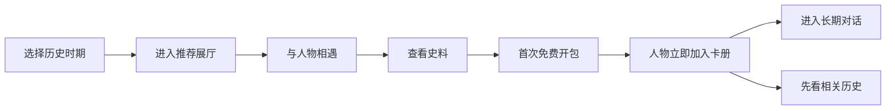

# Stage 3 v6 — 好用、好玩、有教育意义的体验修订

- 日期：2026-07-16
- 状态：Approved
- PRD 基线：[02-prd-remediation-v3.md](./02-prd-remediation-v3.md)
- 人物基线：[02-character-roster-v2.md](./02-character-roster-v2.md)
- 可点击原型：[design/ai-museum-stage3-v6.html](./design/ai-museum-stage3-v6.html)

## 1. 本轮结论

v6 不取消抽卡，而是重新安排它在学习旅程中的位置：用户先进入历史时期、理解一个问题、与人物相遇并查看史料，随后获得第一次免费开包。卡牌提供惊喜和长期关系，历史展厅提供理解结构，两者互相增强而不互相替代。

## 2. 首次十分钟路径

首页只突出“继续上次探索”或“选择一个历史时期”。探索星和卡册可见，但不会先于历史内容抢占主动作。

## 3. 页面结构

| 页面 | 主动作 | 次动作 | 关键状态 |
|---|---|---|---|
| 主页 | 继续探索/选择时期 | 我的博物馆 | 新用户、已有历史 |
| 探索历史 | 进入一个时期馆 | 搜索人物 | 3个时期固定入口 |
| 时期馆 | 进入推荐展厅 | 展开12人、查看卡包 | 默认3位人物 |
| 历史展厅 | 与推荐人物相遇 | 查看其他人物 | 核心问题、时间地点 |
| 人物相遇 | 提问并查看史料 | 返回展厅 | 未获得也可体验 |
| 人物资料 | 查看历史/进入长期线程 | 查看来源与关系 | 拥有状态一致 |
| 我的博物馆 | 继续人物线程 | 选择卡包 | 36人按时期分组 |
| 卡包详情 | 免费/积分开启 | 先看历史 | 概率、保底、12/12门禁 |
| 揭晓覆盖层 | 开始长期对话 | 先看相关历史 | 结果已持久化、可跳过 |
| 搜索覆盖层 | 打开本人 | 查看关系/时期 | 保持原页面状态 |

## 4. 历史优先

- 时期馆首屏依次展示时间地点、核心问题、推荐展厅和3位推荐人物；
- “进入推荐展厅”是唯一强调按钮；
- 卡包入口为普通文本或次级按钮，位于历史内容之后；
- 12人名册默认收起，展开后按历史角色而非稀有度排序；
- 稀有度只在卡册和卡包中出现，不影响历史展厅的人物尊重与视觉权重。

## 5. 人物资料与对话

人物卡不再只触发 Toast。人物资料页/浮层必须展示：

- 肖像、姓名、年代和一句身份；
- 所属时期与至少一个历史展厅；
- 两条可解释关系；
- 公开生平和史料入口；
- `已获得`时显示“继续长期对话”；
- `未获得`时显示“完成一次博物馆相遇”和相关卡包，但不隐藏知识。

“开始长期对话”直接进入 `userId + characterId` 的唯一线程；人物卡揭晓不创建第二条线程。

## 6. 抽取与恢复

抽取确认层显示免费资格或积分成本、卡池版本、概率、保底和重复补偿。确认后，结果先进入拥有集合和账本，再进入揭晓动画。

- 跳过、`Esc`、刷新和断线不会改变结果；
- 揭晓关闭后，“最近获得”仍可继续处理未查看结果；
- 首次免费开包保证未拥有人物；
- 普通重复卡显示史料碎片与定向兑换进度；
- 全部收齐后关闭随机抽取；
- `prefers-reduced-motion` 下直接显示静态结果。

## 7. 状态表达

拥有状态由 `characterId` 集合驱动。搜索、时期名册、卡册、资料页、揭晓结果和线程入口使用同一状态，不允许根据人物数组位置推断。

原型提供开发状态控制：重置首次体验、模拟已有用户、预览积分不足、重复卡、服务失败和减少动态。正式产品不向普通用户显示这些开发控件。

## 8. 视觉与无障碍

### 儿童模式

- 正文18px，辅助文字14px，行高1.65；
- 按钮最小高度48px、可点击卡片有按钮语义；
- 每屏一个主动作、最多两个明显次动作；
- 使用真实肖像风格占位框加完整姓名，单字仅作为原型资产占位；
- 深色历史材质上增加稳定遮罩，文字对比至少4.5:1。

### 成人模式

- 正文16px，辅助文字13px；
- 同屏显示更多年代、来源和关系说明；
- 控件最小44px；
- 功能、概率、人物数据与儿童模式完全相同。

### 通用

- 焦点可见、卡片可键盘触发；
- 模态框具有标题、关闭入口和焦点边界；
- 颜色之外同时使用名称和符号区分卡级；
- 关键错误不使用会自动消失的 Toast；
- 动效服从减少动态设置。

## 9. 关键错误状态

- **网络失败**：不扣分，确认层保留，显示重试；
- **提交成功后断线**：恢复同一已持久化结果；
- **积分不足**：显示差额和一个真实历史任务，不提供购买；
- **卡池未就绪**：可浏览时期馆，隐藏抽取动作；
- **人物撤回**：停止新抽取，已获得版本和旧对话显示说明；
- **关系不可用**：保留人物本人结果，不生成假关系；
- **登录合并**：拥有集合取并集，账本和线程幂等去重。

## 10. v5反馈闭环

| v5问题 | v6处理 |
|---|---|
| 8–12px小字与小按钮 | 儿童18/14px、48px硬标准 |
| 浅色背景白字 | 历史卡片遮罩与主题正文色 |
| `known++`解锁错误人物 | `ownedIds`按人物ID驱动 |
| 关闭动画可能丢结果 | 结果先持久化，动画只展示 |
| 开始对话跳回卡册 | 进入真实人物线程页面 |
| 时期馆先推卡包 | 推荐展厅成为唯一主动作 |
| 同屏显示12人 | 默认3人，主动展开12人 |
| 人物卡只有Toast | 新增人物资料与来源/关系入口 |
| 新用户等待第一次抽取 | 首次有效相遇后免费开包 |
| 成人模式只换颜色 | 增加真实信息密度差异 |

## 11. Stage 3 验收

- [x] 历史展厅优先于卡包；
- [x] 首次十分钟路径完整；
- [x] 3人默认名册与12人展开状态；
- [x] 人物资料、公开来源和真实线程入口；
- [x] ID驱动的拥有状态；
- [x] 结果先持久化、动画可关闭；
- [x] 首次免费、普通抽取、积分不足、失败和重复状态；
- [x] 儿童与成人密度差异；
- [x] 字号、触控区、对比度和键盘语义进入设计硬标准；
- [x] Browser 测试将在 Stage 5 HTTP 本地环境执行。

## 12. 原型验证记录

2026-07-16 对 v6 可点击原型完成静态与语义验证：

- JavaScript 可成功解析；
- 3 个时期各 12 人，总计 36 个唯一 `characterId`；
- 每个时期卡级结构均为白3、蓝3、紫3、橙2、金1；
- 时期页默认展示3人，可主动展开12人；
- 人物拥有状态、搜索结果、资料页、卡册和对话入口均由 ID 集合驱动；
- 抽取结果在揭晓层渲染前写入本地持久状态；
- 积分不足、服务失败、重复卡和减少动态均可由开发控件预览；
- 儿童主按钮白字对比度为 5.16:1，成人主按钮为 6.72:1；两者均达到 WCAG AA 正文对比度要求。

Browser 深度测试不在 `file://` 原型上执行；按工作流在 Stage 5 建立 HTTP 本地环境后进行，并依据结果重新进入 Stage 2–5 修订闭环。
