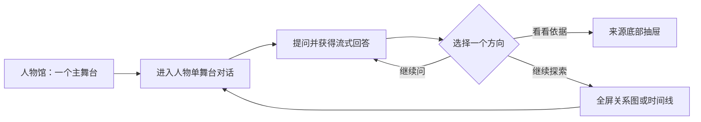
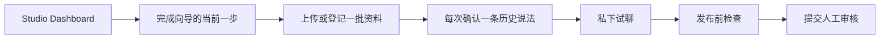

# AI Museum 产品与交互设计

- 阶段：Stage 3
- 状态：Approved — v6 remediation
- 此前设计批准日期：2026-07-16
- 基线：[02-prd.md](./02-prd.md)
- 视觉设计板：[design/ai-museum-design-board.html](./design/ai-museum-design-board.html)
- 调研记录：[design/children-product-research.md](./design/children-product-research.md)
- 完整 UI Flow：[03-ui-flow-spec.md](./03-ui-flow-spec.md)
- 可点击原型：[design/ai-museum-click-prototype.html](./design/ai-museum-click-prototype.html)
- 访客端导航 v3：[03-navigation-v3.md](./03-navigation-v3.md)
- 导航 v3 可点击原型：[design/ai-museum-navigation-v3.html](./design/ai-museum-navigation-v3.html)
- 人物收藏 PRD 修订：[02-prd-amendment-character-collection.md](./02-prd-amendment-character-collection.md)
- 人物收藏设计 v4：[03-collection-gameplay-v4.md](./03-collection-gameplay-v4.md)
- 人物收藏 v4 可点击原型：[design/ai-museum-collection-v4.html](./design/ai-museum-collection-v4.html)
- 36人物设计 v5：[03-design-v5-36-character.md](./03-design-v5-36-character.md)
- 36人物 v5 可点击原型：[design/ai-museum-stage3-v5.html](./design/ai-museum-stage3-v5.html)
- 体验修订设计 v6：[03-design-v6-remediation.md](./03-design-v6-remediation.md)
- 体验修订 v6 可点击原型：[design/ai-museum-stage3-v6.html](./design/ai-museum-stage3-v6.html)
- 日期：2026-07-16

## 1. 本轮修订

v6 是本轮 Stage 3 的唯一评审入口，详细内容以 `03-design-v6-remediation.md` 和对应可点击原型为准。v5 仅保留为设计历史。v6 将首次体验改为“时期 → 推荐展厅 → 人物相遇 → 史料 → 免费开包 → 长期线程”，并修复 ID 拥有状态、揭晓恢复、人物资料、异常状态与儿童可访问性。

根据评审反馈，v2 不再沿用“通用 SaaS 三栏工作台”思路，而把产品拆成两个完全独立的体验：

1. **孩子使用端：AI Museum**。面向 9–12 岁，以人物、对话和探索场景为中心。
2. **成人维护端：AI Museum Studio**。面向人物维护者和审核者，以向导、单任务页面和直白说明为中心。

两个产品共享人物包和设计基础，但不共享主导航、首页结构、术语密度和操作模型。孩子端不显示“创作人物”“Candidate Claim”“Provider”等维护入口；维护端也不使用儿童化措辞或娱乐式反馈。

## 2. 调研结论及应用

### 2.1 可借鉴的共同模式

- 儿童教育产品常用鲜明角色、插画或内容照片形成第一视觉锚点，而不是让孩子面对文字导航树。
- 入口用“玩什么、看什么、问谁”这类具体行动表达，层级浅，返回路径稳定。
- 适龄产品把学习包装成一次短小、可完成的探索，但不过度依赖积分、连续签到和诱导性奖励。
- 对已有阅读能力的 9–12 岁用户，应保留真实内容和自主选择，避免照搬学龄前产品的巨大图标、婴幼儿角色和过度语音提示。
- 儿童数据采用高隐私默认、最小收集和可理解说明；不能通过颜色、奖励或人物情感诱导儿童提供更多信息。

### 2.2 AI Museum 的推导

调研样例不直接等同于历史人物对话产品。以下是结合 PRD 得出的设计推论：

- “轻快”由场景变化、柔和图案、人物肖像、历史物件插图和有节制的动效提供，不靠增加按钮。
- “简洁”不是纯白和空旷，而是每个屏幕只有一个主要故事、一个主要动作和最多两个次要动作。
- 对话页不常驻关系图、时间线、来源栏和人物列表；它们在需要时作为单一抽屉出现。
- 学习路线不是任务清单，而是博物馆地图上的“下一站”；用户可以跳过，不设置留存压力。

## 3. 访客界面的双设计模式

访客不只有儿童。产品提供 `child` 与 `adult` 两种可切换的纯表现层模式，类似 light/dark theme，而不是两套功能或两套数据模型。

- 两种模式使用完全相同的路由、功能、消息、人物线程、记忆、权限、API 和无障碍语义。
- 模式只改变设计令牌、字号密度、留白、插画强度、动效幅度、背景纹理和文案语气。
- `child` 模式沿用当前已批准的“轻快历史探险”设计语言。
- `adult` 模式更克制、稍严肃：降低插画面积和颜色饱和度，增加史料阅读感与排版密度，但不恢复三栏工作台式信息过载。
- 用户可随时切换；偏好保存在用户 Profile，并在未登录时保存在设备 Cookie/本地偏好中。
- 模式切换不得改变模型 Prompt 的事实范围、人物记忆、回答内容或安全策略；允许仅调整 UI 展示密度和非事实性辅助文案。
- 维护端 Studio 仍是独立产品界面，不等同于访客端的 `adult` 模式。

成人模式的具体页面视觉和双模式切换流程按评审决定，在 Stage 4 技术设计完成后回到 UI 设计细化；本阶段先固定“同功能、同语义、纯主题适配”的边界。

## 4. 统一注意力预算

除 Dashboard 外，每个页面最多出现三个需要理解的焦点：

1. **我在哪里/正在做什么**：页面标题、人物或当前步骤。
2. **当前内容**：对话、一个人物、一个候选知识或一个表单分组。
3. **下一步**：一个主动作，必要时最多两个次动作。

同屏限制：

- 最多 1 个主按钮。
- 最多 2 个次按钮；其余动作进入“更多”或下一层。
- 最多 1 个文本输入区。
- 非 Dashboard 不同时展示多个表单分组。
- 不同时打开来源、关系图、时间线和记忆详情。
- 装饰元素不可伪装成可点击控件。

## 5. 孩子端设计

### 4.1 设计气质：轻快的历史探险

- 背景使用天空、地图、星轨、纸片和历史物件组成的低对比场景纹理，避免大面积空白纯色。
- 使用明快但不过饱和的天蓝、太阳黄、珊瑚橙、青绿色和薰衣草紫。
- 大面积色彩只承担分区和情绪，不用十几个彩色卡片争夺注意力。
- 人物肖像是主视觉；不把历史人物改造成夸张萌宠，也不做不尊重史实的娱乐化表演。
- 正文保持深蓝高对比；彩色背景上的文字必须落在实色或半透明阅读层上。

### 4.2 孩子端信息架构

顶部只保留：

- **人物馆**：回到人物与主题入口。
- **我的探索**：已聊人物、学习线索和记忆控制。
- **个人头像**：隐私和帮助，不在一级导航展开。

“关系图”和“时间线”不是独立常驻导航，而是从当前回答或人物页进入的探索模式。

### 4.3 人物馆

人物馆首屏只包含三个焦点：

1. 一句欢迎与当前探索主题。
2. 一个“继续和某人物聊”主舞台。
3. “换个人物”与“随机问题”两个次动作。

其他人物不在首屏铺成密集卡片阵列；通过横向人物画廊逐个浏览，每次突出一个人物。

### 4.4 对话页

对话页从三栏改为单舞台：

- 顶部只有人物头像、姓名和“换人物”。
- 中央只有对话历史；人物回答和博物馆旁白通过角色标签区分。
- 底部只有一个输入区、语音按钮和发送/停止动作。
- 每次回答末尾最多显示一个“看看依据”入口和一个由内容决定的“继续探索”入口。
- 点击“看看依据”后，来源以底部抽屉覆盖输入区；关闭后回到原位置。
- 关系图或时间线打开为全屏探索模式，不与聊天并排。

### 4.5 人物切换

“换人物”打开轻量覆盖层，一次突出一个人物及其上次摘要。选择后立即恢复独立线程。

确认文案只表达两件事：

- 会恢复与新人物的旧对话。
- 新人物不会看到其他人的私聊。

掌握度共享属于后台行为，不在每次切换时增加解释负担；第一次发生讲解深度调整时再用一句旁白说明。

### 4.6 记忆回调

人物主动回忆应融入一句自然对话，随后只提供两个即时动作：

- “对，我记得”
- “不是这样”

“暂时别提”“查看来源”“删除记忆”等低频动作在点击“不是这样”后进入记忆处理页，避免一次出现三个以上选择。

### 4.7 我的探索

默认只显示：

1. 最近聊过的人物。
2. 正在探索的一个主题。
3. “人物记得什么”入口。

记忆中心、全部历史和数据控制是二级页面。学习状态不用分数、排行榜或连续天数表示。

## 6. 成人维护端设计

### 5.1 独立入口

Studio 使用独立路径、品牌后缀和导航。孩子端不显示 Studio 链接；维护者从项目文档、独立登录页或明确 URL 进入。

Studio 使用较中性的浅灰蓝背景和清楚的状态色，不沿用孩子端的地图场景。语言直白，但允许显示“候选知识、版本、许可”等必要概念，并在首次出现时解释。

### 5.2 Dashboard 例外

Dashboard 可以汇总多个关注点，但只回答四个问题：

- 我维护哪些人物？
- 哪些事情在等待我？
- 是否存在阻塞发布的问题？
- 下一步应该做什么？

不得加入与当前任务无关的趋势图、活动流、费用图和技术监控。

### 5.3 人物创建向导

每页只处理一个主题：

1. 人物是谁
2. 他生活在什么时候
3. 他可以谈什么
4. 资料从哪里来
5. 检查 AI 找出的候选知识
6. 私下试聊
7. 提交审核

每页最多一个表单分组；顶部显示“第 3/7 步”和一句目的说明。使用“保存并继续”为唯一主按钮，“稍后再做”为次动作。

### 5.4 候选知识审核

从密集列表改为“每次审核一条”：

1. 上方：AI 找出的说法。
2. 中间：原文与准确位置。
3. 下方：接受、修改、拒绝。

冲突信息在需要时展开，不常驻并排差异表。维护者可以返回 Dashboard 查看队列总量，但审核页不显示多个候选卡。

### 5.5 直白语言

- Candidate Claim → “待确认的历史说法”，括号中仅首次展示技术名。
- Ingestion → “资料处理”。
- Entity Disambiguation → “确认是不是同一个人/地点”。
- Character Version → “人物资料版本”。
- Validation → “发布前检查”。

错误必须说明“发生了什么、数据有没有保留、现在能做什么”，不只显示错误码。

## 7. 核心流程

### 6.1 孩子探索

### 6.2 成人维护

## 8. 状态设计

### 孩子端

- **正在回答**：人物气泡逐步出现；唯一动作是“停一下”。
- **断流**：保留已有内容和问题；唯一主动作“接着回答”。
- **没有史料**：人物说不知道；提供一个相关问题，不显示技术原因。
- **人物边界外**：人物自然说明，旁白可提供一个安全替代方向。
- **Mock**：开发模式不允许儿童端公开访问；若本地开发打开，顶部持续显示明显横幅。

### 维护端

- **处理中**：显示当前步骤和预计等待，不展示伪精确百分比。
- **需要决定**：说明为什么停住，并只给与该决定相关的动作。
- **API 失败**：说明资料是否已保存，提供重试或稍后处理。
- **无许可**：指出缺失的许可类型和如何补充，不允许继续发布。

## 9. 设计系统

### 8.1 孩子端色彩

- `Sky #64B7F6`：主要场景与探索感。
- `Sun #FFD45A`：人物焦点和温暖提示。
- `Coral #FF7D66`：主要行动和活力。
- `Leaf #42B883`：安全、完成与自然。
- `Lavender #A995F5`：关系、想象和夜空场景。
- `Ink #18304B`：正文。
- `Cloud #FFFDF7`：阅读层。

### 8.2 Studio 色彩

- `Studio Ink #243247`
- `Studio Blue #356CC8`
- `Studio Surface #F6F8FB`
- `Studio Success #237A57`
- `Studio Warning #A46713`
- `Studio Danger #B64444`

### 8.3 排版与控件

- 孩子端正文至少 18px，行高至少 1.7；按钮触控区至少 48×48px。
- Studio 正文至少 16px，触控区至少 44×44px。
- 孩子端主按钮使用动作动词，不用“确认”“提交”等抽象词。
- 同一页面仅一个强调色主按钮。
- 动效服务于方向变化：人物进入、抽屉打开、路线移动；支持减少动态效果。

## 10. 后续验证要求

架构前不要求实现真实界面，但工程阶段必须安排 9–12 岁儿童的可用性验证，重点观察：

- 首次进入是否知道哪里可以提问。
- 是否把装饰元素误认为按钮。
- 回答后是否能理解“继续问”和“看看依据”的区别。
- 切换人物后是否误以为新人物知道上一段私聊。
- 是否能在没有成人帮助时纠正一次错误记忆。

维护者验证必须覆盖非技术用户：

- 是否能理解“待确认的历史说法”。
- 是否能找到原文位置和许可状态。
- 是否能在不理解 API、Embedding 或知识图谱的情况下完成一次私有预览。

## 11. Gate 3 验收

- [x] 孩子端与成人维护端完全分离。
- [x] 非 Dashboard 页面执行最多三个注意焦点。
- [x] 孩子端从三栏改为单舞台、按需抽屉和全屏探索。
- [x] 轻快视觉不依赖按钮堆叠或纯色空白。
- [x] 维护流程改为逐步向导和单条候选审核。
- [x] 视觉设计板同步更新。
- [x] 用户批准儿童设计逻辑，并确认访客端增加纯表现层成人模式。
- [x] v6 修订稿已获用户批准并进入 Stage 4。
