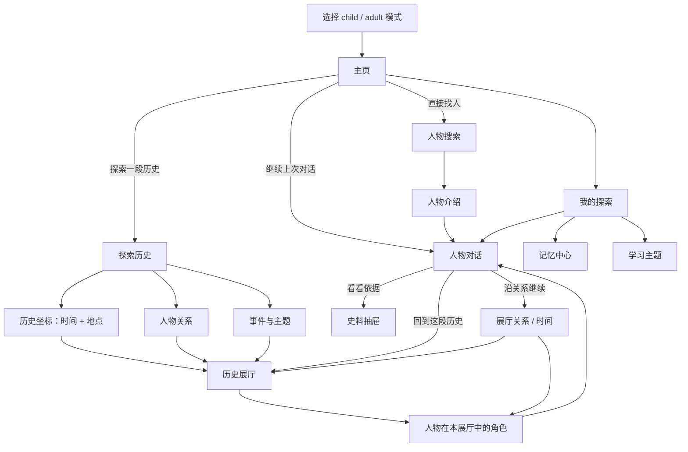
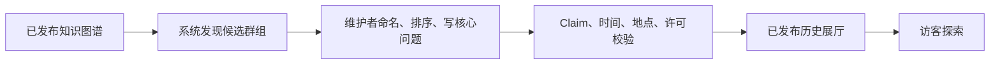

# AI Museum 访客端导航设计 v3

- 阶段：Stage 3 Navigation Revision
- 状态：Superseded as primary navigation by `03-design-v5-36-character.md`; search overlay rules remain valid
- 设计基线：[03-design.md](./03-design.md)
- 完整交互基线：[03-ui-flow-spec.md](./03-ui-flow-spec.md)
- 可点击原型：[design/ai-museum-navigation-v3.html](./design/ai-museum-navigation-v3.html)
- 日期：2026-07-16

## 1. 改动结论

取消“人物画廊”作为主要发现入口。人物不再作为一组互不相关的头像出现，而是通过可理解的历史结构进入。

访客端一级导航固定为：

- **主页**：继续对话、探索历史、直接找人。
- **探索历史**：按照历史坐标、人物关系、事件主题发现展厅。
- **我的博物馆**：人物卡册、最近人物、学习主题和未完话题。
- **头像菜单**：模式、帮助、设置与隐私。

Studio 继续使用独立入口，不出现在普通访客一级导航中。

## 2. 核心概念

### 2.1 历史展厅 `Historical Hall`

历史展厅不是简单标签集合，而是一段可进入的历史语境：

- 标题和一句核心问题；
- 时间范围与地点；
- 一个事件、冲突或共同背景；
- 3–8 位关键人物及其角色；
- 支撑成员关系的正式 Claim；
- 推荐的起始人物与探索路线；
- 策展说明和适龄摘要。

示例：

```text
1927 · 布鲁塞尔
第五届索尔维会议

核心问题：自然世界究竟是确定的，还是只能用概率描述？

爱因斯坦 —— 质疑概率是最终答案
玻尔 —— 捍卫新的量子解释
居里夫人 —— 实验科学家与会议参与者
普朗克 —— 量子理论的早期开创者
```

### 2.2 三种发现视角

三种视角最终都进入同一种历史展厅，不产生三套人物页面。

1. **历史坐标**：时间 + 地点，是默认视角。
2. **人物关系**：家族、王朝、师生、学派、合作、争论、组织、思想影响。
3. **事件与主题**：会议、战争、革命、发现、作品，以及“科学家为什么会争论”等问题。

人物可以同时属于多个展厅。展厅是图谱上的策展投影，不改变人物包本身。

## 3. 新导航流程



## 4. 页面与路由

| ID | 页面 | 路由 | 替代旧设计 |
|---|---|---|---|
| N01 | 主页 | `/` | V02 人物馆主页 |
| N02 | 探索历史 | `/explore` | V03 人物画廊 |
| N03 | 历史展厅 | `/halls/:hallId` | 新增 |
| N04 | 人物搜索浮层 | 无独立页面路由 | 旧画廊的直接找人能力 |
| N05 | 人物介绍 | `/people/:personId` | V04 |
| N06 | 人物对话 | `/chat/:characterId` | V05，保留 |
| N07 | 展厅关系/时间 | `/halls/:hallId/map` | V08/V09 的上下文化版本 |
| N08 | 我的博物馆 | `/me` | V10 扩展人物卡册 |

史料、换人物和记忆纠正继续作为覆盖层，不进入一级导航。

## 5. N01 主页

### 有历史记录

页面只出现三个主要方向：

1. **继续上次对话**：主舞台和唯一主按钮。
2. **探索一段历史**：进入 N02。
3. **直接找人**：在当前主页打开 N04 搜索浮层。

顶部一级导航为“主页 / 探索历史 / 我的探索”。右侧提供常驻人物搜索框，头像菜单包含模式、帮助和隐私。窄屏时搜索框折叠为搜索按钮，点击后展开，不额外占用儿童首页的主要注意力。

### 无历史记录

主舞台不伪造“继续”。改为一个推荐历史展厅：

- 一句核心问题；
- 时间与地点；
- 3 位代表人物；
- 主按钮“进入这段历史”。

次动作仍为“探索其他历史”和“直接找人”。

## 6. N02 探索历史

页面顶部是三个互斥视角，不同时展示三套内容：

- `历史坐标`（默认）
- `人物关系`
- `事件与主题`

### 历史坐标

使用可滚动年代带 + 地域选择。用户选择后展示 1 个重点展厅和少量相邻展厅。

示例：

- 1920–1930 · 欧洲 → 量子革命、包豪斯、战间期文化。
- 1400–1550 · 意大利 → 佛罗伦萨文艺复兴。
- 600–900 · 中国 → 盛唐长安、丝绸之路。

MVP 人物稀少时，只展示真实可进入的坐标，不显示大量空时代。

### 人物关系

先选择关系类型，再显示策展关系集合：

- 家族与王朝
- 师生与学派
- 合作与发现
- 对手与争论
- 组织与共同事件
- 思想影响

不是直接展示完整图谱。每个集合必须有标题、关系解释和建议入口人物。

### 事件与主题

按照一个可提问的问题组织，而不是抽象学科标签：

- 科学家为什么会争论？
- 帝国为什么会衰落？
- 女性如何进入现代科学？
- 航海如何改变世界？

每个主题至少对应一个可进入展厅，否则不发布入口。

## 7. N03 历史展厅

页面三个焦点：

1. **历史坐标**：时间、地点和场景。
2. **核心问题**：这段历史为什么值得探索。
3. **关键人物**：每个人在场景中的角色。

主要动作：

- `从推荐人物开始`：进入该人物对话，并把 `hallId` 写入返回上下文。
- 点击人物：展开角色说明，再显示 `和他/她聊聊`。
- `查看关系与时间`：进入 N07。

进入对话后，线程仍然是 `userId + characterId` 的唯一长期线程；`hallId` 只是本次进入上下文，不创建第二条人物线程。

## 8. N04 搜索浮层与 N05 人物介绍

用于已经知道目标的人，同时利用正式关系图谱帮助用户发现与目标直接相关的人物。

N04 不是独立页面。它以居中的浮层覆盖在当前页面之上，背景保留并轻度虚化：

- 从任意页面点击顶部搜索框时，保留当前路由、滚动位置、筛选条件和未发送的对话输入。
- 点击关闭、遮罩或按 `Esc` 后，原页面原样恢复。
- 只有选择人物、关系网络或历史展厅后才发生导航。
- 浮层内部输入和结果区域独立滚动，页面背景不可滚动。
- 移动端使用接近全屏的底部抽屉，但仍保留明显的关闭入口和来源页面语义。
- 搜索词可以写入 URL 查询参数以支持刷新恢复，但不能将搜索表现为新的导航层级或历史页面。

- 搜索支持姓名、别名、时期、地点和主题。
- 输入人物姓名时，精确匹配的本人固定排在第一位。
- 本人之后显示“与他相关的人”，只召回存在正式 Relationship/Claim 或共同展厅证据的人物。
- 关联排序依次考虑：直接关系强度、共同事件/组织、与当前学习主题的相关性；热度不能覆盖证据相关性。
- 每张关联人物卡必须解释推荐原因，例如“长期学术争论”“同在普林斯顿高等研究院”“共同参加索尔维会议”，并可打开相应关系或展厅依据。
- 默认不展示无穷人物网格，只显示最近访问和匹配结果；无可靠关系时不补齐推荐数量。
- 结果卡展示姓名、年代、一句身份、所属展厅数量和关系标签。
- 人物介绍展示其出现的主要展厅，允许用户从人物反向进入历史语境。

搜索结果分为两个视觉层级：

1. **你搜索的人**：唯一精确命中，使用主结果卡。
2. **与他相关的人**：最多首屏 3 人，使用次级卡，并显示关系路径；继续滚动或点击“查看关系网络”后才展示更多。

如果输入存在歧义，先展示同名候选并要求用户确认，不在确认前生成关系推荐。拼写纠正必须显式展示“是否想找……”。

浮层打开后自动聚焦搜索框；加载时保留已有结果并显示局部进度，不清空背景页面。无结果、网络错误和关系图谱不可用只影响浮层：用户可以修改关键词、重试或直接关闭，不会丢失当前操作。

## 9. 对话后的导航

旧设计的“继续探索”含义不够明确，改为：

- `看看依据`：当前回答的来源抽屉。
- `回到「第五届索尔维会议」`：回到进入时的展厅。
- `看看这些人怎么相连`：进入当前展厅的关系/时间页面。

如果用户通过直接搜索进入人物，则不显示虚假的“回到展厅”；根据当前回答命中的实体，显示 `看看相关历史`，进入真实存在的候选展厅选择。

## 10. 展厅生成与治理



系统可以建议相近时间地点、共同事件或高密度关系群，但不得自动发布展厅。维护者必须确认：

- 为什么这些人属于同一语境；
- 展厅的时间地点是否准确；
- 成员关系是否都有正式 Claim；
- 推荐入口是否符合教育目标；
- 是否错误地把后人评价当作人物当时认知。

## 11. 空状态与规模变化

### 人物很少时

- 只展示 2–4 个完整展厅。
- 不显示空地图、空年代和“即将上线”的大量入口。
- 同一人物可出现在多个展厅，以验证多重关系组织。

### 人物很多时

- 默认仍只突出少量策展展厅。
- 搜索和过滤用于已知目标；不把所有人物一次性铺开。
- 完整图谱只在具体展厅和当前问题范围内投影。

### 无匹配结果

- 保留用户搜索词。
- 提供清除筛选和一个最邻近的真实展厅。
- 不让模型即时创造不存在的人物或展厅。

## 12. 本轮不变内容

- child/adult 仍是纯 UI 模式。
- 对话、史料、记忆、学习和隐私流程不变。
- 每位用户与每个人物只有一条长期线程。
- 不共享人物私聊和关系记忆。
- Studio 导航暂不修改；后续增加“历史展厅策展”工作区。

## 13. Gate 3 v3 验收

- [x] 取消人物画廊作为主要发现入口。
- [x] 以历史坐标、人物关系、事件主题组织探索。
- [x] 三种视角统一进入历史展厅。
- [x] 保留直接寻找人物的短路径。
- [x] 对话可以返回进入时的历史语境。
- [x] 定义少人物和多人物时的不同状态。
- [x] 可点击 v3 原型完成。
- [ ] 用户批准后同步回完整 UI Flow，再进入工程实现。
