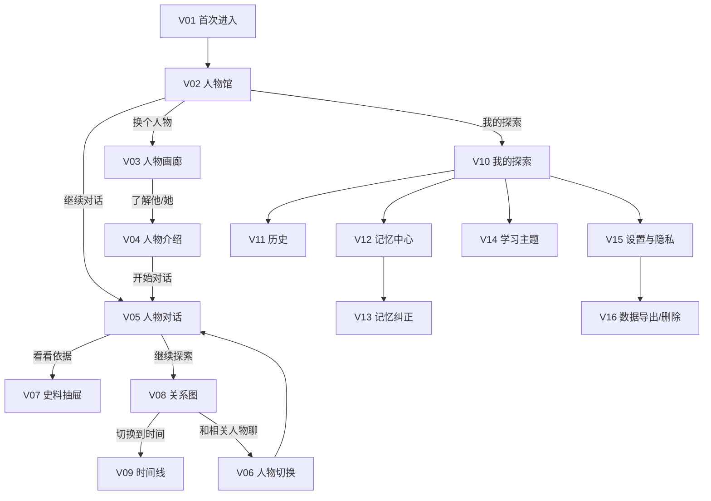
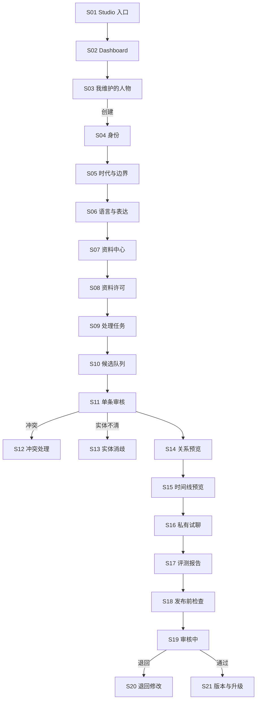

# AI Museum 完整 UI Flow Addendum

- 阶段：Stage 3 Addendum
- 状态：Draft v1 — awaiting approval
- 设计基线：[03-design.md](./03-design.md)
- 技术约束：[04-tech-design.md](./04-tech-design.md)
- 可点击原型：[design/ai-museum-click-prototype.html](./design/ai-museum-click-prototype.html)
- 日期：2026-07-16

> 导航修订说明：本文件的详细交互与异常处理仍有效；V02–V04 的“人物画廊”发现路径已由 [03-navigation-v3.md](./03-navigation-v3.md) 中的“主页 → 探索历史/直接找人 → 历史展厅”替代。导航 v3 批准后再统一重编号。

## 1. 范围与共同规则

本文件补齐访客端和 Studio 的页面、控件、跳转、异步状态、错误和恢复行为。工程阶段不得只实现 Happy Path。

### 1.1 三个界面概念

- **访客端 child mode**：轻快历史探险设计。
- **访客端 adult mode**：同功能、同结构、同语义，使用更克制的排版与色彩。
- **Studio**：维护者独立入口和导航，不属于访客主题切换。

`ui_mode` 不影响人物回答、权限、数据、安全和年龄规则。

### 1.2 全局交互规则

- 返回必须回到用户刚才的位置，保留滚动、输入草稿和已展开内容。
- destructive action 必须二次确认，并明确影响范围。
- 主按钮每页最多一个；最多两个次动作。
- 所有异步写操作先给即时本地反馈，再等待服务端确认。
- 断网、刷新和重复点击不得重复创建消息、任务、人物版本或审核决定。
- 所有错误回答三件事：发生了什么、内容是否保存、下一步能做什么。

## 2. 页面清单

### 2.1 访客端

| ID | 页面/覆盖层 | P0 | 主要目的 |
|---|---|---:|---|
| V01 | 首次进入与模式选择 | ✓ | 选择视觉模式、建立匿名身份 |
| V02 | 人物馆首页 | ✓ | 继续上次探索或选择人物 |
| V03 | 人物画廊 | ✓ | 一次浏览一个人物 |
| V04 | 人物介绍 | ✓ | 理解人物、时代、可聊主题 |
| V05 | 人物对话 | ✓ | 文字流式对话 |
| V06 | 人物切换覆盖层 | ✓ | 恢复另一人物的独立线程 |
| V07 | 史料依据抽屉 | ✓ | 查看逐断言来源 |
| V08 | 全屏关系图 | ✓ | 探索当前问题相关关系 |
| V09 | 全屏时间线 | ✓ | 探索当前问题相关事件 |
| V10 | 我的探索 | ✓ | 查看最近人物、主题和未完话题 |
| V11 | 对话历史 | ✓ | 分页、搜索和时间定位 |
| V12 | 记忆中心 | ✓ | 查看人物记忆与 Profile |
| V13 | 记忆纠正 | ✓ | 修改、暂停或忘记记忆 |
| V14 | 学习主题详情 | ✓ | 查看掌握状态和相关人物 |
| V15 | 设置与隐私 | ✓ | 模式、语言、动效、记忆和数据控制 |
| V16 | 数据导出/删除 | ✓ | 发起可审计的隐私操作 |
| V17 | 语音授权与转录确认 | P1 | Push-to-talk 前授权并编辑转录 |
| V18 | Guide 学习路线 | P1 | 查看、修改或跳过跨人物路线 |
| V19 | 媒体合影授权 | P1 | 照片上传、用途确认和任务状态 |

### 2.2 Studio

| ID | 页面/覆盖层 | P0 | 主要目的 |
|---|---|---:|---|
| S01 | Studio 入口 | ✓ | 登录/确认维护者身份 |
| S02 | Dashboard | ✓ | 人物、待办、阻塞和下一步 |
| S03 | 我维护的人物 | ✓ | 进入人物或创建/Fork/导入 |
| S04 | 创建人物：身份 | ✓ | 名称、生卒、身份依据 |
| S05 | 创建人物：时代与边界 | ✓ | 认知截止与可谈范围 |
| S06 | 创建人物：语言与表达 | ✓ | 语言、语气、适龄表达 |
| S07 | 资料中心 | ✓ | 上传文件或登记 URL |
| S08 | 资料许可 | ✓ | 声明权利依据和使用权限 |
| S09 | 上传/处理任务 | ✓ | 查看安全检查、OCR/转录进度 |
| S10 | 候选知识队列 | ✓ | 选择下一条待审核说法 |
| S11 | 单条候选审核 | ✓ | 接受、修改或拒绝 |
| S12 | 冲突处理 | ✓ | 比较来源并决定并存/拆分/拒绝 |
| S13 | 重复与实体消歧 | ✓ | 确认是否同一人物/地点/事件 |
| S14 | 关系图预览 | ✓ | 检查正式 Claim 投影 |
| S15 | 时间线预览 | ✓ | 检查时间与人物认知分类 |
| S16 | 私有试聊 | ✓ | 使用草稿进行非公开对话 |
| S17 | 自动评测报告 | ✓ | 查看事实、边界和注入问题 |
| S18 | 发布前检查 | ✓ | 解决阻塞问题并提交审核 |
| S19 | 提交成功/审核中 | ✓ | 查看审核状态，不能修改该提交 |
| S20 | 退回修改 | ✓ | 按审核意见创建修订 |
| S21 | 版本与升级 | ✓ | 查看版本、创建新草稿、回滚线程提示 |
| S22 | Fork 人物 | ✓ | 保留来源作者创建派生人物 |
| S23 | 包导入 | ✓ | 校验 ZIP/JSON-LD 并预览差异 |
| S24 | 包导出 | ✓ | 选择获许可资产并生成 ZIP |
| S25 | 协作者与权限 | P1 | 邀请维护者/审核者 |
| S26 | Agent 任务详情 | ✓ | 取消、确认、恢复长任务 |
| S27 | 媒体任务 | P1 | 授权、生成、检查和下载产物 |

## 3. 访客主流程



## 4. 访客页面级交互

### V01 首次进入与模式选择

**焦点**：产品是什么、视觉偏好、开始。

| 控件 | 行为 |
|---|---|
| `给孩子使用` | 设置 `ui_mode=child`，只改变主题预览 |
| `给成人使用` | 设置 `ui_mode=adult`，只改变主题预览 |
| `开始探索` | 创建/恢复匿名身份；成功进入 V02 |
| `隐私说明` | 原地打开简短抽屉，不离开当前选择 |

异常：Cookie 被禁用时说明只能临时使用、刷新可能失去历史；仍允许进入，但发送首条消息前再次提示。

### V02 人物馆首页

**默认**：有历史时突出一条“继续与人物对话”；无历史时突出官方示范人物。

| 控件 | 行为 |
|---|---|
| `继续和我聊` | 立即显示本地缓存并进入 V05；后台同步增量消息 |
| `换个人物` | 进入 V03，保留 V02 位置 |
| `给我一个问题` | 从当前人物包的已审核问题中随机选择，不调用模型；显示后按钮变为 `拿这个去问` |
| `人物馆` | 当前页，无重复导航 |
| `我的探索` | 进入 V10 |
| 头像 | 打开小菜单：模式、帮助、隐私；不铺开完整设置 |

状态：首次空状态、缓存恢复中、服务端同步失败、人物版本有更新、无已发布人物。

### V03 人物画廊

一次只聚焦一个人物。左右滑动/箭头切换，屏幕阅读器使用列表语义。

| 控件 | 行为 |
|---|---|
| 左右箭头/滑动 | 切换焦点人物，不创建线程 |
| `了解他/她` | 进入 V04 |
| `直接聊聊` | 获取或创建该人物线程，进入 V05 |
| 主题筛选 | 单选主题；只改变人物顺序，不隐藏全部人物 |

空结果保留“显示全部人物”，不显示空白页。

### V04 人物介绍

展示肖像、生活年代、三个可聊主题、一句人物自述和人物包版本。

| 控件 | 行为 |
|---|---|
| `开始对话` | 获取/创建线程并进入 V05 |
| `看他认识谁` | 进入以该人物为中心的 V08 |
| `返回` | 回到 V03 原人物位置 |

### V05 人物对话

#### 发送消息

1. 用户在唯一 textbox 输入；前端保存草稿到当前 `threadId`。
2. 点击发送或 `Ctrl/⌘+Enter`；空白、超长或只含控制字符时不提交并原地解释。
3. 前端立即追加用户气泡，textbox 清空但保留可撤销草稿 10 秒。
4. 生成 `clientMessageId + Idempotency-Key`，打开 SSE。
5. 收到 `meta` 后记录人物版本；收到 `delta` 逐段显示。
6. 生成期间发送按钮变为 `停一下`；点击后取消请求，保留已生成内容并标记未完成。
7. 收到 `citation` 时只累计，不打断阅读；`done` 后显示 `看看依据`。
8. 断流时显示 `接着回答`；重试复用同一用户消息，不重复写入。

| 控件 | 行为 |
|---|---|
| textbox | 输入问题；最多 4,000 字；自动增长到 5 行后内部滚动 |
| 语音按钮 | P0 显示“即将支持”；P1 进入 V17 |
| `发送` | 触发上述发送流程 |
| `停一下` | Abort 生成；assistant message 记为 interrupted |
| `接着回答` | 从 interrupted message 恢复或重新生成；明确可能措辞不同 |
| `看看依据` | 打开 V07，不离开对话 |
| `继续探索` | 根据 answer link 进入 V08 或 V09 |
| `换人物` | 打开 V06 |
| 记忆 `对，我记得` | 增加确认信号，收起提示 |
| 记忆 `不是这样` | 立即 suppress；进入轻量 V13 |

特殊回答：无史料、争议、人物不知道的现代知识、注入/越界、敏感问题、模型配额、离线、人物版本失效。

### V06 人物切换覆盖层

- 展示目标人物和其独立线程摘要。
- 文案明确“会恢复与目标人物的历史；不会分享当前人物私聊”。
- `进入对话`：先读缓存，切换 URL，后台同步。
- `先不换`：关闭覆盖层，恢复原滚动位置。
- 如果目标人物无历史，显示“第一次见面”，不伪造摘要。

### V07 史料依据抽屉

- 默认定位当前回答第一条历史断言。
- 断言 tabs 最多显示 3 个，更多使用“其余 N 条”。
- 每条展示来源标题、类型、定位、摘录许可和争议状态。
- `查看原位置`：获许可则打开受控预览；link-only 新标签打开原网页并提示离开平台。
- 来源撤销时显示“该依据已撤销”，对应回答仍保留历史审计，但不允许再次当作有效证据。
- `看完了` 关闭抽屉并恢复对话。

### V08/V09 关系图与时间线

- 一次只显示与进入问题相关的 5–9 个节点/事件。
- `关系/时间` 是二选一视图切换。
- 点击节点只选中并展示一张说明卡，不立即跳转。
- `和这个人物聊` 打开 V06。
- `回到对话` 恢复 V05 原位置。
- 图谱不可用时显示等价列表；键盘和屏幕阅读器默认使用列表。

### V10 我的探索

只展示最近人物、一个活跃主题、人物记忆入口。`全部历史` → V11；`人物记得什么` → V12；主题 → V14；头像菜单 → V15。

### V11 对话历史

- 人物筛选为单选；搜索输入防抖 300ms。
- 结果显示前后一句上下文。
- 点击结果进入 V05 并定位 message；若消息属于旧 epoch，顶部显示当时人物版本。
- 无结果提供清除搜索，不推荐无关内容。

### V12/V13 记忆中心与纠正

- V12 先按人物分组，不混排全部推断。
- 记忆卡展示内容、范围、确定程度、来源和最近调用。
- `纠正` 打开 V13 textbox；保存创建新 revision，旧版保留审计。
- `暂停` 立即退出召回但保留内容；可恢复。
- `忘记` 二次确认后删除正文、向量和召回索引；来源消息本身不因此删除。
- 敏感候选显示 `是否记住`，未经确认不进入上下文。

### V14 学习主题

展示 `刚接触/正在练习/已经掌握/需要复习`，不显示伪精确分数。提供 `继续问当前人物` 和 `换个角度听另一人物`；后者进入 V06。不得显示学习来源来自哪段其他人物私聊。

### V15/V16 设置、导出与删除

- 模式切换即时预览，保存后跨设备同步；失败回滚并说明。
- 记忆总开关关闭后停止新建和召回，不自动删除旧记忆。
- 导出创建异步任务；完成后提供有时效下载链接。
- 删除人物对话只影响该 thread；删除账户覆盖全部个人消息、摘要、记忆、向量和产物。
- 输入确认词后才能提交账户删除；任务执行前提供冷静期和取消入口（适用政策允许时）。

## 5. Studio 主流程



## 6. Studio 页面级交互

### S01–S03 入口、Dashboard、人物列表

- 无权限访问 Studio 时回到访客端并解释，不显示空 Dashboard。
- Dashboard 卡只允许跳转到明确待办。
- `创建人物` 提供三个入口：从空白创建、Fork 已发布人物、导入人物包。
- 人物列表支持状态筛选和名称搜索；不默认显示技术 ID。

### S04 身份

字段：多语言名称、出生、去世、身份依据 URL/文件、作者显示名。`保存并继续` 先客户端校验再服务端校验。人物未去世则允许保存私有草稿，但阻止公共提交。日期不确定可选择“约/范围/未知”，不能强迫伪精确日期。

### S05 时代与边界

字段：知识截止、主要主题（1–3）、有限主题、禁止主题、人物不知道的模式。提供自然语言例子；高级 JSON 放在“更多设置”，不在默认界面。

### S06 语言与表达

字段：语言、表达特点、价值立场、拒答方式、不同年龄表达示例。`生成示例` 调用模型只产生草稿，必须人工保存。

### S07/S08 资料与许可

#### 文件上传

1. `添加资料` → 选择“上传文件”或“登记网页”。
2. 选择文件后立即显示类型、大小和限制；不合格不发起上传。
3. 进入 S08 选择权利依据和权限；未完成许可不能上传。
4. 服务端创建 signed upload session；浏览器直传对象存储。
5. 可暂停/重试分片上传；完成后校验 SHA-256。
6. 成功进入 S09；重复文件提示复用现有资料或保留新来源元数据。

#### URL

- 只接受 HTTP(S)，输入时不自动抓取。
- 完成许可声明后点击 `检查并登记` 才访问。
- SSRF/登录墙/超大/禁止访问时说明具体原因；仍可选择只保存链接元数据。

### S09 处理任务

步骤：安全检查 → 去重 → 文本/OCR/转录 → 分段定位 → 候选提取。显示步骤而非伪精确百分比。`取消处理` 保留原资料但停止后续步骤；`重试` 从失败步骤继续。等待人工决定时跳转 S10。

### S10–S13 候选审核

- S10 只显示分类数量和“继续下一条”，可筛选新增/冲突/重复/低置信/缺证据。
- S11 一次显示一条说法、来源和三个决定。
- `确认正确` 使用 expectedRevision；并发冲突返回 409，重新加载差异。
- `需要修改` 允许编辑 subject/predicate/object/time/status，但保存前必须选择证据。
- `不是这样` 要求可选原因，不要求长说明。
- 冲突可以并存，使用 `established/disputed/self-reported/later-assessment/inference`，不强迫合并。
- 实体消歧展示名字、年代、地点和关联来源；`不是同一个` 创建独立实体。

### S14/S15 图谱与时间线预览

只显示已接受 Claim。图/时间错误不能直接拖动修改事实；点击关系或事件回到支撑 Claim 的审核/编辑页。无来源边永远不能保存。

### S16 私有试聊

- 顶部持续显示“草稿试聊，不是公开人物”。
- 试聊只能使用当前草稿已接受 Claim。
- 每个回答提供 `事实问题/语气问题/边界问题` 标记，生成修复候选。
- 不把试聊消息混入访客长期线程和 mastery。

### S17 自动评测

分类显示事实、争议、身后事件、Prompt 注入、年龄表达、引用完整性。失败项提供测试输入、实际结果、期望和 `创建修复任务`；评测 Agent 不能直接改版本。

### S18–S20 提交、审核、退回

- 发布前检查按身份、已故状态、史料、许可、边界、测试和未审候选列出阻塞。
- `提交审核` 只在阻塞为 0 时可用；二次确认版本将冻结。
- 审核中版本只读；需要修改时创建新的 draft revision，不覆盖提交快照。
- 退回页按审核意见逐条跳转到对应页面；重新提交形成新审计事件。

### S21–S24 版本、Fork、导入导出

- 新版本由已发布版本复制为 Draft；旧线程不自动升级。
- Fork 显示原人物、版本、作者和许可；派生作者不可删除来源声明。
- 导入先在隔离区校验 Schema、ID、版本、许可、路径和可执行内容，再显示差异；确认后才创建草稿。
- 导出默认排除无再发布权限原件，生成清单说明哪些资产被排除及原因。

### S26 Agent 任务详情

显示计划、当前步骤、耗时、授权点和产物。`取消` 在安全点停止；`重试` 从失败步骤恢复；`确认继续` 只确认当前授权，不扩大任务权限。失败提供 error code 的人话解释。

## 7. 全局状态矩阵

| 场景 | 访客端 | Studio | 恢复策略 |
|---|---|---|---|
| 离线 | 保留草稿和缓存历史，禁止发送 | 保留未提交表单和审核草稿 | 恢复网络后用户主动重试 |
| 401/身份失效 | 尝试刷新匿名/登录会话 | 回到 Studio 入口 | 未提交内容保存在本地加密/短期缓存 |
| 403 | 说明无权限，不泄露资源存在性 | 显示申请权限路径 | 不自动重试 |
| 404 人物/版本 | 从缓存退出并回人物馆 | 版本列表显示已归档 | 不静默切到别的版本 |
| 409 并发冲突 | 合并新增消息 | 展示审核/草稿差异 | 用户确认后重做决定 |
| 413 超限 | 不适用普通聊天 | 上传前和服务端双重提示 | 选择较小文件/拆分资料 |
| 429 限流 | 保留问题，显示 retry-after | 保留任务输入 | 到时允许重试，不伪回答 |
| Provider 超时 | 保留部分回答 | 步骤失败可恢复 | 有限自动重试后交给用户 |
| 数据库短暂失败 | 本地状态标记未同步 | 表单标记未保存 | 幂等重试 |
| 来源撤销 | 历史引用标记撤销 | 显示受影响 Claim | 从回答索引移除，保留审计 |
| 人物版本升级 | 继续旧 epoch | 新版本独立草稿 | 访客明确确认后升级线程 |
| Mock | 持续开发横幅 | 持续开发横幅 | 禁止公开评测/发布 |

## 8. 可访问性与输入

- 所有流程可用键盘完成；焦点顺序与视觉顺序一致。
- 覆盖层打开后焦点锁定，关闭后回到触发控件。
- 图谱提供等价关系列表，时间线提供纯文本列表。
- 颜色不是唯一状态；所有图标有文本。
- 屏幕阅读器对流式回答每个自然段播报一次，不逐 token 打断。
- 输入法组合期间 Enter 不发送。
- Touch target：访客 48px，Studio 44px。
- `prefers-reduced-motion` 下移除轨迹和位移动效。

## 9. 路由建议

```text
/                         首次进入/人物馆
/characters               人物画廊
/characters/:id           人物介绍
/chat/:characterId        持续线程对话
/explore/:characterId     关系图/时间线
/me                       我的探索
/me/history               对话历史
/me/memories              记忆中心
/me/topics/:topicId       学习主题
/settings                 设置与隐私
/studio                   Studio Dashboard
/studio/characters        我维护的人物
/studio/characters/:id/*  向导、资料、审核、预览、评测、发布、版本
/studio/tasks/:id         Agent/处理任务详情
```

抽屉和覆盖层使用可分享的 query/hash 状态，例如 `?panel=sources&message=...`，关闭时恢复原 URL；不为每个小弹层创建完全独立页面。

## 10. Gate 验收

- [x] 列出访客端和 Studio 页面。
- [x] 说明主要按钮、textbox、校验、导航和后台行为。
- [x] 覆盖聊天流、人物切换、来源、图谱、时间线、记忆、学习和隐私。
- [x] 覆盖人物创建、资料、许可、处理、候选审核、试聊、评测和发布。
- [x] 覆盖空状态、断网、错误、并发、限流、版本和撤销。
- [x] 规定儿童/成人主题同功能边界。
- [x] 可点击原型完成并通过脚本语法与关键路由静态检查。
- [ ] 用户批准后进入 Stage 5。
