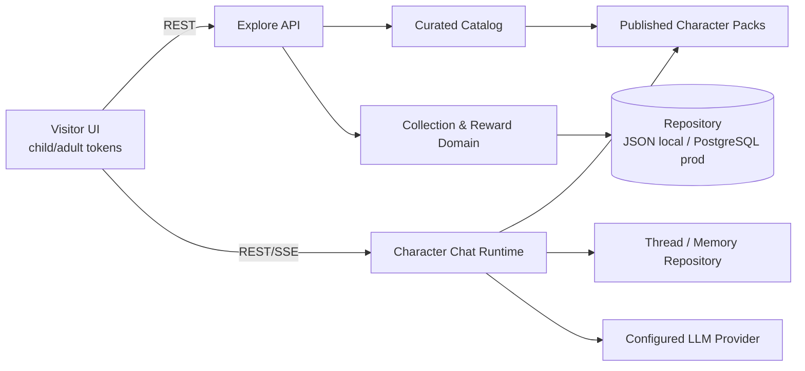

# Stage 4 v6 — 历史探索与人物收藏技术架构

- 日期：2026-07-16
- 状态：Approved by explicit advance authorization
- 产品基线：[02-prd-remediation-v3.md](./02-prd-remediation-v3.md)
- 设计基线：[03-design-v6-remediation.md](./03-design-v6-remediation.md)
- 总体架构基线：[04-tech-design.md](./04-tech-design.md)

## 1. 本轮目标与边界

本轮将 v6 的访客体验落实为可运行的 HTTP 产品：3 个历史时期、36 位人物、历史展厅、人物相遇、学习奖励、卡包、人物资料、关系搜索和每人物唯一长期线程。

不在本切片完成生产 PostgreSQL 部署、真实媒体生成、完整 OCR 或公共发布审核。已有 Chat、Memory、Agent、人物包和 Studio 模块继续保留；访客界面不暴露维护端复杂度。

## 2. 技术选项

| 方案 | 说明 | 优点 | 风险 | 结论 |
|---|---|---|---|---|
| A. 服务端权威垂直切片 | Next.js Route Handler + Repository；浏览器只缓存 UI 偏好 | 奖励和拥有状态一致，可迁移 PostgreSQL | 需要新增领域模型与 API | **采用** |
| B. 纯浏览器状态 | 所有星星、卡牌和进度保存在 localStorage | 最快 | 可篡改、跨设备丢失、无法审计 | 拒绝 |
| C. 独立收藏微服务 | 单独部署 Reward/Draw 服务 | 可独立扩缩容 | MVP 运维和一致性复杂度过高 | 暂缓 |

本地开发使用 JSON 文件 Repository；它与生产 PostgreSQL Repository 实现相同领域接口。JSON 文件不定义公共数据契约，也不承担多实例并发。

## 3. 系统边界



边界规则：

- `Catalog` 定义人物属于哪个时期、展厅、卡级和关系线索，不替代人物包 Claim；
- `Collection` 只控制长期关系入口，不锁定公开生平、来源与博物馆相遇；
- `Reward` 只接受服务端定义的有效学习事件；客户端不能直接提交星星数量；
- `Draw` 在同一事务中写消费、结果、拥有集合和重复补偿，响应失败可用幂等键恢复；
- `Chat Runtime` 继续只读取已发布人物包和当前人物的线程/记忆。

## 4. 功能模块

### 4.1 Curated Catalog

提供三个 `HistoricalPeriod`，每组固定 12 位 `CatalogCharacter` 与至少三个 `ExhibitHall`。人物以稳定 `characterId` 连接人物包、收藏、搜索与线程。卡级含义是本时期策展深度，不评价人物价值。

### 4.2 Exploration Progress

记录用户是否查看史料、完成相遇，以及首次免费开包资格。事件使用 `userId + idempotencyKey` 唯一；重复请求返回原结果，不重复奖励。

### 4.3 Collection 与 Reward Ledger

`UserCollection` 保存星星余额、史料碎片、首次免费资格和已拥有 ID。`RewardLedger` 保存每次增减原因和关联资源。余额由账本投影得出或在同一事务中更新，禁止客户端指定余额。

### 4.4 Draw Transaction

抽取状态为 `created → committed → revealed`。`committed` 已经是最终结果；揭晓只是 UI 展示。首次免费抽取保证未拥有；普通抽取遵守卡池权重，重复人物转化为史料碎片。卡池全部拥有时拒绝继续随机抽取。

### 4.5 Visitor Shell

`child/adult` 共用组件、路由语义、数据与权限，只切换 Design Token 和辅助信息密度。访客一级导航只有主页、探索历史、我的博物馆；搜索为悬浮层。Studio、Memory、Agent 通过独立路径保留，不进入儿童主导航。

## 5. 数据模型

```ts
type HistoricalPeriod = {
  id: string; title: string; years: string; places: string[];
  inquiry: string; hallIds: string[]; characterIds: string[];
};

type CatalogCharacter = {
  id: string; periodId: string; displayName: string;
  tier: "white" | "blue" | "purple" | "orange" | "gold";
  curatorRole: string; relationCharacterIds: string[];
};

type UserCollection = {
  userId: string; ownedCharacterIds: string[];
  stars: number; fragments: number;
  firstFreeEligible: boolean; firstFreeUsed: boolean;
  revision: number; updatedAt: string;
};

type LearningEvent = {
  id: string; userId: string; characterId: string; periodId: string;
  type: "evidence_viewed" | "encounter_completed" | "meaningful_question";
  idempotencyKey: string; rewardStars: number; createdAt: string;
};

type DrawTransaction = {
  id: string; userId: string; periodId: string; idempotencyKey: string;
  costStars: number; resultCharacterId: string; duplicate: boolean;
  fragmentReward: number; status: "committed" | "revealed";
  createdAt: string; revealedAt?: string;
};
```

生产表增加 `historical_periods`, `catalog_characters`, `exhibit_halls`, `user_collections`, `learning_events`, `reward_ledger`, `draw_transactions`。唯一约束包括：

- `catalog_characters(character_id)`；
- `user_collections(user_id)`；
- `learning_events(user_id, idempotency_key)`；
- `draw_transactions(user_id, idempotency_key)`；
- `character_threads(user_id, character_id)`。

## 6. API

### `GET /api/explore`

返回时期、展厅、36 人轻量目录、当前收藏状态和最近未确认揭晓。公开人物资料不因拥有状态过滤。

### `POST /api/exploration-events`

```json
{
  "characterId": "albert-einstein",
  "periodId": "physics-revolution",
  "type": "encounter_completed",
  "idempotencyKey": "client-generated-id"
}
```

服务端验证人物与时期关系。完成相遇奖励 20 星，并在首次完成时开放免费抽取；同键重试不重复奖励。

### `POST /api/draws`

```json
{ "periodId": "physics-revolution", "idempotencyKey": "client-generated-id" }
```

响应包含 committed 结果、最新余额和收藏投影。先提交结果再响应；网络重试使用同一键恢复。

### `POST /api/draws/:id/reveal`

只将展示状态改为 revealed，不改变人物、余额或重复补偿。

### 对话

继续使用 `POST /api/threads` 与 `POST /api/threads/:id/messages`。人物卡只打开 `userId + characterId` 的既有线程，不创建收藏专用线程。

## 7. LLM Provider

MVP 使用受控服务端 Provider，人物包不能选择供应商。对话采用 LLM-first：通过安全、提示词注入和时代错位检查后，即使没有命中 Claim 也可在人物身份与认知边界内回答。接口接收人物 Persona、相关的一跳关系、可选 Claim、年龄段、当前人物记忆和近期线程；不接收其他人物私聊。配置缺失时开发环境明确显示规则模式，不伪装为模型回答。

首个实现支持 OpenAI-compatible HTTPS 配置：`MODEL_API_URL`, `MODEL_API_KEY`, `MODEL_NAME`。Key 只存在服务端环境变量；请求日志与 Browser 产物不得包含 Key。Provider 返回后仍核验其声明使用的 Claim ID；无 Claim 的回答显示为“模型角色演绎”，有 Claim 的回答显示为“馆藏史料增强”。关系分为 `public-source` 与 `model-suggested`：后者只能使用不确定表达，不能声称亲自认识、通信或合作。

## 8. 安全、隐私与儿童保护

- 访客身份为 HttpOnly、SameSite Cookie；收藏与线程均按服务端身份读取；
- 学习事件类型、奖励数和抽取成本由服务端白名单决定；
- 所有写操作使用幂等键，生产环境使用数据库事务和 revision；
- 卡包不提供购买、限时倒计时、连续登录或付费入口；公开概率与保底；
- 未拥有人物的基本资料、来源和引导式相遇始终开放；
- `ui_mode` 不改变事实、年龄安全和权限；
- 关系搜索只返回正式目录关系；正式版本需由 Claim/Relationship 支持；
- 历史消息、搜索词和人物资料均按不可信输入处理。

## 9. 可观测与验收

记录 `requestId`, `userId` 哈希、学习事件、账本原因、drawId、人物包版本、Provider mode、耗时和错误码，不记录 Cookie、Key 或完整儿童私聊。

Stage 5 必须验证：

- 3组各12人、36个唯一人物 ID 和正确卡级结构；
- 切换双模式不改变收藏和线程；
- 搜索为悬浮层且关系人物状态一致；
- 首次完成相遇只奖励一次，免费抽取只使用一次；
- 抽取结果先提交，刷新后仍在收藏中；
- 未拥有人物可看资料和相遇，但不能进入长期线程；
- 已拥有人物进入唯一长期线程并恢复历史；
- 缺少模型配置时持续标明规则模式；
- 桌面与窄屏可用，无关键控制台错误。

## 10. Stage 5 实施顺序

1. 增加 36 人 Catalog 与人物包；
2. 增加 Collection/Reward/Draw 领域与持久 Repository；
3. 增加 Explore/Event/Draw API；
4. 以 v6 组件替换访客端 `/museum`；
5. 保留并嵌入现有长期线程与引用展示；
6. 增加领域测试、类型检查、构建验证；
7. 通过 HTTP 启动本地环境并执行 Browser 深度测试。

## 11. Gate 4

- [x] 系统层与模块边界；
- [x] 至少两种方案及推荐理由；
- [x] 数据与存储模型；
- [x] API 与状态不变量；
- [x] LLM/Agent 边界；
- [x] 安全、隐私、可观测和本地部署；
- [x] Stage 5 实施顺序；
- [x] 用户已明确授权 Stage 4 完成后直接进入 Stage 5。
