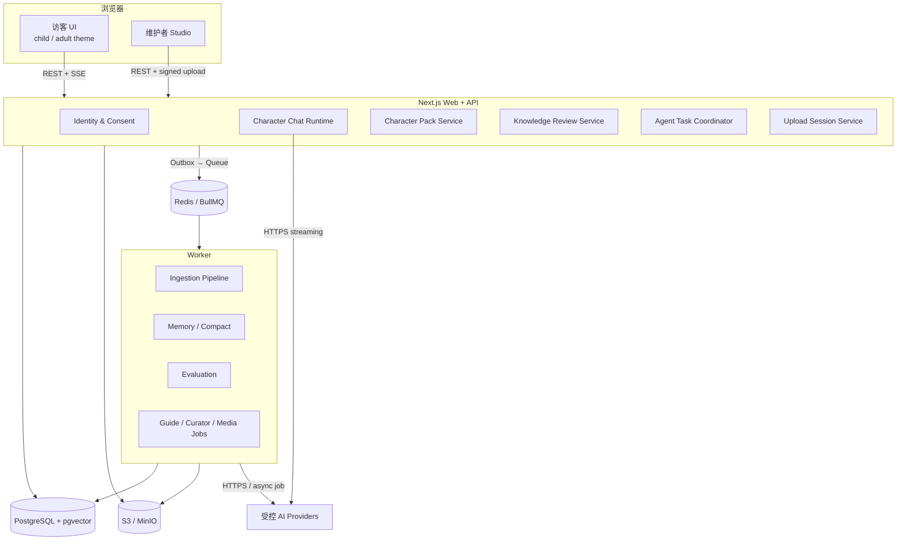
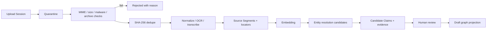

# AI Museum 技术设计

- 阶段：Stage 4
- 状态：Approved with v6 addendum
- 批准日期：2026-07-16
- 产品基线：[02-prd.md](./02-prd.md)
- 设计基线：[03-design.md](./03-design.md)
- 日期：2026-07-16
- v6 增补：[04-tech-design-v6.md](./04-tech-design-v6.md)

## 1. 技术目标

MVP 需要同时支撑四类能力：

1. 低延迟、有证据、具备长期人物记忆的流式对话。
2. 声明式、可版本化、可导入导出的人物包。
3. 多模态资料的安全异步处理和人工知识审核。
4. 可暂停、可恢复、可审计的专业 Agent 任务。

本阶段不实现代码。技术设计批准后，Stage 5 才开始迁移数据库、接入真实 Provider 和改造现有原型。

## 2. 已确认的关键边界

### 2.1 访客双 UI 模式

`child` 与 `adult` 是纯表现层主题，不是不同产品能力：

- 共用路由、React 组件语义、API、线程、记忆、人物包和权限。
- `ui_mode` 只影响 Design Token、排版密度、插画、动效和辅助文案。
- `ui_mode` 与 `age_band` 分离。成人视觉模式不会自动获得成人内容；儿童视觉模式也不会改变历史事实。
- 匿名用户偏好保存在签名 Cookie 和设备本地缓存；登录后同步到 `user_preferences`。
- Studio 是单独应用区域，不是 `adult` 主题。

### 2.2 人物对话不是开放式 Agent

Character Chat Runtime 是确定性流水线。它只能读取当前已发布人物版本、检索证据、召回当前人物记忆并调用模型生成；不能自主联网、修改知识或调用媒体工具。

### 2.3 知识永远先候选、后人工确认

OCR、转录、实体识别和 LLM 提取只能写入 Candidate 区。正式 Claim 必须经过维护者或审核者的显式决定，发布版本不可覆盖。

## 3. 架构选项比较

### 3.1 选项 A：模块化单体 Web API + 独立 Worker（推荐）

- 一个 Next.js Web 应用承载访客端、Studio 和同源 API。
- 一个独立 Worker 进程处理资料、记忆 compact、评测和长 Agent 任务。
- PostgreSQL 是系统记录源；Redis/BullMQ 负责任务调度；S3/MinIO 保存二进制对象。
- 业务模块通过 TypeScript 接口隔离，不在进程内互相读取私有表实现。

优点：部署简单、事务边界清楚、开发和本地贡献门槛低；保留未来拆服务的模块边界。缺点：Web API 仍共享部署单元，需要通过代码所有权和模块接口防止耦合。

### 3.2 选项 B：按领域拆分微服务

- Chat、Knowledge、Identity、Agent、Media 分别部署。
- 使用事件总线或 gRPC/HTTP 通信，每个服务拥有独立数据库 Schema 或数据库。

优点：独立扩缩容、故障隔离强。缺点：MVP 会立即引入服务发现、分布式追踪、消息一致性、跨服务授权和多套本地环境；对开源贡献者非常不友好。

### 3.3 选项 C：全托管 BaaS + Serverless Functions

- 使用托管 PostgreSQL、对象存储、身份和短函数。
- 长任务依赖厂商任务系统或第三方工作流。

优点：早期运维量小。缺点：长时间 OCR/转录、可恢复 Agent、流式生成和本地开源部署容易被平台限制；厂商绑定强。

### 3.4 结论

选择 A。它与现有 monorepo、Next.js、Worker、PostgreSQL/pgvector、Redis、MinIO 基线一致。模块接口设计成可远程化，只有当真实负载或团队边界证明有必要时才拆分服务。

| 维度 | A 模块化单体 + Worker | B 微服务 | C BaaS/Serverless |
|---|---:|---:|---:|
| MVP 交付速度 | 高 | 低 | 中高 |
| 本地开源体验 | 高 | 低 | 中低 |
| 长任务适配 | 高 | 高 | 中低 |
| 事务一致性 | 高 | 低 | 中 |
| 独立扩缩容 | 中 | 高 | 中 |
| 厂商可迁移性 | 高 | 高 | 低 |

## 4. 系统总览



## 5. Monorepo 与模块边界

建议保留 npm workspaces，并演进为：

```text
apps/
  web/                 # Next.js 访客端、Studio、BFF/API
  worker/              # BullMQ consumers 与定时任务
packages/
  sdk/                 # 人物包 Schema、公共 DTO、Provider contracts
  domain/              # 纯领域规则，不依赖 Next/DB
  db/                  # migrations、typed repositories、事务管理
  providers/           # 模型、Embedding、转录、存储适配器
  ui/                  # 共享无样式语义组件和两套 visitor tokens
  characters/          # 官方样例人物包；与第三方包走相同校验
infra/
  migrations/
  compose/
docs/
```

依赖方向固定为：`apps → providers/db/ui → domain/sdk`。`domain` 和 `sdk` 不得反向依赖数据库、Next.js 或供应商 SDK。

## 6. 功能模块

### 6.1 Identity、Profile 与 Consent

- 创建 HttpOnly 匿名访客身份，登录后幂等合并。
- 维护 `age_band`、locale、无障碍偏好和 `ui_mode`。
- `age_band` 影响安全与表达；`ui_mode` 只影响界面。
- 管理儿童相关同意、照片/媒体授权、记忆开关和数据导出删除。
- Profile 不保存 API Key；密钥只存在服务端 Secret。

### 6.2 Character Pack Service

- 管理人物、草稿、版本、Fork、导入、导出和发布状态机。
- Draft 可修改；Published 为不可变快照。
- 官方样例和第三方人物包使用相同 Schema 与 Runtime。
- 包内只允许声明式 JSON/JSON-LD 和获许可媒体，不允许脚本或二进制插件。

### 6.3 Knowledge Service

- 管理 Source Asset、Source Segment、Candidate Claim、正式 Claim、Entity 和 Relationship。
- 提供单条候选的乐观并发审核。
- 撤销来源后重算证据支持；无有效证据 Claim 退出回答索引。
- 图谱与时间线是 Claim 的投影，不是独立真相源。

### 6.4 Character Chat Runtime

每一轮按固定顺序执行：

1. 鉴权、限流和线程版本固定。
2. 年龄安全、问题分类和人物边界预判。
3. 召回近期消息、Episode Summary、当前人物记忆和无来源 mastery 信号。
4. 检索正式 Claim、证据段落和相关实体邻域。
5. 组装有 token 预算的上下文。
6. Model Provider 流式生成结构化回答计划与文本。
7. 逐断言映射 Claim；无法映射的历史断言删除、重写或拒绝。
8. SSE 返回完成事件和引用。
9. 异步创建 compact、记忆候选和学习证据任务。

### 6.5 Memory Service

- 原始消息是永久归档源；Summary 和 Memory 是可重建投影。
- `character_relationship` 与推断 preference 按 `user_id + character_id` 隔离。
- 显式 Profile 可全局读取；mastery 只共享主题与级别，不共享来源线程。
- 每条记忆保留来源消息、版本、置信度、重要度、敏感性和状态。
- 用户否认后状态改为 `suppressed`，立即退出召回；纠正创建新 revision。
- Compact 不覆盖消息，以 `message_start_id/message_end_id` 记录覆盖范围。

### 6.6 Agent Task Coordinator

- 支持 Guide、Knowledge Curator、Evaluation、Media 四类任务。
- 每类任务使用代码定义的有限状态图，不允许模型自由循环。
- 工具来自管理员白名单，输入输出均经 Zod/JSON Schema 校验。
- 授权、发布、高成本生成和用户照片处理进入 `waiting_review`。
- 单步默认最多自动重试两次；非幂等 Provider 操作必须使用供应商幂等键或先查询原任务。

### 6.7 Provider Registry

接口包括：

- `ChatModelProvider`
- `StructuredModelProvider`
- `EmbeddingProvider`
- `TranscriptionProvider`
- `OcrProvider`
- `ImageGenerationProvider`
- `VideoGenerationProvider`
- `SpeechProvider`
- `ObjectStorage`

人物包不能选择任意 Provider；管理员通过环境配置注册，并为每种能力指定默认实现、预算和允许的数据区域。

## 7. 数据存储策略

### 7.1 PostgreSQL

保存身份、权限、业务状态、人物版本、知识图谱、消息、记忆、任务和审计，是唯一系统记录源。

### 7.2 pgvector

保存 Claim、Source Segment、Episode Summary 和 Memory 的语义向量。MVP 只启用一个主 Embedding Space；每条向量记录 `provider/model/dimension/version/content_hash`。更换模型时后台建立新空间并重嵌入，不原地覆盖旧向量。

当前 `vector(1536)` 不应成为公共 Schema 承诺。实现时由主 Embedding 模型决定固定维度，并通过新表/新索引迁移切换。

### 7.3 S3/MinIO

保存上传原件、隔离区文件、派生 OCR/转录、关键帧和媒体产物。数据库只保存 Object Key、哈希、MIME、大小、状态和许可。

对象 Key 不使用原始文件名：

`tenant/{ownerId}/asset/{assetId}/original/{sha256}`

派生物：

`tenant/{ownerId}/asset/{assetId}/derived/{pipelineVersion}/{artifactId}`

### 7.4 Redis/BullMQ

只保存短期队列、租约、延迟重试和速率计数，不作为任务真实状态源。任务状态先写 PostgreSQL，再通过 Transactional Outbox 投递队列。

## 8. 核心数据模型

### 8.1 身份与偏好

| 表 | 关键字段 |
|---|---|
| `users` | `id`, `status`, `created_at`, `deleted_at` |
| `guest_identities` | `guest_id`, `user_id`, `merged_into`, `created_at` |
| `user_profiles` | `user_id`, `display_name`, `age_band`, `locale` |
| `user_preferences` | `user_id`, `ui_mode`, `reduced_motion`, `voice_enabled`, `memory_enabled`, `revision` |
| `consents` | `id`, `user_id`, `type`, `scope`, `status`, `policy_version`, `expires_at`, `revoked_at` |

`ui_mode` 只允许 `child | adult`，不得被 Chat Runtime 用于决定事实或权限。

### 8.2 人物与版本

| 表 | 关键字段 |
|---|---|
| `characters` | `id`, `owner_id`, `canonical_name`, `visibility`, `created_at` |
| `character_collaborators` | `character_id`, `user_id`, `role` |
| `character_versions` | `id`, `character_id`, `semver`, `status`, `schema_version`, `pack_snapshot`, `created_by`, `published_at` |
| `character_boundaries` | `version_id`, cutoff、topics、modern policy |
| `character_personas` | `version_id`, locale、tone、age rules、refusal style |
| `character_forks` | `child_character_id`, `source_character_id`, `source_version_id`, `source_author_id` |

发布时在同一事务中：冻结规范化行、生成 `pack_snapshot`、构建检索投影、写 Outbox。`pack_snapshot` 用于精确导出和历史重放；规范化表用于查询和约束。

### 8.3 资料与知识

| 表 | 关键字段 |
|---|---|
| `source_assets` | `id`, `character_id`, `draft_version_id`, `kind`, `original_name`, `detected_mime`, `size`, `sha256`, `storage_key`, `external_url`, `status` |
| `source_licenses` | `asset_id`, `basis`, `license_code`, permissions、attribution、evidence |
| `source_segments` | `id`, `asset_id`, `segment_type`, `text`, `locator_json`, `start_ms`, `end_ms`, `page_no`, `content_hash` |
| `ingestion_jobs` | `id`, `asset_id`, `pipeline_version`, `status`, `attempt`, `idempotency_key`, `error_code` |
| `ingestion_steps` | `job_id`, `step`, `status`, `input_hash`, `artifact_key`, `started_at`, `finished_at` |
| `candidate_claims` | `id`, `version_id`, `body`, `classification`, `review_status`, `revision`, `created_by_run_id` |
| `candidate_evidence` | `candidate_id`, `segment_id`, `quote`, `locator_json` |
| `entities` | `id`, `version_id`, `type`, localized names、dates |
| `claims` | `id`, `version_id`, subject、predicate、object/value、time、status、confidence、perspective |
| `claim_evidence` | `claim_id`, `segment_id`, `source_id`, `locator_json`, `support_status` |
| `relationships` | `id`, `version_id`, `from_entity_id`, `to_entity_id`, `type` |
| `relationship_claims` | `relationship_id`, `claim_id` |

`locator_json` 使用判别联合：

```ts
type SourceLocator =
  | { kind: "page"; page: number; bbox?: [number, number, number, number] }
  | { kind: "text"; start: number; end: number; heading?: string }
  | { kind: "time"; startMs: number; endMs: number }
  | { kind: "web"; selector?: string; paragraph?: number; capturedAt: string };
```

### 8.4 对话、记忆与掌握度

| 表 | 关键字段 |
|---|---|
| `character_threads` | `id`, `user_id`, `character_id`, `current_epoch_id`, `updated_at`；唯一 `(user_id, character_id)` |
| `thread_epochs` | `id`, `thread_id`, `character_version_id`, `started_at`, `ended_at` |
| `messages` | `id`, `thread_id`, `epoch_id`, `role`, `content`, `status`, `request_id`, `created_at` |
| `message_claims` | `message_id`, `claim_id`, `span_start`, `span_end` |
| `message_citations` | `message_id`, `claim_id`, `source_id`, `locator_json`, `display_order` |
| `episode_summaries` | `id`, `thread_id`, `start_message_id`, `end_message_id`, `summary`, `model_run_id`, `revision`, `status` |
| `memories` | `id`, `user_id`, `character_id?`, `type`, `content`, `confidence`, `importance`, `sensitivity`, `status`, `revision` |
| `memory_sources` | `memory_id`, `message_id` or explicit profile input |
| `mastery_topics` | `user_id`, `topic_id`, `level`, `confidence`, `updated_at` |
| `mastery_evidence` | `mastery_id`, `message_id`, `kind`, `weight` |

### 8.5 Agent、模型与审计

| 表 | 关键字段 |
|---|---|
| `agent_tasks` | type、status、input、plan、current_step、budget、consent、resume token |
| `agent_steps` | task、step key、status、attempt、tool、input/output references |
| `agent_artifacts` | kind、storage key、content type、provenance |
| `tool_calls` | task/step、tool version、input hash、output hash、timing、result |
| `model_runs` | purpose、provider、model、prompt version、token、cost、latency、status |
| `prompt_versions` | purpose、version、template hash、schema version、created_at |
| `audit_events` | actor、action、resource、before/after hash、request id、timestamp |
| `outbox_events` | topic、payload、status、attempt、available_at |

## 9. 通信设计

### 9.1 浏览器到 Web API

- 同源 HTTPS。
- CRUD 使用版本化 REST JSON：`/api/v1/...`。
- 聊天使用 `POST /api/v1/threads/:id/messages`，响应为 SSE。
- 上传使用“创建上传会话 → S3 signed PUT → 完成上传”三步。
- 列表使用 opaque cursor，不使用页码。
- 所有写接口支持 `Idempotency-Key`；可并发编辑资源使用 `revision` 或 `If-Match`。
- 错误统一为 Problem Details 风格：`code`, `message`, `action`, `requestId`, `retryAfter?`。

### 9.2 Chat SSE 协议

```text
event: meta
data: {"requestId":"...","messageId":"...","characterVersion":"1.2.0"}

event: delta
data: {"text":"我们在 1920 年代..."}

event: citation
data: {"claimId":"...","sourceId":"...","label":"索尔维会议档案"}

event: narrator
data: {"text":"以下是博物馆补充..."}

event: done
data: {"usage":{...},"memoryCandidateQueued":true}

event: error
data: {"code":"PROVIDER_INTERRUPTED","recoverable":true,"action":"retry"}
```

SSE 适合服务器单向流式返回；MVP 不需要 WebSocket。取消通过客户端断开流并调用 Provider abort signal。服务端先写用户消息，再为 assistant message 建立 `generating` 记录；完成后改为 `completed`，断流则改为 `interrupted`。

### 9.3 Web 到 Worker

- Web 在业务事务内写 `outbox_events`。
- Outbox Publisher 将事件投递 BullMQ，使用事件 ID 作为 Job ID。
- Worker 获取数据库租约并检查任务状态，重复消息不会重复生成正式结果。
- 任务进度先写 PostgreSQL。前端 MVP 每 2 秒轮询任务；后续可增加任务 SSE，不引入 WebSocket。

### 9.4 服务端到 Provider

- 只从服务端发起 HTTPS。
- 统一 timeout、abort、并发、token/费用预算和 retry policy。
- Prompt 中只发送完成任务所需的最少数据。
- 模型供应商不得看到 API Key 以外的其他供应商配置，也不得自行联网。

## 10. 公共 API 草案

### 10.1 对话

```ts
POST /api/v1/threads/:threadId/messages
Headers: Idempotency-Key
Body: {
  content: string;
  clientMessageId: string;
  locale?: string;
}
Response: text/event-stream
```

`ui_mode` 不发送给 Chat Runtime。`age_band` 从经过授权的 Profile/Session 读取，不能由每轮请求随意提升。

### 10.2 上传

```ts
POST /api/v1/assets/upload-sessions
Body: {
  characterId: string;
  draftVersionId: string;
  fileName: string;
  declaredMime: string;
  size: number;
  sha256?: string;
  license: SourceLicenseInput;
}
Response: { assetId, uploadUrl, requiredHeaders, expiresAt }

POST /api/v1/assets/:assetId/complete
Body: { sha256: string }
```

完成后服务端重新计算或验证哈希、嗅探 MIME，并将对象从 `incoming` 标记为 `quarantined`。安全检查通过后才进入处理队列。

### 10.3 审核

```ts
POST /api/v1/candidate-claims/:id/review
Body: {
  decision: "accept" | "edit" | "reject";
  expectedRevision: number;
  edits?: CandidateClaimPatch;
  note?: string;
}
```

数据库执行 `UPDATE ... WHERE id = ? AND revision = ? AND review_status = 'pending'`。更新行数为 0 时返回 `409 REVIEW_CONFLICT`，不使用进程内锁。

## 11. 允许提交的资料格式

原则：扩展名只用于提示，真实类型通过 magic bytes/MIME 嗅探确认。默认限制可由部署者调低，但不能由普通维护者调高。

### 11.1 P0 直接支持

| 类别 | 扩展名 / MIME | 默认单文件限制 | 处理方式 |
|---|---|---:|---|
| 纯文本 | `.txt` `text/plain` | 10 MB | UTF-8 检测、分段 |
| Markdown | `.md` `text/markdown` | 10 MB | 去除危险 HTML 后分段 |
| PDF | `.pdf` `application/pdf` | 50 MB / 500 页 | 文本抽取；扫描页 OCR |
| Word | `.docx` OOXML | 50 MB / 500 页 | 解包限制、正文/标题/脚注抽取 |
| 图片 | `.jpg/.jpeg`, `.png`, `.webp`, `.tif/.tiff` | 20 MB / 80MP | 元数据清理、OCR、缩略图 |
| 音频 | `.mp3`, `.wav`, `.m4a`, `.ogg/.opus`, `.flac` | 250 MB / 2 小时 | 转码代理、转录、时间定位 |
| 视频 | `.mp4`, `.webm`, `.mov` | 1 GB / 60 分钟 | 探测、音轨转录、关键帧；不默认公开原件 |
| 字幕 | `.srt`, `.vtt` | 5 MB | 编码规范化、时间段解析 |
| 外部链接 | `https://`，必要时 `http://` 重定向到 HTTPS | 单页 10 MB 响应 | SSRF 检查、元数据、许可摘录 |

### 11.2 专用导入，不作为普通资料

- 人物包：`.zip`，包含 `manifest.json` 与声明式 JSON/JSON-LD、获许可资产。
- 知识交换：`.jsonld`、符合平台 Schema 的 `.json`。
- ZIP 必须检查文件数量、递归深度、压缩比、解压后总大小、路径穿越和符号链接。

### 11.3 P1/P2 或暂不支持

- P1：`.epub`（需处理 DRM/版权）、`.heic`、`.pptx`、批量 CSV 映射导入。
- 暂拒绝：`.exe/.dll/.js/.html` 可执行内容、宏文档 `.docm`、加密 PDF/ZIP、磁盘镜像、原始数据库备份。
- `.svg` 默认拒绝作为普通图片；未来仅在严格清洗并栅格化后接受。
- 不接受 DRM 绕过，不自动下载需要登录、付费或明确禁止抓取的完整内容。

### 11.4 每份资料必填的许可信息

```ts
type SourceLicenseInput = {
  basis: "own" | "public-domain" | "licensed" | "link-only" | "unknown";
  licenseCode?: string;
  attribution?: string;
  permissions: Array<"process" | "display" | "transcode" | "redistribute" | "training" | "voice" | "likeness">;
  evidenceUrl?: string;
  note?: string;
};
```

`unknown` 资料只能留在私有草稿，不能公开展示、导出原件或支持已发布 Claim。`link-only` 默认只保存 URL、元数据、允许摘录和处理结果。

## 12. 资料处理流水线



### 12.1 幂等性

- 文件级：`owner + sha256 + processing_policy` 去重。
- 步骤级：`asset_id + pipeline_version + step + input_hash` 唯一。
- LLM 提取结果记录模型、Prompt、Schema 和输入 segment hash。
- 重试只覆盖失败步骤；已经完成的 OCR/转录派生物复用。

### 12.2 定位与可追溯性

所有 Candidate Claim 必须引用一个或多个 `source_segments`。人工修改事实内容时仍必须保留或重新选择证据，不能产生无来源正式 Claim。

## 13. 对话上下文与模型调用

### 13.1 Token 预算顺序

1. 系统安全与人物边界：不可裁剪。
2. 当前问题命中的 Claim 与证据：不可省略事实支撑。
3. 最近消息：保留最近完整轮次。
4. 活跃 Episode Summary。
5. 相关人物记忆与 Open Loop。
6. 全局 mastery 信号。

预算不足时先减少候选数量和旧摘要，不删除当前证据或安全规则。

### 13.2 生成协议

推荐模型先输出受 Schema 约束的内部回答计划：

```ts
type AnswerPlan = {
  classification: string;
  boundary: { allowed: boolean; reason?: string };
  claims: Array<{ claimId: string; intent: string }>;
  memoryCallbacks: Array<{ memoryId: string; certainty: "certain" | "uncertain" }>;
  narratorNeeded: boolean;
};
```

文本生成只能使用计划中的 Claim。服务端核验最终断言与引用后再发送 `done`。若无法可靠核验，返回局部、安全的回答，不让模型自由补齐。

### 13.3 模型降级

- 主模型超时：允许同 Provider 的已批准备用模型，但必须记录变化。
- Embedding 暂不可用：允许精确关键词检索继续，但 UI 明确“搜索能力暂时受限”；不切换成无史料模型常识。
- 无 API Key：仅开发 Mock，持续标记，禁止公开评测。

## 14. 权限模型

角色：

- `visitor`：访问已发布人物和自己的数据。
- `guardian`：只在明确绑定和适用法律允许范围内管理儿童同意；不默认读取全部私聊。
- `maintainer`：编辑被授权人物的草稿和审核候选。
- `reviewer`：审核提交版本，不能冒充作者。
- `admin`：配置 Provider、政策、预算和工具白名单。

资源权限在 Service 层和 Repository 查询中同时执行。对象存储使用短时 signed URL；任何用户提供的 Object Key 都不能直接拼接访问。

## 15. 安全与隐私

- 上传先进入隔离区；MIME 嗅探、宏/脚本拒绝、压缩炸弹、路径穿越和恶意文件扫描。
- URL 执行 DNS 解析、私网/环回/云元数据 IP 拦截、每次重定向复检、响应大小和超时限制。
- 文档、网页、字幕、历史消息和 Memory 都是不可信输入，永远不能改变系统策略。
- Prompt 与 Trace 默认脱敏；不记录 API Key、Cookie、完整儿童私聊或原始照片。
- 儿童敏感记忆默认关闭；高隐私、最小数据和匿名公共改进默认关闭。
- 删除用户时清理消息、Summary、Memory、Embedding、个人产物和备份清理任务；公共知识图谱不因某个访客删除而变化。
- 撤销来源时保留最小审计元数据，受限原文按许可删除或封存。

## 16. 可观测性与评测

### 16.1 Trace

每个请求贯穿 `request_id → model_run_id → message_id → async task ids`。记录：

- 阶段耗时、首 token、总时长。
- Provider、模型、Prompt 和 Schema 版本。
- token、估算费用、重试和错误码。
- 检索到的 Claim ID、Memory ID 和 Source Segment ID。
- 不记录未脱敏敏感正文。

### 16.2 核心 SLO

- 人物切换缓存恢复 P95 < 150ms。
- 历史分页 P95 < 500ms。
- 正常模型服务下首 token P95 < 3s。
- 正式历史断言 Claim/Source 覆盖 100%。
- 跨人物私聊与关系记忆泄漏 0。
- 结构化模型输出最终 Schema 通过率 ≥ 99%。

### 16.3 Evaluation Agent

- 评测集版本绑定人物包、Prompt 和模型版本。
- 自动检查事实、引用、人物边界、身后事件、注入、年龄表达和记忆隔离。
- 自动评测只生成报告和修复候选，不直接修改发布版本。

## 17. 部署拓扑

### 17.1 本地开源

Docker Compose：Web、Worker、PostgreSQL/pgvector、Redis、MinIO。模型 Key 通过 `.env.local` 注入，不提交仓库。提供 Mock Provider 运行测试。

### 17.2 托管 MVP

- Web：一个可水平扩展的 Node/Next 服务。
- Worker：按 `ingestion`, `memory`, `agent`, `media` 队列分别设置并发。
- 托管 PostgreSQL + pgvector，启用 PITR 和加密备份。
- 托管 Redis，只作队列。
- S3 兼容存储，原件和派生物使用不同生命周期策略。
- CDN 只服务公开、获许可的静态资产；私有对象使用短期签名 URL。

## 18. 现有原型迁移

当前仓库可保留，但 Stage 5 需要按顺序替换：

1. 将内存 `repository.ts/platform-store.ts` 替换为 PostgreSQL Repository。
2. 用规范化表 + 不可变 `pack_snapshot` 替代主要依赖 JSONB Pack 查询。
3. 将进程内 `reviewLocks` 改为数据库 revision 乐观并发。
4. 增加 `source_segments`, evidence, summaries, model_runs, outbox 等表。
5. 把 `vector(1536)` 抽象成版本化 Embedding Space。
6. 实现真实 ObjectStorage 和 signed upload；上传不穿过 Next.js 内存。
7. 完成 Worker 步骤状态、重试与幂等。
8. 接入一个真实 Chat/Structured Model Provider 和 Embedding Provider。
9. 最后迁移 UI；child/adult 只切换 Token，不复制业务组件。

## 19. Stage 5 实施切片建议

### Slice A：真实持久层与身份

数据库 Repository、Migration、匿名身份、双 UI 偏好、线程/消息持久化。

### Slice B：API-first Character Chat

真实 Model/Embedding Provider、SSE、Claim 检索、引用核验、Trace 和错误恢复。

### Slice C：Memory 与 Compact

异步 Summary、人物隔离 Memory、用户纠正、掌握度与删除链路。

### Slice D：安全资料导入

Signed Upload、隔离、文本/PDF/DOCX/图片处理、Source Segment 和 Candidate Claim。

### Slice E：审核、发布和人物包往返

单条审核、乐观并发、不可变发布、ZIP/JSON-LD 导入导出和 Fork。

### Slice F：Agent Runtime

Outbox、任务状态机、Guide/Curator/Evaluation；Media 在许可流程稳定后进入。

## 20. 需要在批准前确认的问题

1. **首个生产 Provider**：建议选择一个同时支持流式文本和可靠结构化输出的主模型 Provider，并单独选择 Embedding 模型；Provider 名称不写入人物包。
2. **托管形态**：是先以单组织自托管部署验证，还是首版就做多租户公共服务？本设计的数据表已按多租户安全边界预留，但 MVP 推荐先单组织公共实例。
3. **儿童账号**：首版是否只提供匿名/监护人管理的访客身份，暂不开放儿童自行注册？推荐是。
4. **视频 P0 范围**：建议允许上传并转录，但不保证首个切片完成关键帧和大文件生产优化；可在 UI 标记 Beta。
5. **公开网络资料**：建议 P0 只允许维护者显式提交 URL，不让 Agent 自主搜索；可信来源发现放 P1。

## 21. Gate 4 验收清单

- [x] 给出三种架构选项并说明推荐理由。
- [x] 定义系统层、模块边界和 monorepo 依赖方向。
- [x] 定义核心数据模型和存储策略。
- [x] 定义 REST、SSE、队列、上传和 Provider 通信。
- [x] 定义人物对话、Memory 和 Agent 架构。
- [x] 定义允许资料格式、大小、许可和处理流水线。
- [x] 覆盖权限、安全、儿童隐私、可观测、评测和部署。
- [x] 给出现有原型迁移顺序和 Stage 5 实施切片。
- [x] 用户批准技术设计；工程实现前先回到 Stage 3 完成 UI Flow Addendum。
