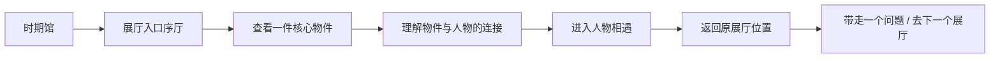
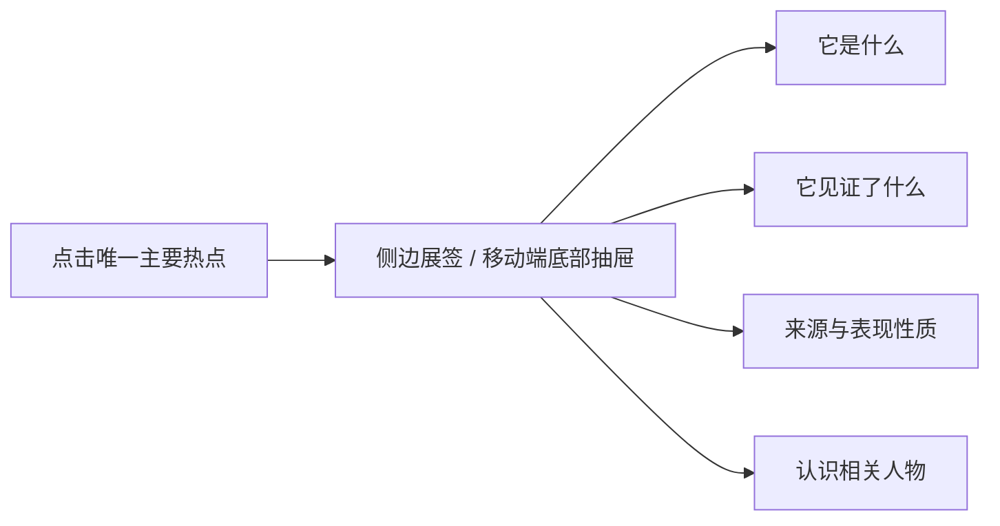
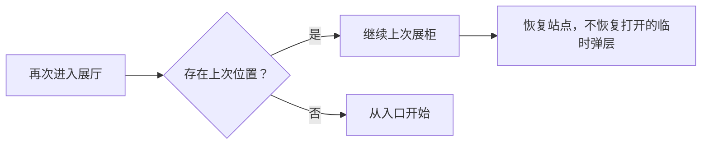

# Stage 2 — 沉浸式历史展厅 PRD

- 日期：2026-07-22
- 状态：Approved by upfront user authorization for Stages 1–4
- North Star：[10-immersive-halls-north-star.md](./10-immersive-halls-north-star.md)
- 当前目录：3 个时期、9 个展厅、36 位人物

## 1. 产品定义

沉浸式展厅是位于“历史时期馆”和“人物相遇”之间的策展体验。它使用时代氛围、空间层次、物件、短标签、关系线索和一个核心问题，让用户理解人物为什么共同出现在这里。

展厅不是聊天背景，也不是一张全屏插画。它由可访问、可追溯、可降级的结构化展项组成，并将用户引向现有的人物资料和人物对话。

## 2. 优先级

### P0：本次必须完成的产品定义

1. 9 个展厅均有独特场景身份、核心物件和人物连接；
2. 展厅按“入口序厅 → 核心物件 → 人物关系 → 离场问题”形成清楚路线；
3. 每屏只有一个主焦点，最多两个次要动作；
4. 轻快版和典藏版语义、功能、进度完全一致；
5. 历史信息、艺术重建与纯装饰具有不同标识和可访问语义；
6. 物件详情展示名称、时间地点、意义、来源/表现性质和相关人物；
7. 从展厅进入人物相遇后可以返回原展厅与原参观位置；
8. 低带宽、背景失败、减少动态、移动端和键盘用户均可完成参观。

### P1：首版实现后补强

1. 展厅参观进度和“上次看到哪里”跨设备保存；
2. 关系线索可以在展厅中展开为简化关系图；
3. 有授权的高分辨率史料图像支持缩放与视觉说明；
4. 维护者工作台支持填写展厅对象、选择模板和预览两套主题；
5. 可选、默认关闭的语音导览。

### P2：未来能力

1. 3D 藏品、空间音频和受控场景视频；
2. 机构发布自己的展厅包与馆藏替换包；
3. 根据掌握度调整标签深度，但不改变事实与参观路线；
4. 多人课堂导览与教师发起的共同问题。

## 3. 核心场景

| ID | 优先级 | 场景 | 当前痛点 | 理想方案 |
|---|---|---|---|---|
| H1 | P0 | 从时期馆进入展厅 | 页面只是换了标题 | 有明确“跨过门槛”的入口序厅，颜色、材料、轮廓和核心物件立即改变 |
| H2 | P0 | 第一次理解展厅 | 标题抽象，儿童不知道发生了什么 | 用一件物件和一句核心问题建立时间、地点与冲突 |
| H3 | P0 | 决定认识谁 | 人物只是平铺卡片 | 每位推荐人物显示“他/她与这件物件或事件的关系” |
| H4 | P0 | 查看展品 | 装饰与历史信息可能混淆 | 物件详情明确区分原始史料、馆藏照片、艺术重建和示意图 |
| H5 | P0 | 进入人物相遇 | 离开展厅后空间感消失 | 人物会面室保留展厅色彩、物件缩略图和返回原位置入口 |
| H6 | P0 | 切换视觉主题 | 主题可能造成内容差异 | 同一 Manifest 使用两套 Asset Variant，语义和交互完全一致 |
| H7 | P0 | 移动端参观 | 背景和横向陈列容易拥挤 | 纵向单路线、紧凑展厅地图、底部一次只显示一个主要动作 |
| H8 | P0 | 资源加载失败 | 大图失败会出现空白空间 | 使用颜色、渐变和结构化文字构成完整 fallback，物件图延迟加载 |
| H9 | P1 | 返回旧展厅 | 用户忘记看到哪里 | 提供“继续上次展柜”和“从入口重新参观”，不强迫继续 |
| H10 | P1 | 维护者创建展厅 | 每个展厅要改前端 | 声明式 Hall Scene Schema、模板、资产清单和发布校验器 |

## 4. 九个首发展厅策展方向

| 展厅 | 空间语汇 | 核心物件 | 辅助物件 | 人物连接重点 |
|---|---|---|---|---|
| 长安：诗人与世界城市 | 夜色靛蓝、城门轮廓、灯影、纸张 | 一页有来源的诗笺 | 坊市地图示意、旅人行囊 | 李白、杜甫、王维如何在城市与旅途中相遇 |
| 佛法东行与丝路旅行 | 沙金、海蓝、层叠路线、译场书案 | 经卷或译稿的合法图像/重建 | 渡海舟示意、旅行记录 | 玄奘、鉴真、阿倍仲麻吕如何让知识跨越语言 |
| 安史之乱：盛世为何转折 | 褪色朱红、撕裂地图、远处烽烟抽象纹理 | 战乱时期的公文或诗稿 | 行军路线示意、流离者行囊 | 皇帝、将领、诗人与普通生活的转折；避免武器奇观化 |
| 佛罗伦萨：艺术为何需要赞助人 | 灰泥、赭石、拱券、工作坊自然光 | 委托契约或账册 | 素描册、颜料与石膏模型 | 艺术家、赞助人、政治权力如何共同生产作品 |
| 罗马工作坊：大师如何竞争 | 石灰白、深红帷幕、脚手架线条 | 大型壁画或雕塑的准备稿 | 雕刻工具、委托函 | 米开朗琪罗、拉斐尔与同行竞争如何改变风格 |
| 从日心说到望远镜 | 深夜蓝、黄铜、印刷网点、观测窗口 | 望远镜或观测记录 | 印刷书页、解剖图、行星轨迹示意 | 新工具、新证据和传播网络如何挑战旧认识 |
| 索尔维会议：自然是概率的吗 | 暖灰会议室、黑板、木桌、思想卡片 | 会议合影或合规艺术重建 | 手写问题卡、会议座签 | 同一证据为何产生不同解释，强调讨论而非天才名录 |
| 原子内部：理论与实验 | 实验室青绿、暗室、粒子轨迹微光 | 金箔散射装置或云室照片 | 实验记录、探测器示意 | 理论如何被实验支持、纠正或推翻 |
| 流亡、战争与科学责任 | 档案灰、褪色蓝、克制红线、空椅 | 流亡证件、书信或公开声明 | 地图、研究机构门牌、伦理问题墙 | 个人处境、国家权力与科学责任；不使用蘑菇云奇观 |

## 5. 主要用户流

### 5.1 第一次参观

### 5.2 核心物件详情

### 5.3 返回与恢复

## 6. 屏幕与交互需求

### 6.1 时期馆的展厅入口卡

- 显示一张轻量场景预览、展厅标题、核心问题和一件代表物件；
- 三张展厅卡必须在轮廓、材料与物件上可区分，不只更换颜色；
- 推荐展厅仍只有一个主按钮，卡包保持次级入口。

### 6.2 入口序厅

- 高度约 55–70vh，产生“进入空间”的第一印象；
- 首屏只突出核心问题和“开始参观”；
- 背景由环境图层、建筑轮廓和装饰物构成，不能承载必须阅读的文字；
- 桌面展示四站路线，移动端只显示当前站和总进度。

### 6.3 核心物件站

- 一件物件成为视觉中心；
- 物件周围最多两个不可点击辅助装饰；
- 展签使用三段式层级：名称/年代、两句意义、来源按钮；
- 轻快版可以是清楚的插画重建，典藏版可以使用获许可图片或克制的写实重建，但标签一致。

### 6.4 人物关系站

- 默认展示 3 位最相关人物，其余可展开；
- 人物之间使用有文字的关系线，不依赖颜色或线型猜测；
- 点击人物进入现有“人物相遇”或人物资料；
- 返回后恢复到该人物所在的关系站。

### 6.5 离场区

- 显示一个开放问题，而不是考试；
- 主动作是“认识一位人物”或“去下一个展厅”，由当前进度决定；
- 可以自由返回时期馆，不以未完成阻止离场；
- 奖励继续由真实学习事件触发，浏览装饰物不产生探索星。

## 7. 内容规则

### 7.1 每个展厅的最小内容包

- 1 个核心问题；
- 1 个入口说明（不超过 80 个中文字符）；
- 1 件核心物件和 2 件辅助物件；
- 3–6 位相关人物；
- 至少 2 条人物—物件/事件连接；
- 1 个离场问题；
- 轻快版与典藏版场景资源；
- 全部有意义素材的来源、许可和表现性质。

### 7.2 诗句和档案文字

- 有意义的诗句和引文必须以可选择、可缩放的 DOM 文字呈现，不烧录在背景图中；
- 显示作者、作品和来源；
- 纯装饰书法纹理不得伪装成可读名句；
- 最多同时突出一条引文，避免儿童把背景当正文阅读。

### 7.3 表现性质标签

- `馆藏/史料图像`：真实来源且许可允许展示；
- `历史重建`：基于资料重建，不声称为现场照片；
- `结构示意`：解释路线、装置或空间；
- `装饰插画`：只营造氛围，不作为历史证据。

## 8. 状态覆盖

- 首次访问、已访问、参观一半和完成；
- 展厅数据加载、背景加载、物件图片加载；
- 物件不存在、来源撤销、表现性质待复核；
- 人物未获得、已获得、有旧线程；
- 轻快版、典藏版、减少动态、高对比/系统字体放大；
- 360/390/768/1280px；
- 离线或慢网、图片失败、API 失败；
- 战争、死亡或迫害主题的内容提示；
- 键盘、屏幕阅读器和触摸操作。

## 9. 成功指标

本功能不以停留时长或热点点击数作为成功指标。

| 指标 | MVP 目标 |
|---|---:|
| 9–12 岁用户进入 15 秒内正确描述展厅主题 | ≥85% |
| 首次用户 15 秒内找到“开始参观”或核心物件 | ≥90% |
| 用户能从物件找到一位相关人物 | ≥85% |
| 用户参观后能说出一条“物件—人物—事件”连接 | ≥75% |
| 同时期三展厅在遮住标题时可被正确区分 | ≥80% |
| 重要历史视觉具有来源或表现性质 | 100% |
| 轻快/典藏切换后的内容与进度一致 | 100% |
| 背景失败时核心流程可完成 | 100% |
| 文本对比度、键盘访问、减少动态硬标准 | 100% |
| 返回人物相遇前的展厅站点成功率 | 100% |

## 10. 验收标准

1. 九个展厅在不修改 React 组件的情况下由数据选择不同场景；
2. 每个展厅存在一件可打开展签的核心物件；
3. 核心物件可以进入至少一位真正属于该展厅的人物；
4. 所有展示文字保持真实 DOM 文本并满足缩放；
5. 所有背景装饰对辅助技术隐藏，信息物件具有名称和文字说明；
6. 正文在所有场景和主题上满足 4.5:1，对大型文字满足 3:1；
7. `prefers-reduced-motion: reduce` 下取消视差、漂浮和转场移动；
8. 首屏不自动播放音频、视频或循环动画；
9. 页面初始只预载入口场景，后续物件和人物资源懒加载；
10. 返回、刷新和主题切换不丢失当前 hallId，P1 实现后还要保留 stationId；
11. 史料来源撤销时对应物件退出公开展厅，回退为文本占位或经批准的替代资源；
12. 战争责任展厅不使用武器、爆炸和蘑菇云作为娱乐性视觉中心。

## 11. 本轮非目标

- 运行时生成场景图；
- 可自由走动的 3D 空间；
- 用户拖拽布展；
- 自动语音、环境音乐或全屏视频；
- 重新设计人物长期聊天；
- 为点击装饰、重复访问或在线时长发放探索星。

## Gate 2

用户已预先授权连续推进至 Stage 4。本 PRD 作为 Stage 3 设计的已批准 ground truth；若最终联合评审修改范围，必须先同步更新本文件，再进入实施。

## Post-Stage-5 Browser Remediation（唯一一轮）

2026-07-22 的真实移动端走查发现：全局固定底栏会覆盖展厅自己的四站路线，造成两个导航层同时争夺注意力和点击区域。P0 增补为：在 `hall`、`map`、`encounter` 三类专注型页面隐藏移动端全局底栏；这些页面必须提供明确的返回时期馆/展厅动作，不能依赖被隐藏的底栏。
