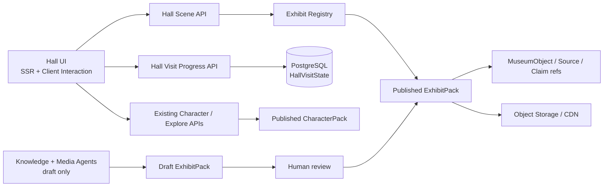
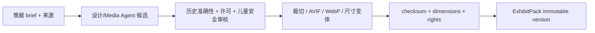

# Stage 4 — 沉浸式历史展厅技术架构

- 日期：2026-07-22
- 状态：Approved；Stage 5 implementation authorized
- PRD：[11-immersive-halls-prd.md](./11-immersive-halls-prd.md)
- UI / UX：[12-immersive-halls-design.md](./12-immersive-halls-design.md)
- 总体架构基线：[04-tech-design.md](./04-tech-design.md)

## 1. 技术目标与边界

本功能在现有 Next.js + TypeScript monorepo 中增加一个数据驱动的展厅渲染层。九个展厅共享组件、状态模型和可访问语义，通过受控 Manifest、设计 Token 和已审核媒体形成不同场景。

本轮架构不引入运行时场景生成、任意 HTML/CSS、WebGL、自动音频或新的微服务。人物线程、收藏、奖励和权限继续使用现有领域，不复制状态。

## 2. 技术选项比较

### 2.1 展厅内容组织

| 方案 | 做法 | 优点 | 风险 | 结论 |
|---|---|---|---|---|
| A. 在 React/CSS 中为九个展厅分别写分支 | `if hallId` 切换布局和样式 | 初次最快 | 无法由维护者扩展；九套页面分叉；难校验来源、许可和双主题一致性 | 拒绝 |
| B. 受控 `HallSceneManifest` + 共用渲染器 | Schema 声明站点、物件、关系、Token 和媒体变体 | 可扩展、可版本化、可测试、兼容 SSR 和无障碍 | 需要先设计 Schema 和资产流水线 | **推荐** |
| C. 用户访问时由 AI 即时生成背景和布展 | Prompt 生成场景、物件和说明 | 每次看似不同 | 延迟、成本、历史错误、版权、视觉漂移、无法稳定评测 | MVP 禁止 |

### 2.2 场景渲染

| 方案 | 优点 | 缺点 | 结论 |
|---|---|---|---|
| DOM + CSS/SVG 分层场景 | SSR、响应式、文字可访问、资源轻、容易降级 | 空间自由度低于 3D | **MVP 推荐** |
| 单张全屏背景图 | 开发快、容易做高保真 | 裁切困难；文字和物件容易烧进图片；无法形成可交互展项 | 仅作为装饰远景的一层 |
| Canvas/WebGL/3D | 空间感强、可自由导航 | 性能、键盘/读屏、内容制作和测试成本高 | P2 独立能力，不进入本功能 MVP |

### 2.3 内容包边界

展厅连接多个独立人物，不应归属于某一个 CharacterPack。推荐新增版本化的 `ExhibitPack`：

- CharacterPack 继续声明人物知识、关系、媒体和认知边界；
- ExhibitPack 声明展厅叙事、物件、场景资产和对已发布人物/Claim 的引用；
- 平台目录把 Period、ExhibitPack 与 CharacterPack 组合成访客体验；
- 首发九厅可以保存在 Git 中，经 SDK 校验后随构建发布；未来支持数据库导入与社区包。

## 3. 系统层与边界



边界规则：

- UI 只解释已经发布的 Manifest，不执行包内代码；
- Scene API 不返回任意 HTML、CSS 或远程脚本；
- ExhibitPack 可以引用人物和 Claim，不能修改人物包；
- 浏览展厅站点不会直接发放探索星；奖励仍走现有 `exploration-events` 白名单；
- 访问进度不读取或写入人物聊天 Memory；
- Agent 只能产生草稿资产和候选连接，不能自动发布。

## 4. Monorepo 模块建议

```text
packages/sdk/src/exhibits.ts
  Zod Schema、公开类型、迁移器、校验错误码

packages/exhibits/
  src/manifests/*.json       首发九厅声明
  src/objects/*.json         物件与来源引用
  src/index.ts               Registry 与查询
  src/*.test.ts              引用、来源、双主题与预算测试

apps/web/components/halls/
  HallScene.tsx              总编排与 SSR fallback
  HallEntrance.tsx           入口序厅
  HallRoute.tsx              四站路线
  ObjectStage.tsx            核心物件与焦点管理
  ObjectLabelDrawer.tsx      展签抽屉
  CharacterRelationWall.tsx  人物连接
  HallExit.tsx               离场问题
  layers/*                   受控装饰图层

apps/web/lib/exhibits/
  repository.ts              JSON/PostgreSQL Repository 接口
  asset-policy.ts            类型、许可、尺寸和路径校验
  progress.ts                访问状态与恢复

apps/web/app/api/halls/*
  Manifest、物件详情、访问进度 Route Handlers
```

如果暂时不新增 workspace，可以先把 `packages/exhibits` 实现在 `packages/characters/src/exhibits` 下，但 SDK 类型和 React 渲染器仍必须保持独立；完成第二个第三方展厅包前迁出。

## 5. 核心数据模型

### 5.1 ExhibitPack

```ts
type ExhibitPack = {
  manifest: {
    schemaVersion: "1.0";
    id: string;
    version: string;
    title: Record<string, string>;
    author: { id: string; name: string };
    license: License;
    compatibleRuntime: string;
    status: "draft" | "review" | "published" | "returned" | "archived";
    createdAt: string;
    publishedAt?: string;
  };
  period: PeriodReference;
  hall: HallSceneManifest;
  objects: MuseumObject[];
  assets: ExhibitAsset[];
  sources: SourceRecord[];
  evaluations: ExhibitEvaluation[];
};
```

发布版本不可覆盖。修改文字、关系、物件、许可或场景资产均产生新的 ExhibitPack version。既有访问状态保存当时的 `sceneVersion`，进入新版本时可迁移 stationId。

### 5.2 HallSceneManifest

```ts
type HallSceneManifest = {
  id: string;
  periodId: string;
  sceneVersion: string;
  locale: string;
  title: string;
  question: string;
  guideTitle: string;
  guideText: string;
  contentWarning?: {
    label: string;
    description: string;
    severity: "notice" | "sensitive";
  };
  theme: HallThemeSpec;
  entrance: {
    kicker: string;
    primaryActionLabel: string;
    anchorObjectId: string;
  };
  stations: HallStation[];
  characterRefs: CharacterReference[];
  exit: {
    reflectionQuestion: string;
    nextHallId?: string;
  };
};
```

### 5.3 Theme 与装饰图层

```ts
type HallThemeSpec = {
  themeKey: string;
  tokens: {
    bgDeep: string;
    bgSoft: string;
    surface: string;
    ink: string;
    accent: string;
    highlight: string;
    textureOpacity: number;
  };
  layers: HallVisualLayer[];
};

type HallVisualLayer = {
  id: string;
  role: "decorative" | "contextual";
  type: "gradient" | "raster" | "safe-svg" | "pattern";
  variants: {
    light: ResponsiveAssetRef;
    archive: ResponsiveAssetRef;
  };
  alt?: string;
  representation:
    | "artifact_photo"
    | "historical_image"
    | "evidence_based_reconstruction"
    | "structural_diagram"
    | "decorative_illustration";
  sourceIds: string[];
  focalPoint?: { x: number; y: number };
};
```

约束：

- `decorative` 必须没有交互，渲染为 `aria-hidden`；
- `contextual` 必须有 `alt`、representation 和 sourceIds；
- Token 颜色必须通过对比度和允许格式校验；
- Manifest 不能包含 CSS 字符串、HTML、事件处理器或任意 URL。

### 5.4 MuseumObject

```ts
type MuseumObject = {
  id: string;
  names: Record<string, string>;
  kind: "artifact" | "document" | "artwork" | "instrument" | "map" | "reconstruction";
  dateLabel: string;
  placeLabel?: string;
  makerLabel?: string;
  shortLabel: string;
  description: string;
  significance: string;
  visualDescription: string;
  representation: HallVisualLayer["representation"];
  sourceIds: string[];
  claimIds: string[];
  relatedCharacterIds: string[];
  mediaAssetIds: string[];
  license: License;
  status: "draft" | "review" | "published" | "withdrawn";
};
```

`MuseumObject` 是展厅知识锚点，不必声称为平台拥有的实体文物。重建、示意和真实馆藏使用同一对象接口，但必须通过 representation 明确区分。

### 5.5 站点与访问进度

```ts
type HallStation = {
  id: string;
  order: number;
  type: "orientation" | "object" | "character_relation" | "reflection";
  title: string;
  body?: string;
  objectIds: string[];
  characterIds: string[];
  relationshipIds: string[];
  claimIds: string[];
};

type HallVisitState = {
  userId: string;
  hallId: string;
  sceneVersion: string;
  lastStationId: string;
  viewedObjectIds: string[];
  visitedCharacterIds: string[];
  completedStationIds: string[];
  startedAt: string;
  updatedAt: string;
  completedAt?: string;
  revision: number;
};
```

访问进度只记录站点和对象 ID，不保存鼠标轨迹、滚动热图或儿童的自由文本反思。离场问题默认不要求用户提交答案。

## 6. Schema 与引用不变量

SDK 发布以下 Zod Schema：

- `exhibitPackSchema`；
- `hallSceneManifestSchema`；
- `museumObjectSchema`；
- `exhibitAssetSchema`；
- `hallVisitStateSchema`。

发布校验必须保证：

1. anchorObjectId 存在且状态为 published；
2. 每个站点引用的物件、人物、Relationship 和 Claim 存在；
3. 公开人物引用固定已发布 CharacterPack version 或兼容范围；
4. contextual layer 具有 alt、representation 和来源；
5. light/archive 两套资产语义槽位一致；
6. 所有资产具有 checksum、contentType、尺寸、大小和许可；
7. 来源撤销后受影响对象不能继续 published；
8. route 中恰好存在 orientation、object、character_relation、reflection 四类核心站点；
9. 核心展签文字长度满足轻快版上限，超长内容进入来源详情；
10. `sceneVersion` 升级提供 stationId 映射或明确从入口重新开始。

## 7. Repository 与存储

### 7.1 首发内容

- 九个 ExhibitPack 以 JSON/TypeScript fixture 存放在 Git；
- CI/build 运行 SDK 校验并生成只读 Registry；
- 首发自有场景素材可以存放于 `apps/web/public/exhibits/{hallId}/{version}/`；
- 文件名使用内容哈希或版本目录，避免 Ctrl+F5 仍命中旧资产。

### 7.2 生产演进

- PostgreSQL：`exhibit_packs`, `exhibit_versions`, `museum_objects`, `exhibit_sources`, `exhibit_asset_records`, `hall_visit_states`；
- S3 兼容对象存储：原图、AVIF/WebP/JPEG 变体、视觉说明附件；
- CDN：不可变版本 URL，`Cache-Control: public, max-age=31536000, immutable`；
- 当前版本 Manifest 使用短缓存 + ETag；撤销来源时发布新版本并使旧 Manifest 退出目录。

### 7.3 Repository 接口

```ts
interface ExhibitRepository {
  getPublishedHall(hallId: string, version?: string): Promise<ExhibitPack | null>;
  listHallPreviews(periodId: string): Promise<HallPreview[]>;
  getObject(objectId: string, exhibitVersion: string): Promise<MuseumObject | null>;
  saveDraft(pack: ExhibitPack): Promise<void>;
  publish(packId: string, version: string): Promise<ExhibitPack>;
  withdrawObject(objectId: string, reason: string): Promise<void>;
}

interface HallProgressRepository {
  get(userId: string, hallId: string): Promise<HallVisitState | null>;
  upsert(input: HallProgressUpdate, expectedRevision?: number): Promise<HallVisitState>;
}
```

## 8. API 设计

### `GET /api/halls/:hallId`

返回发布 Manifest、轻量物件标签、人物引用和当前用户访问进度。大型来源详情和高清媒体不内联。

```json
{
  "hall": { "id": "tang-changan", "sceneVersion": "1.0.0", "title": "长安：诗人与世界城市" },
  "scene": { "theme": {}, "entrance": {}, "stations": [] },
  "objects": [{ "id": "tang-changan-poem", "shortLabel": "一页诗笺怎样连接城市与旅人" }],
  "characters": [{ "id": "li-bai", "relationshipLabel": "诗歌与漫游" }],
  "progress": { "lastStationId": "entrance", "revision": 0 }
}
```

### `GET /api/exhibit-objects/:objectId?version=`

返回完整展签、视觉说明、来源摘要、许可和相关人物。只有公开对象可匿名读取。

### `PUT /api/halls/:hallId/progress`

```json
{
  "sceneVersion": "1.0.0",
  "lastStationId": "characters",
  "viewedObjectIds": ["tang-changan-poem"],
  "visitedCharacterIds": ["li-bai"],
  "expectedRevision": 2
}
```

服务端验证 ID 属于该版本；冲突返回最新状态，由客户端集合合并 viewed/visited/completed，lastStation 使用最新更新时间。

### 现有 API 的变化

- `GET /api/explore` 的 hall preview 增加 `sceneRef`, `previewAsset`, `anchorObjectLabel`；
- `POST /api/exploration-events` 不接受 `object_viewed` 作为奖励来源；
- 人物相遇入口增加 `returnTo={hallId, stationId, objectId}` 客户端导航状态，刷新时可由 URL 查询参数恢复；
- `/api/characters/:id/graph` 继续提供正式关系，ExhibitPack 只保存引用和策展说明。

## 9. 前端渲染与通信

### 9.1 首屏

- Next.js Server Component/SSR 输出入口标题、问题、fallback 颜色与路线；
- Manifest 在服务端验证后序列化给 Client Component；
- 只 preload 当前主题的 hero 远景和 anchor object 中等尺寸资源；
- 另一主题与后续站点使用懒加载；
- 所有媒体预留 `width/height` 或 `aspect-ratio`，防止 CLS。

### 9.2 Client 状态

```ts
type HallUIState = {
  activeStationId: string;
  objectDrawerId?: string;
  returnFocusId?: string;
  visualMode: "light" | "archive";
  assetStatus: Record<string, "idle" | "loading" | "ready" | "failed">;
};
```

临时抽屉、焦点和资源状态只在浏览器中；station progress 经 800–1500ms debounce 或页面离开时上报。页面不因进度上报失败阻塞导航。

### 9.3 返回人物相遇

推荐 URL：

```text
/museum?route=encounter&character=li-bai&fromHall=tang-changan&fromStation=characters
```

返回优先读取显式参数，其次读取 `HallVisitState`，最后回到展厅入口。不能只依赖 React 内存状态。

## 10. 资产流水线与预算

### 10.1 生成/导入



Media Agent 可以生成轻快/典藏候选素材，但必须记录 prompt、provider、输入来源、表现性质和审核人；Knowledge Curator 可以建议物件与关系，但只能进入草稿。

### 10.2 性能预算

| 项目 | 移动端预算 | 桌面预算 |
|---|---:|---:|
| 首屏场景媒体总量 | ≤600 KB | ≤1.0 MB |
| anchor object 首屏资源 | ≤220 KB | ≤350 KB |
| 初始 Hall JS 增量 gzip | ≤35 KB | ≤35 KB |
| LCP p75（4G/中端设备） | ≤2.5s | ≤2.0s |
| CLS | ≤0.1 | ≤0.1 |
| INP p75 | ≤200ms | ≤200ms |

禁止首屏加载两套主题全部大图。PNG 只用于确有透明需求的插画源文件；交付优先 AVIF/WebP，并保留合理 fallback。

## 11. 安全、许可与隐私

### 安全

- ExhibitPack 禁止任意 HTML、CSS、JavaScript、iframe 和外部字体；
- Token 只允许十六进制颜色、有限数字范围和平台枚举；
- SVG 必须由平台模板生成或经过严格 sanitizer；不可信 SVG 默认转成 raster；
- 浏览器不直接加载维护者提供的远程 URL，发布前导入对象存储并校验 MIME、魔数、尺寸和恶意内容；
- CSP 限制 `img-src`, `media-src`, `style-src`；
- 展签文本按纯文本/受控 Markdown 渲染，不允许原始 HTML。

### 许可与历史可信度

- 每个 contextual asset 必须有 Source、License、Representation 和允许用途；
- 只有 display/redistribute 权限明确的资源进入开源默认包；
- 史料图、艺术重建、结构示意和装饰插画标签不可由主题隐藏；
- 来源撤销保留审计记录，但对象立即退出公开 Registry；
- 诗句与引文保存作品、版本、定位和译文来源，不把未知文本写进装饰图。

### 儿童隐私

- HallVisitState 只记录资源 ID 和站点进度；
- 不记录鼠标轨迹、精确停留时长、滚动热图或反思自由文本；
- 可观测日志使用用户哈希，不记录聊天内容、Cookie 或邮件；
- 不使用第三方广告追踪像素。

## 12. 无障碍

- 装饰图层从可访问树中移除；contextual 图像具有简短 alt，完整视觉说明在展签中；
- 文本不直接放在未经对比度控制的背景图上；
- Token CI 针对 surface/ink、button/bg、focus/bg 执行对比度检查；
- 物件按钮、抽屉、路线与人物入口支持键盘顺序和可见焦点；
- 抽屉使用 focus trap、`Esc` 和 return focus；
- `prefers-reduced-motion` 为渲染器硬约束，不由内容包覆盖；
- 200% 缩放、系统大字号和 360px 宽度不丢失控制；
- 可选音频不自动播放，提供文字等价物。

## 13. Agent 架构

本功能不增加访客运行时 Agent。只在维护端复用现有确定性 Agent Task：

- Knowledge Curator：根据已登记来源提出物件、时间、地点、人物和 Claim 引用候选；
- Media Creation Agent：根据已审核 brief 生成轻快/典藏场景候选和尺寸变体；
- Evaluation Agent：检查引用完整性、人物归属、时代错误、表现性质标签和双主题一致性。

所有任务输出状态为 draft，必须经过维护者确认和发布审核。Agent 不生成可执行图层，不允许自己抓取并复制未经许可的网页或馆藏图片。

## 14. 可观测性与评测

### 产品事件

- `hall_entered`：hallId、sceneVersion、入口来源；
- `hall_station_viewed`：stationId；
- `hall_object_opened`：objectId、representation；
- `hall_character_selected`：characterId、fromStation；
- `hall_exited`：目标页面，不记录自由文本。

这些事件用于发现迷路、失败和无效入口，不优化停留时长。

### Trace / 错误

- Manifest 读取与校验错误；
- asset load failure 按 hall/version/assetId 聚合；
- progress revision conflict；
- withdrawn source/object 命中；
- LCP、CLS、INP 和资源字节数；
- 抽屉焦点恢复失败与客户端异常。

### 自动测试矩阵

1. 9 halls × 2 themes × 4 viewports 的视觉回归；
2. 所有 Manifest 的 Schema、引用、来源、许可和双主题槽位测试；
3. 资源路径、checksum、MIME、尺寸、比例和预算测试；
4. axe/WCAG 基础检查、键盘路线、焦点恢复和减少动态；
5. 背景、核心物件、API 分别失败的降级测试；
6. 人物相遇返回站点、刷新、主题切换和版本升级测试；
7. 来源撤销后对象退出 Registry；
8. 代表性历史内容由人工执行时代、地点、物件与人物关系审核。

## 15. 部署与缓存

- Render 继续部署同一个 Next.js Web Service；本功能不增加服务；
- 内置 ExhibitPack 随应用构建，生产数据库启用后迁入 Repository；
- 媒体使用版本化 immutable URL，Manifest 使用 ETag；
- 新 ExhibitPack 发布先进行预热和资源 HEAD 校验，再切换目录 currentVersion；
- 回滚只切换目录引用，不覆盖旧版本；
- 资产撤销可以在 CDN 层紧急失效，同时让 Registry 停止返回。

## 16. 现有数据迁移

现有 `ExhibitHall` 保持兼容：

```ts
interface ExhibitHall {
  id: string;
  title: string;
  question: string;
  guideTitle: string;
  guideText: string;
  characterIds: string[];
  sceneRef?: { exhibitPackId: string; version: string };
}
```

- 没有 `sceneRef` 的旧展厅使用平台默认“纸面展厅” fallback；
- 首发九厅逐个增加 sceneRef，不一次破坏目录 API；
- 现有人物 `recommendedHallId` 与 hallId 保持不变；
- 当前 localStorage 的 hallId 继续有效；P1 增加 stationId 后使用独立版本字段；
- 当前人物相遇、收藏和奖励 API 无需迁移。

## 17. Stage 5 实施顺序建议

### Slice 1：契约与默认展厅

- 增加 SDK Schema、Exhibit Registry 和 reference validator；
- 扩展 `ExhibitHall.sceneRef`；
- 实现默认 CSS fallback 和一个长安 fixture；
- 先验证 SSR、键盘、低带宽和双主题。

### Slice 2：共用渲染器

- 实现入口、四站路线、ObjectStage、展签抽屉、人物关系墙和离场区；
- 接入现有人物相遇路由与返回参数；
- 不接入新奖励。

### Slice 3：九厅内容

- 每个时期先完成一个代表展厅，验证三种视觉语汇；
- 再补齐同一时期其余两个展厅；
- 每厅完成内容、来源、许可、双主题和时代审核后才进入目录。

### Slice 4：访问恢复与 API

- 增加 HallVisitState Repository 和 API；
- 实现跨刷新/跨设备站点恢复、revision 合并和版本迁移；
- 无账户/临时身份继续使用现有身份策略。

### Slice 5：资产与质量门禁

- 增加 AVIF/WebP 派生、srcset、预算测试与不可变 URL；
- 完成 72 组视觉回归、axe、失败降级和减少动态测试；
- 通过 Browser 深度体验后再进入既定 remediation 流程。

## 18. Open Questions for Joint Review

这些问题不阻塞技术可行性，但会影响 Stage 5 内容和资产成本：

1. 首批核心物件优先使用“有许可的真实史料/馆藏图”，还是统一先使用明确标注的艺术重建？推荐混合：能取得可靠许可时用真实图，否则使用重建，不等待全部馆藏谈判。
2. 展厅是否在首版保存跨设备 station progress？推荐列为 P1，在共用渲染器稳定后实现，首版先用 URL + 本地状态恢复。
3. 展厅离场是否必须包含下一厅推荐？推荐包含但不强迫，人物相遇仍是主动作。
4. 轻快版是否允许非常轻的环境音？推荐 MVP 不加入；语音导览另立功能并由用户主动启动。
5. 九厅资产是否全部一次制作？推荐以“每时期一个代表厅”做视觉验收，再批量补齐，避免错误风格扩散。

## Gate 4

- [x] 系统层和模块边界；
- [x] 三种内容组织方案与三种渲染方案比较；
- [x] 推荐的版本化 ExhibitPack / HallSceneManifest；
- [x] 物件、资产、站点和访问状态模型；
- [x] Repository、API 和迁移策略；
- [x] 维护端 Agent 边界；
- [x] 性能、无障碍、安全、许可、隐私和可观测性；
- [x] 部署、缓存、回滚与 Stage 5 实施顺序；
- [x] 用户已批准 UI / UX 与技术设计，并授权连续完成后续阶段。

## Post-Stage-5 Browser Remediation（唯一一轮）

浏览器反馈没有改变 ExhibitPack、API 或存储边界。客户端导航新增一条渲染约束：`hall | map | encounter` 路由不挂载移动固定底栏，返回动作由页面内语义按钮承担；CSS 在 860px 以下将显示设置收敛为 44px 图标控制。自动化需断言展厅移动视口不存在 `.visitor-bottom-nav`。
