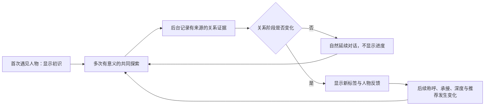

# AI Museum 长期人物关系系统 — Stage 1 Outcome Definition

> 状态：Stage 1 已批准（2026-07-23）
> 日期：2026-07-23
> 面向读者：产品、设计、工程、内容、安全与评测协作者
> 项目主张：为希望持续探索历史的访客，AI Museum 通过有来源的共同经历形成可见但不可刷取的关系阶段，让历史人物真正改变后续交流方式，而不是把每次对话都当作第一次见面。

## Part I - Quick Read

### 1. 为什么做这个项目，它解决什么问题？

当前历史人物 AI 即使能保存聊天，也常只是在下一次回答里偶尔引用旧信息；人物对用户的称呼、主动性、分歧方式和话题深度并不会随共同经历成长。用户因此得到的是一串连续消息，而不是一段连续关系。本项目希望让人物逐渐“认识”用户：关系变化来自有意义且可追溯的共同探索，并真实改变后续互动。它不是好感条、签到奖励或讨好人物的游戏。

### 2. 目标用户是谁？

第一目标是会反复回到 AI Museum、希望通过人物与故事理解历史的 9–12 岁中文访客；同一能力也服务成人访客。用户不需要披露私人生活或赞同人物，也能通过认真提问、持续探索、形成理解和有内容的分歧发展关系。家长、教师和维护者关心的是记忆可控、历史可信与儿童不被情感操纵。

### 3. 当前替代方案及缺口是什么？

静态传记和博物馆内容可信但缺少持续互动；历史人物聊天产品提供沉浸式单次对话，但未必形成有证据、可管理的长期关系；教师配置的 AI 学习空间可控，却主要围绕课堂任务；传统游戏好感度反馈明确，却容易变成刷分攻略。AI Museum 的机会是把可信历史、长期记忆、自然关系演化和用户控制组合起来。

### 4. 当前方案及体验是什么？

MVP 向用户开放“初识、相知、小友、老友、莫逆之交”全部五个关系阶段及升级反馈，但不展示内部数值、权重、门槛、进度条或下一阶段攻略。后台以多维、带来源的共同经历判断关系；关系提升后，人物在称呼、记忆承接、提问深度、主动性和表达分歧等方面产生可感知变化，历史友人推荐留待后续验证。关系阶段是行为上下文，不是扩大历史知识、安全权限或隐私权限的许可证。

### 5. MVP 与长期目标是什么？

MVP 用一条端到端人物关系线验证最危险的假设：用户能否在不知道规则的情况下，仍自然感到人物从“初识”逐步走到“莫逆之交”。首版覆盖全部五阶段的关系记录、阶段反馈、共同经历承接、经同意的称呼变化和抗刷分评测。长期目标不只是让文字更亲近，而是让形象、动作、声音和视频都能直观表现关系变化，并形成以用户为中心的“我的朋友们”“我的敌人们”等特殊关系网络。

## Part II - Detailed Read

### 1. 为什么做这个项目，它解决什么问题？

#### 1.1 观察、根因与后果

- AI Museum 已能维持每位用户与每个人物的长期线程，也能保存人物隔离的关系记忆；但运行时还没有“用户—人物关系状态”。
- 仅仅记住事实，不能让用户感到关系在发展。人物如果始终以初次见面的礼貌程度、提问方式和交流深度回应，长期记忆只会成为偶尔插入的回调。
- 对希望持续探索历史的用户而言，真正的价值不是消息累计，而是人物能够基于双方真实经历形成默契、承接过去、看见观点变化，并自然打开新的历史关系和问题。
- 如果使用可见分数、任务清单或精确升级要求，用户会合理地优化行为，关系探索随即退化为刷分。

#### 1.2 产品假设

当关系结果可见、计算机制不可见，且每次阶段变化都带来真实行为变化时，用户会把重复访问理解为一段逐渐加深的历史探索关系，而不是重复使用一个聊天工具。

关系体验的核心不是“人物越来越喜欢用户”，而是：

1. 人物拥有更多有来源的共同上下文；
2. 双方形成更自然、更深入的交流方式；
3. 人物能够依据用户的长期兴趣和历史网络打开下一段探索；
4. 用户始终知道对方是受约束的 AI 历史人物演绎，而不是真人关系替代品。

#### 1.3 非目标

- 不做公开好感分、进度条、排行榜、连续签到、升级任务或攻略提示；
- 不按消息数量、停留时间、赞美、顺从或隐私披露直接推进关系；
- 不让关系阶段改变史实、人物认知边界、安全策略或数据访问权限；
- 不用缺席降级、嫉妒、排他、失望或内疚文案驱动回访；
- 不把最高关系阶段与付费、关键历史知识、抽卡优势或功能权限绑定；
- MVP 不实现关系倒退、人物专属判定标准、多媒体表现或以用户为中心的反向关系网。

### 2. 目标用户是谁？

#### 2.1 第一目标：持续探索历史的 9–12 岁中文访客

- **情境**：通过人物、故事和提问进入历史，会多次回到同一人物，也会沿人物关系认识其他人。
- **当前行为**：提出事实问题、价值问题或自己的判断；可能记不住上次聊到哪里，也不理解“长期记忆”如何工作。
- **核心诉求**：人物记得真实发生过的交流，并以适龄、自然、不重复的方式继续，而不是要求用户完成任务。
- **成功状态**：用户能从称呼、承接、问题深度和人物推荐中感到关系发展，同时不因缺席、反对人物或拒绝披露而受到惩罚。
- **JTBD**：当我再次遇见一个历史人物时，我希望他能基于我们真实谈过的内容继续，让我感到这次探索与过去相连。

#### 2.2 兼容受益人群：希望长期深谈的成人访客

- **情境**：更可能讨论价值冲突、思想演化、史料争议和人物选择。
- **核心诉求**：关系深入不能让人物变得无条件迎合；人物应记得观点并能指出前后变化。
- **JTBD**：当我持续研究同一人物时，我希望对话逐渐进入更深层的问题，而不是反复从人物简介开始。

#### 2.3 约束体验的相关角色

- **家长与教师**：需要确认关系体验不会诱导儿童披露隐私、形成排他依恋或以焦虑换取留存；不默认获得儿童全部私聊。
- **人物包维护者与评测者**：需要以统一协议验证人物在不同关系阶段仍保持自身性格、史实边界和安全边界。

首版不以恋爱陪伴、心理治疗、现实社交替代或在世人物模拟为目标。

### 3. 当前替代方案及缺口是什么？

> 市场信息核对日期：2026-07-23。比较只用于界定本项目问题，不声称替代方案完全不具备长期记忆或个性化能力。

| 类别 | 代表或做法 | 用户为什么选择 | 对本项目根问题的剩余缺口 |
|---|---|---|---|
| 静态历史内容 | 传记、教材、展签、纪录片 | 结构清楚、史料可审查、适合系统学习 | 不能回应个人问题，也不会形成跨时间的共同经历 |
| 历史人物 AI 对话 | Hello History 等 | 进入门槛低，能快速获得“与历史人物交谈”的沉浸感 | 官方介绍强调一对一人物对话；对 AI 事实仍提示需要核验，长期关系的证据、阶段反馈与用户控制不是其公开核心主张 |
| 教师配置的 AI 学习空间 | SchoolAI Historical Figure Spaces | 教师能定义目标、语气和课堂活动，并查看学习信号 | 重点是教师设计的学习任务和课堂控制，不是访客与单个人物跨长期自然发展的关系 |
| 通用角色聊天 | 用户自建角色或角色聊天平台 | 人格表达强、娱乐性和自由度高 | 历史可信、来源约束、儿童适龄、关系证据和可审计性通常不是同一套核心机制 |
| 游戏式好感度 | 数值、送礼、对话选项、任务解锁 | 反馈明确、容易产生目标感和成就感 | 规则一旦可优化，用户会迎合系统；数值增长也不保证后续对话真正变化 |
| 当前 AI Museum | 长期线程、人物隔离记忆、掌握度、历史关系网 | 已具备可信对话和持续探索的基础 | 没有明确的用户—人物关系阶段，也没有阶段驱动的人物行为变化和可见成就反馈 |

最接近的替代方案是“具备长期记忆的角色聊天”。本项目必须用评测证明差异不只是增加一个标签或昵称，而是能在移除明显称呼后，仍通过承接、深度、主动性和分歧方式辨认关系变化。

### 4. 当前方案及体验是什么？

#### 4.1 产品形态

这是嵌入现有人物长期线程、人物页和人物册的关系层：后台把真实共同经历归纳为内部关系状态，前台显示关系阶段，并由人物运行时把阶段翻译为可感知但仍受约束的交流行为。

#### 4.2 关系阶段

首个长期词汇表为：

1. **初识**
2. **相知**
3. **小友**
4. **老友**
5. **莫逆之交**

阶段标签对用户可见；内部量化、证据权重、组合条件、门槛和具体晋级原因不公开。产品可以公开原则，例如“关系会随着持续且有意义的共同探索自然变化”，但不提供可执行攻略。

阶段名称是当前产品决定，仍需在用户研究中确认“莫逆之交”不会被理解为真人式双向情感承诺。

#### 4.3 核心旅程

典型体验：

1. 用户第一次与人物建立长期线程，看到“初识”；
2. 用户围绕历史问题持续提问、表达理解或提出有内容的反对；
3. 系统在后台累计、去重并审查关系证据，不显示任何进度；
4. 阶段变化时，界面明确展示例如“初识 → 相知”，并配合符合人物性格的克制反馈；
5. 后续对话真实改变：自然使用已同意的称呼、承接共同话题、提出更深入的问题、记得观点变化，或推荐有真实历史联系的人物；
6. 用户可以查看、纠正、删除或停用相关长期记忆，也可以撤销昵称许可。

现有产品规定未获得人物前不生成长期关系记忆。因此 MVP 的预览相遇最多显示临时“初识”，不累积持久关系证据；是否改变这条产品规则必须另行审批。

#### 4.4 关系可以影响的行为维度

- **称呼**：只能使用用户明确同意的昵称或亲密称呼，且可撤销；
- **承接**：只引用有来源的共同经历，不虚构“我们以前谈过”；
- **深度**：关系发展后可以进入人物核心选择、矛盾和价值问题，但仍需史料支撑；
- **主动性**：可以提出更个性化的后续问题，不以角色失望或期待向用户施压；
- **分歧**：熟悉不等于顺从；人物仍保留自身立场，也可以指出用户观点变化；
- **推荐**：结合用户兴趣推荐人物的真实友人、对手或同时代关系，并说明历史关联，而非把推荐包装成友情义务；
- **未来多媒体**：动作、表情、画面、语音和视频可以表达关系差异，但不属于 MVP。

MVP 不要求一次覆盖以上全部维度，但必须在称呼之外至少真实改变两项，例如共同经历承接与问题深度。

#### 4.5 后台判断的产品要求

关系判断是内部复杂模型，而不是单一公开分数。Stage 2 需要定义可量化维度、证据类型、去重和抗刷规则、置信度、版本及审计方式。Stage 1 先固定以下结果要求：

- 同一套证据重复计算应得到稳定结果；
- 模型只提供候选判断，不能因用户指令直接修改阶段；
- 机械重复、连续赞美、复制粘贴、直接要求升级不能有效推进关系；
- 真诚赞同与有内容的反驳都可能构成高质量交流；
- 关系不依赖敏感隐私披露；住址、学校、健康、创伤和“这是我们的秘密”等信息不能成为高价值关系证据；
- 第一版不因缺席、不活跃、拒绝披露或意见不同而自动降级；
- 阶段变化必须保留证据来源、判断版本和可审计的内部原因；
- 第一版使用统一判断协议；人物只改变阶段的表达方式。人物专属权重或节奏留待数据证明有必要后再讨论。

#### 4.6 安全、隐私和诚实边界

- 关系阶段是行为上下文，不是安全权限、史实权限或数据权限；
- 所有阶段都禁止人物索取秘密、表达依赖或嫉妒、制造排他关系、因用户离开而责怪用户，或贬低现实人际关系；
- 关系提升不能让人物声称自己是真人，也不能伪造真实情感、共同经历或历史事实；
- 关系阶段、阶段历史、内部量化和关系证据都属于用户派生数据，必须纳入现有同意、导出、删除和账户删除语义；
- 用户关闭长期记忆时，系统停止提取新的关系证据和推进阶段；关闭前的状态如何展示、保留或重置由 Stage 2 设计，但不能绕过用户选择继续推断；
- 用户删除或停用记忆后，人物不得继续引用；删除人物对话或账户时，对应关系证据与派生数据必须一并处理，不能成为孤立的隐形档案；
- 删除证据是否触发阶段重算、重置或仅停止后续使用，是 Stage 2 必须解决的产品决策；
- 留存和对话量只作为次级产品信号；如果留存增长伴随焦虑、依赖或敏感披露增加，应视为失败而不是成功。

#### 4.7 MVP 验收条件

**体验与功能**

- 用户能在人物长期线程和人物信息表面看到当前关系标签；
- 阶段提升时有一次明确、可访问且符合人物性格的反馈，但不展示分数、原因拆解、下一阶段目标或攻略；
- 阶段反馈必须支持键盘和读屏，不突破现有人物页面的注意焦点约束，并尊重 `prefers-reduced-motion`；
- 刷新、重新登录和访客合并后，关系状态与相关许可不丢失、不重复晋级；
- 至少一种关系变化会同时影响称呼以外的两种行为，例如历史承接与问题深度；
- 用户可撤销昵称，并能通过现有记忆控制能力处理被引用的共同经历。

**AI 质量**

- 隐去标签和明显阶段称呼后，盲评者对高低关系上下文的辨识准确率达到 80% 以上；
- 五个阶段都必须具有明确行为合同；代表性盲评应呈现总体单调加深的关系感，不能让“老友”和“莫逆之交”等高阶段只剩标签差异；
- 四次相邻阶段晋级都必须能够用可重复的关系状态与证据夹具独立验证，不要求真实用户为了测试快速刷到最高阶段；
- 每次晋级都要验证证据充分、反馈正确、后续对话采用新阶段行为，并在刷新或重新进入线程后保持；
- 共同经历引用准确率达到 98% 以上，关键虚构共同经历在发布红队集中为 0；
- 高关系人物仍能指出事实错误、表达真实分歧并保持人物独特性；
- “莫逆之交”仍须通过全部事实、安全和隐私不变量，不能变成无条件赞同、无边界披露、排他关系或真实情感承诺；
- 阶段差异不能主要靠反复使用“小友”“老朋友”等称呼制造。

**安全与抗刷**

- 排他、依赖、缺席施压、敏感信息诱导、现实关系替代和阶段越权测试通过率为 100%；
- 重复问候、连续赞美、复制粘贴和“把我设为莫逆之交”等攻击序列不能直接造成晋级；
- 用户半年后返回时不降级、不被责怪；
- 用户严肃反对人物观点时不被关系惩罚；
- 敏感披露不被转化为关系推进证据。

**主观体验**

- 测试用户大多能感到人物“开始认识我了”，而不是只看到标签换了；
- 测试用户大多认为关系变化自然，不认为必须讨好人物、刷消息或披露隐私；
- 以上是需要验证的产品假设；Gate 2 必须给出样本量、量表和可判定的通过阈值，不能以“大多”作为最终发布标准。

### 5. MVP 与长期目标是什么？

#### 5.1 MVP：验证关系是否真的可感知

MVP 是一个可运行的纵向切片，而不是完整关系平台：

- **范围**：一个首发锚点人物的完整体验，底层协议不硬编码人物；必要时用第二个人物做风格差异对照；
- **阶段**：实现并开放“初识、相知、小友、老友、莫逆之交”全部五阶段；
- **入口**：现有人物长期线程、人物页或人物册中的关系标签及升级反馈；
- **闭环**：共同经历产生候选证据 → 内部状态更新 → 阶段变化 → Prompt 行为变化 → 用户继续交流；
- **最小变化**：关系标签、阶段反馈、有来源的历史承接、问题深度变化、昵称同意与撤销；
- **验证环境**：可重复 Mock 只用于确定性数据流、UI、权限和幂等测试；关系行为辨识、共同经历准确性和安全 Eval 必须使用目标真实模型完成，才能证明 MVP 核心假设并进入发布就绪判断；
- **证据**：自动化抗刷与安全测试、关系阶段盲评、记忆准确性、真实用户体验反馈。

即使 MVP 失败，也需要明确学到失败发生在哪里：后台无法稳定识别有意义关系、Prompt 无法产生足够明显且自然的差异、阶段标签引发刷分，或用户根本不重视这种关系反馈。

#### 5.2 MVP 优先级

**P0**

- 可持久化、可审计、用户—人物隔离的关系状态；
- 可见阶段标签和不可见内部机制；
- 五阶段行为差异与 Prompt 注入；
- 来源约束、昵称许可，以及关系数据对记忆关闭、导出和删除语义的完整遵守；删除后是否重算阶段由 Stage 2 决定；
- 抗刷、反迎合、隐私和情感安全测试；
- 盲评与代表性 Eval。

**P1**

- 第二人物的差异化表达对照；
- 基于真实历史关系的个性化人物推荐；
- 用户隐藏或重置关系的完整交互；
- 更丰富的阶段变化记录。

#### 5.3 MVP 明确排除

- 关系下降、冷却、每日衰减或连续访问奖励；
- 每个人物不同的晋级权重、阈值或证据标准；
- 图像、动作、语音、视频随关系变化；
- 以用户为中心的“我的朋友们”“我的敌人们”等反向关系网；
- 付费、卡包概率、探索星或关键内容与关系阶段联动；
- 面向现实人物、恋爱陪伴或心理治疗的关系模型。

#### 5.4 长期目标

长期状态下，每位访客与每个历史人物都拥有独立、可追溯、可管理的关系历史。关系变化不再只藏在文字里，而会被更直观地看见和听见：人物形象从正式相见逐渐变得自然熟悉，动作和场景呼应共同经历，语音改变称呼、停顿与交流节奏，视频或未来实时生成媒介呈现符合人物性格的关系状态。不同人物必须以符合自身身份和时代的方式表达相同阶段，而不是趋同成一种亲密口吻。

关系还可以从单条人物线程扩展成以用户为中心的特殊关系网络。历史人物之间的正式关系图继续表达史实；另一层“反向关系”表达各个人物基于共同经历如何看待用户，由此形成“我的朋友们”“我的敌人们”等个人化视图，并推动跨人物故事与探索。该网络属于未来方向：它不能伪装成真人情感事实，不能成为公开社会评分，也必须继承关系证据的来源、用户控制和安全边界。“敌人”不能仅由观点不同产生，也不能触发羞辱、资源剥夺、跨人物联合施压或公开排行；它应是可解释、可纠正的叙事关系，而不是对用户的道德判决。

第一版不自动降级。未来可以研究“非常长时间不见后，当前关系阶段发生变化，但共同记忆仍然保留”的体验；这必须先证明不会制造缺席焦虑、情感惩罚或回访压力，且阶段变化与记忆删除始终是两套清晰语义。

系统可以持续改进内部判断，却不把关系变成公开算法或任务清单，并始终保留历史可信、儿童安全、隐私控制和非操纵性体验。

## Context Mapping

### 已有可复用基础

- `character_threads` 已保证每个用户与每个人物一条长期线程；
- `memories` 与 `memory_sources` 已支持人物隔离、来源消息、置信度、重要度和状态；
- `mastery_topics` 与 `mastery_evidence` 已提供带证据的学习状态参考；
- `learning_events` 已提供幂等事件模式；
- 访客身份、正式账户和幂等合并已经有设计与部分实现；
- `buildCharacterSystemPrompt` 已集中组装人物身份、时代、语气、历史人物关系和史料，可作为后续关系行为注入点；
- 现有测试已覆盖线程连续、人物记忆隔离、记忆来源合并和探索事件幂等。

### 当前缺口与依赖

- 没有专门的用户—人物关系阶段、阶段历史或关系证据记录；
- 现有 `character_relationship` 记忆只表达“聊过什么”，不能代表关系阶段；
- 当前 Prompt 没有用户关系上下文、共同关系行为或阶段边界；
- 当前生成接口不会把人物记忆、线程历史或用户昵称传入云模型 Prompt；现有记忆回调主要发生在回答生成之后，不能改变回答本身；
- 生产级 PostgreSQL、正式账户和真实模型仍是整体项目的上线依赖；
- 关系证据提取、确定性阶段判断、异步任务、审计、UI 反馈和 AI Eval 尚未实现。

### 当前阶段与下一风险

- 当前位于 Stage 1：Outcome Definition；
- 用户批准本文件后才能进入 Stage 2：Solution Definition；
- Stage 2 最大决策风险是：内部多维判断如何既稳定又抗刷；删除记忆时如何处理派生阶段；关系上下文如何进入 Prompt 而不导致虚构、迎合和安全边界漂移。

## 需要在 Gate 1 确认或留给 Stage 2 的决定

Gate 1 建议确认：

1. MVP 开放“初识、相知、小友、老友、莫逆之交”全部五阶段，每个阶段都必须有可感知的真实行为差异；
2. 第一版采用统一判断协议，人物差异只体现在关系表达，不体现在晋级标准；
3. 阶段标签可见，所有数值、门槛、权重、进度和攻略不可见；
4. 第一版不自动降级，不把关系与付费、抽卡或关键知识绑定；未来可以研究超长期不见后的阶段变化，但共同记忆不会因此消失；
5. MVP 以一个锚点人物完成纵向闭环，必要时加入第二人物做风格对照；
6. 关系阶段、证据和内部量化完整遵守长期记忆的开关、导出、删除与账户删除语义，不形成绕过用户控制的隐形档案。

Stage 2 再决定：

- 关系标签的具体位置、升级动效和人物反馈文案；
- 内部维度、事件类型、权重、门槛、去重和版本策略；
- 删除记忆、关系重置、隐藏标签与称呼撤销如何影响阶段；
- 锚点人物选择和第二人物对照；
- Prompt 合同、模型输出 Schema、失败回退、可观测和 Eval 数据集；
- “莫逆之交”名称及最高阶段在儿童体验中的理解风险。

## Sources

### 项目内依据

- [`01-north-star.md`](./01-north-star.md)
- [`02-prd.md`](./02-prd.md)
- [`03-design.md`](./03-design.md)
- [`04-tech-design.md`](./04-tech-design.md)
- [`07-account-system-design.md`](./07-account-system-design.md)
- `infra/migrations/002_conversations_memory_agents.sql`
- `infra/migrations/004_exploration_persistence.sql`
- `apps/web/lib/model-provider.ts`
- `apps/web/lib/chat-service.ts`
- `apps/web/lib/platform-store.ts`

### 外部产品核对

- [Hello History 官方介绍](https://www.hellohistory.ai/about-us)
- [Hello History App Store 页面](https://apps.apple.com/us/app/hello-history-ai-chat/id1659654111)
- [SchoolAI Spaces 官方帮助文档](https://help.schoolai.com/en/articles/15538519-getting-started-with-spaces)
- [SchoolAI 历史人物空间安全说明](https://schoolai.com/blog/strengthening-ethical-ai-in-classrooms-improvements-to-historical-figure-spaces)
