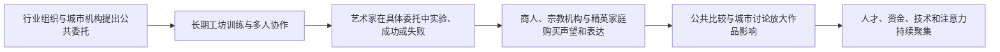

# 佛罗伦萨旗舰展厅 — 策展研究与馆藏清单 v1

> 日期：2026-07-31
> 状态：Stage 2 research complete
> 对应成果定义：[数字展览与可选人物导览](./27-guided-digital-museum-outcome-definition.md)

## 1. 研究结论

旗舰展厅可以继续使用“为什么文艺复兴的杰作会在佛罗伦萨成群出现？”作为入口问题，但正文必须避免把复杂历史压缩成单一因果。更适合 10 分钟体验的表达是：

> 佛罗伦萨怎样把城市委托、工坊训练、赞助网络和公共竞争，变成持续产生杰作的条件？

这不是“美第奇家族花钱，所以诞生文艺复兴”的简单故事。六件核心展品分别提供不同证据：城市机构公开委托、工坊多人协作、艺术家在委托中实验或失败、私人赞助与社会声望、古典主题进入精英住宅，以及公共作品被重新解释为城市象征。

## 2. 时间与地点边界

- 主线时间：1401—1504；
- 核心地点：佛罗伦萨洗礼堂、韦罗基奥工坊、圣多纳托修道院、圣母百花大教堂相关机构、圣母新教堂与市政广场；
- 展厅不是对一座真实建筑的复制，而是将不同地点的作品汇集到虚构数字展馆；
- 达·芬奇可从 1452—1519 的亲历和可知范围讲解；米开朗琪罗可从 1475—1564 的范围讲解；
- 1401 年的竞赛发生在两人出生前，人物只能将其作为自己时代已经形成的城市传统，不得声称在场。

## 3. 四幕与六件核心展品

### 第一幕：一座城市先学会提出难题

#### 展品 1：吉贝尔蒂《佛罗伦萨洗礼堂北门》

- 作者：洛伦佐·吉贝尔蒂及其工坊；
- 年代：1403—1424；
- 类型：镀金青铜门、28 块浮雕；
- 事实锚点：1401 年举行竞赛决定第二组洗礼堂铜门的作者，吉贝尔蒂胜出；制作持续约二十年；
- 策展意义：作品不是孤立灵感，而是城市机构、行业组织、竞赛、长期资金和工坊劳动共同形成的公共项目；
- 官方来源：[Opera di Santa Maria del Fiore — North Gate](https://duomo.firenze.it/en/discover/opera-duomo-museum/the-halls/sala-del-paradiso/8623/lorenzo-ghiberti-porta-nord-del-battistero)、[Opera Duomo history](https://duomo.firenze.it/en/about-us/history/art)；
- 图像来源：[Wikimedia Commons 文件页](https://commons.wikimedia.org/wiki/File:North_doors_of_the_Baptistry_(Florence).jpg)；摄影 Yair Haklai；CC BY-SA 4.0。

**人物边界**

- 达·芬奇：可以谈这类公共项目怎样塑造他进入的工坊城市，不能声称见证 1401 年竞赛；
- 米开朗琪罗：可以从青铜、尺度、公共位置和城市声望谈作品，不能把后来的“天堂之门”称呼错误套给北门。

### 第二幕：天才从工坊里长出来

#### 展品 2：韦罗基奥与达·芬奇《基督受洗》

- 作者：安德烈亚·德尔·韦罗基奥、达·芬奇及其他合作者；
- 年代：约 1470—1475；
- 技法：蛋彩与油彩、木板；
- 事实锚点：十五世纪工坊常由负责人设计，再由学生与合作者完成不同部分；当前研究认为达·芬奇的参与可能不限于左侧天使；
- 策展意义：让用户在同一画面中辨认“共同生产”，打破一件作品只属于一个天才的想象；
- 官方来源：[Uffizi — The Baptism of Christ](https://www.uffizi.it/en/artworks/verrocchio-leonardo-baptism-of-christ)；
- 图像来源：[Wikimedia Commons 文件页](https://commons.wikimedia.org/wiki/File:Verrocchio_and_Leonardo,_Baptism_of_Christ,_c1470-75,_Uffizi.jpg)；Public Domain。

**争议处理**

- 瓦萨里的“韦罗基奥因学生画得太好而不再作画”属于后世叙事，不作为确定事实；
- 展签使用“瓦萨里后来讲述……；当前研究更关注多人分工和更广泛的达·芬奇参与”区分故事与研究判断。

#### 展品 3：达·芬奇《三博士来朝》

- 作者：达·芬奇；
- 年代：约 1481—1482；
- 状态：未完成；木板上的炭笔、墨、水彩与油彩；
- 事实锚点：1481 年文件记录奥斯定会修士委托达·芬奇为圣多纳托修道院高祭坛作画，并约定完成期限；作品最终未完成；
- 策展意义：委托并不保证完成。未完成表面让用户直接看到构图、修改和制作过程，也呈现艺术家、期限与职业流动的摩擦；
- 官方来源：[Uffizi — Adoration of the Magi](https://www.uffizi.it/en/artworks/leonardo-adoration-of-the-magi)；
- 图像来源：[Wikimedia Commons 文件页](https://commons.wikimedia.org/wiki/File:Leonardo_da_Vinci,_Adoration,_c1481,_Uffizi.jpg)；CC BY-SA 4.0。

### 第三幕：谁付钱，谁又想被看见

#### 展品 4：波提切利《三博士来朝》

- 作者：桑德罗·波提切利；
- 年代：约 1470—1475；
- 原始用途：佛罗伦萨圣母新教堂德尔·拉马礼拜堂祭坛画；
- 事实锚点：委托人加斯帕雷·德尔·拉马是商人与兑换商行会代理人；画面将宗教题材与佛罗伦萨社会、美第奇家族形象和委托人自我呈现结合；
- 策展意义：私人委托同时是信仰表达、社会关系和公共声望工程；艺术家也借成功委托获得名声；
- 官方来源：[Uffizi — Botticelli Adoration](https://www.uffizi.it/en/artworks/boticelli-adoration-lami)；
- 图像来源：[Wikimedia Commons 文件页](https://commons.wikimedia.org/wiki/File:Botticelli,_Adorazione_dei_Magi,_1475_circa,_Galleria_dei_Uffizi,_Firenze.JPG)；摄影 Ghislainn；CC BY-SA 4.0。

#### 展品 5：波提切利《维纳斯的诞生》

- 作者：桑德罗·波提切利；
- 年代：约 1485；
- 技法：蛋彩、画布；
- 事实锚点：作品采用古典神话题材与古代雕像姿态；很可能与美第奇家族支系有关，但 1550 年以前没有书面记录，具体委托背景不能写成定论；
- 策展意义：当私人住宅、古典文本、收藏和艺术家技巧相遇，委托主题可以超出公共宗教图像；同时它是展厅中展示“不确定性如何被诚实表达”的核心案例；
- 官方来源：[Uffizi — Birth of Venus](https://www.uffizi.it/en/artworks/birth-of-venus)；
- 图像来源：[Wikimedia Commons 文件页](https://commons.wikimedia.org/wiki/File:La_Venere_di_Botticelli.jpg)；Public Domain Mark。

**争议处理**

- 展签用“很可能 / 目前没有更早书面记录”，不写“洛伦佐·德·美第奇命波提切利创作”；
- 人物可以提出自己的观察，但不得伪造与波提切利或委托人的私下谈话。

### 第四幕：杰作离开工坊，成为城市的脸

#### 展品 6：米开朗琪罗《大卫》

- 作者：米开朗琪罗；
- 年代：1501—1504；
- 材料：大理石；高约 517 厘米；
- 事实锚点：佛罗伦萨大教堂工程委员会在 1501 年委托，原拟置于大教堂外部高处；1504 年由包括达·芬奇、波提切利等人在内的委员会重新决定放到旧宫入口，成为佛罗伦萨力量与独立的象征；原石料此前已被其他艺术家加工并放弃；
- 策展意义：材料限制、长期公共工程、艺术家劳动和城市政治解释共同改变一件作品的意义；它适合作为前面所有条件汇聚后的终点；
- 官方来源：[Galleria dell’Accademia — David](https://www.galleriaaccademiafirenze.it/opere/david/)、[Accademia — Davids in Florence](https://www.galleriaaccademiafirenze.it/en/events/le-sculture-di-david-a-firenze-tra-storia-e-simbolo/)；
- 图像来源：[Wikimedia Commons 文件页](https://commons.wikimedia.org/wiki/File:Michelangelo%27s_David,_Galleria_dell%27Accademia,_Florence_(26651321296).jpg)；摄影 Dimitris Kamaras；CC BY 2.0。

## 4. 因果链与最终结论

离场表达：

> 杰作当然需要非凡的艺术家，但佛罗伦萨让委托、工坊、财富、竞争和公共空间彼此咬合。天才不是被城市制造出来的机器零件；城市做的是不断给天才难题、材料、同伴、观众和被看见的机会。

## 5. 视觉资产策略

- 六件作品使用本地化、压缩后的真实图像，并保留文件页、作者 / 摄影者、许可与官方馆藏链接；
- 真实作品不加统一“油画滤镜”，不裁掉影响理解的关键区域；
- 入口环境使用 AI Museum 生成的虚构 2.5D 数字展馆，标注“艺术化虚构展馆”；
- 虚构场景不承担具体史实证明，不将生成的契约、铭文或建筑细节当成证据；
- 图片加载失败时，名称、短展签、意义、来源与路线仍可使用。

### 新入口环境资产

- 用途：佛罗伦萨旗舰展厅入口和四幕总览；
- 生成方式：Codex built-in image generation；
- 风格：青少年向高质量图像小说 / 动画概念设计、2.5D 分层、深红与群青、虚构博物馆；
- 表现性质：`decorative_illustration`；
- 禁止作为佛罗伦萨真实建筑、真实展厅或文物图像的证据。

## 6. 不进入首版的候选内容

- 布鲁内莱斯基透视实验：重要但原始实验装置不存，容易让重建承担过多事实；
- 《春》：与《维纳斯的诞生》在当前十分钟路线中功能重复；
- 达·芬奇与米开朗琪罗的“战役壁画竞赛”：两件原作均已失传，首版如果同时解释复制品、草图与归属会显著增加认知负担；
- 美第奇家族完整政治史：保留为深入分支，不把佛罗伦萨艺术史简化为一个家族传记；
- 颜料、银行账簿与委托契约重建：可在第二版作为辅助物件加入，首版先以可核对的真实作品建立信任。

## 7. 内容评审清单

- [x] 六件展品均有官方馆藏或文化机构页面；
- [x] 六张候选图像均有可核查许可；
- [x] 每一幕至少有一件展品提供直接证据；
- [x] 已标记“后世叙事”“研究判断”“很可能”与确定事实；
- [x] 已识别两位导游在出生前事件和亲历归属上的边界；
- [x] 展览结论采用多条件解释，不声称单一原因；
- [ ] 中文展签在实现后进行逐条事实与语气复核；
- [ ] 模型导览 Eval 验证人物不会把不确定委托写成定论。
