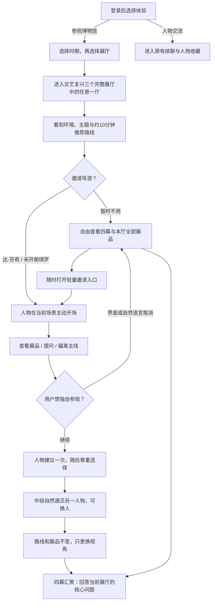
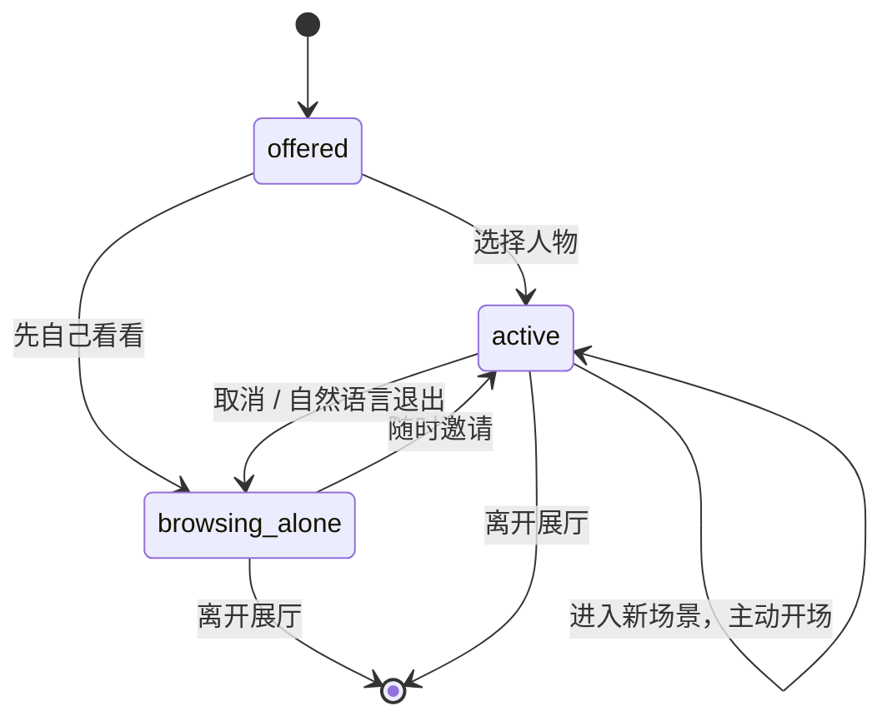

# AI Museum 数字展览与可选人物导览 — Stage 2 Solution Definition

> 状态：Stage 2 approved by user authorization; implementation may proceed
> 日期：2026-07-31
> Outcome Definition：[27-guided-digital-museum-outcome-definition.md](./27-guided-digital-museum-outcome-definition.md)
> 策展研究：[佛罗伦萨](./28-renaissance-florence-curatorial-research.md) · [罗马工作坊与天文观察](./28b-renaissance-rome-observation-curatorial-research.md)
> 设计原型：[design/ai-museum-guided-renaissance-v1.html](./design/ai-museum-guided-renaissance-v1.html)

## 1. 方案摘要

保留现有 3 个时期馆、9 个主题展厅与声明式 `ExhibitPack`，以佛罗伦萨旗舰展厅建立 `guided_gallery` 体验，再将同一协议扩展到罗马工作坊与天文观察两厅。文艺复兴时期馆因此形成 3 个主题展厅、12 幕、17 件真实展品的完整体验；每厅都有清晰但不强制的推荐路线，以及可随时邀请、取消或更换的两位历史人物导览。

这不是新增一个人物聊天页面。登录后先明确选择“参观博物馆”或“与历史人物深入交流”；只有进入参观分支后才继续选择时期与展厅。人物对话以当前场景和展品为上下文，默认收拢为展品下方的陪伴条；用户主动打开后才出现完整对话层，关闭它以后，展品与路线保持原样。

## 2. 核心用户流



## 3. 信息架构与页面布局

### 3.0 登录后用途选择

- 默认 `/museum#home` 只呈现两个大入口：“参观博物馆”与“与历史人物深入交流”；
- 旧的“继续和最近人物对话”迁入人物交流分支，不再抢占登录后首屏；
- 参观分支按“时期 → 展厅 → 展品”逐层展开；时期页只承担展厅选择，不同时展示人物名册、卡包和续聊动作；
- 人物交流分支保持既有续聊、人物资料与收藏行为；
- 顶部导航收敛为“参观博物馆 / 人物交流”，品牌按钮返回用途选择页；
- 明确的公开展厅深链仍可越过用途选择，保留用户从知识页进入某个展厅的已表达意图。

### 3.1 入口序幕

- 全宽 2.5D 虚构展馆环境；
- 左侧：馆名、核心问题、“推荐约 10 分钟 · 可随时自由参观”；
- 主动作：“从第一幕开始”；次动作：“先看全部展品”；
- 清楚标注环境为艺术化虚构展馆；
- 导游不使用阻断弹窗，入口下方以两张人物邀请卡出现，旁边保留“我先自己看看”。

### 3.2 四幕场景

桌面采用三层结构：

1. 顶部单行进度：只显示当前幕与“查看全部路线”；四幕跳转在用户主动展开后出现；
2. 中央展览：场景问题、短引导、一次只突出 1 件真实作品；同幕第二件作品通过唯一的“下一件作品”动作串行出现；
3. 展品下方陪伴条：无导游时只有轻量邀请；有导游时只显示人物与最近一句讲解。完整记录、建议问题、输入框、换人和退出在侧边抽屉中按需展开。

移动端保持内容顺序：场景标题 → 当前展品 → 人物陪伴条 → 唯一前进动作。完整导览使用底部抽屉，不固定占据展品视口。

### 3.3 展品卡与详情

卡片第一层只显示：

- 真实作品图像；
- 名称、作者、年代；
- 一句“为什么现在看它”；
- 事实状态标签：史料明确 / 研究判断 / 存在争议；
- “仔细看看”。

详情抽屉显示：完整展签、视觉观察提示、策展意义、事实与争议、官方馆藏链接、图像许可、相关人物。真实作品图像可在抽屉内放大，但首版不做深度切片或 IIIF 查看器。

## 4. 主线与自由参观

- 当前幕始终可见，但四幕路线默认收起且不显示完成百分比；
- 任何场景和展品都可直接打开；
- 场景标题构成基础因果线，即使只速览也能理解；
- 内部继续记录 `lastStationId`、`viewedObjectIds` 与 `completedStationIds`，只用于恢复位置和导览上下文；
- 不因为缺少已看展品而锁住下一幕；
- “主线完成”只用于分析，不触发奖励或权限。

## 5. 导游状态设计

### 5.1 状态机



客户端状态：

```ts
type GuideState = {
  status: "offered" | "browsing_alone" | "active";
  characterId?: string;
  transcript: Array<{ role: "visitor" | "guide"; content: string }>;
  remindedOffRoute: boolean;
};
```

- 首版不持久化导游 transcript，不写入长期人物线程或关系证据；
- 当前选择只在展厅组件生命周期内保存；刷新后重新邀请，避免把一次短导览误认为长期关系；
- 导游不要求人物卡已解锁，因为它不开放长期线程，也不隐藏公共知识；
- 未来是否将有意义的导览对话转入长期线程，需要另行设计同意和来源语义。

### 5.2 取消与换人

界面动作：`换一位`、`我想自己看看`。

自然语言退出意图包括但不限于：

- “我想自己看看”；
- “你先去忙吧”；
- “不用讲了”；
- “让我一个人逛”。

服务端返回 `action: "dismiss"`，客户端立即退出 active，不再发起后续模型调用。

进入第三幕时显示一次人物相遇卡：当前人物用一句符合性格的话介绍另一人物，并提供“继续同行 / 换一位”。这不是必选弹窗，也不改变路线。

## 6. AI 行为方案

### 6.1 采用方案

新增瞬时接口：

```text
POST /api/halls/:hallId/guide
```

请求：

```json
{
  "characterId": "leonardo-da-vinci",
  "stationId": "workshop",
  "objectId": "renaissance-baptism",
  "message": "为什么说这幅画是多人一起完成的？",
  "history": [{ "role": "guide", "content": "……" }],
  "ageBand": "13-15"
}
```

响应：

```json
{
  "answer": "……",
  "action": "stay",
  "mode": "cloud-model",
  "citations": [{ "title": "Uffizi — The Baptism of Christ", "url": "…" }]
}
```

### 6.2 Prompt 合同

接口复用现有 `buildCharacterSystemPrompt`，再追加只读的“当前数字展厅手册”：

- 当前展厅、场景、主线问题；
- 当前展品的事实、意义、表现性质与来源；
- 本幕其他展品的简要目录；
- 已看展品 ID 与下一幕标题；
- 导游状态：是否已经提醒过偏离主线；
- 最多 6 轮短 transcript，防止上下文无限增长。

附加硬规则：

1. 先回应用户当前问题，不为推进路线回避问题；
2. 只在回答结束后用一句可拒绝的建议引回展品；
3. 已被用户拒绝主线提醒后不重复催促；
4. 展品事实来自手册；模型已有知识只能用于低风险解释，不能改写作者、年代、馆藏、委托和争议强度；
5. 清楚区分“我亲历”“我时代可知”“后世馆藏研究”；
6. 当前人物出生前或去世后的事项不得说成亲历；
7. 不声称用户与人物已有长期关系，不读取或写入关系阶段；
8. 最多 4 个短段落，不输出 Markdown 表格；
9. 用户表达退出时不再调用模型，由规则直接返回告别和 `dismiss`。

### 6.3 无模型降级

如果未配置模型或模型请求失败：

- 自由参观完全不受影响；
- 导游以人物语气返回当前展品的策展摘要和一个观察问题；
- 界面显示“当前使用馆藏讲解模式”，不伪装成模型自由回答；
- 用户仍可取消或换人；
- 不保存失败请求，不重复自动重试造成费用。

## 7. 关键技术决策

### 7.1 短导览是否复用长期人物线程

| 方案 | 优点 | 问题 | 结论 |
|---|---|---|---|
| 复用 `/api/threads` | 已有消息、记忆、关系与流式响应 | 要求解锁人物；会把短导览写入长期关系证据；离开展厅后丢失空间上下文 | 不采用 |
| 独立瞬时 guide endpoint | 导览可选、无需解锁、不污染关系记忆；上下文可严格绑定展品 | 需要新增接口与短 transcript | **采用** |

### 7.2 旗舰数据是否写死在组件

| 方案 | 优点 | 问题 | 结论 |
|---|---|---|---|
| 在 React 中写死馆藏作品 | 实现快 | 无法复用公开知识页、来源验证和未来模板 | 不采用 |
| 扩展 `ExhibitPack` | 数据可审计、公开页与登录体验共用、未来可提炼模板 | 需要兼容旧包和 Schema 测试 | **采用** |

## 8. Schema 演进

保持现有 `schemaVersion: "1.0"` 的基础包兼容；新增字段均为 optional：

```ts
museumObjectSchema.extend({
  assetId?: string;
  creatorLabel?: string;
  factStatus?: "established" | "interpretation" | "disputed";
  observationPrompt?: string;
  licenseNote?: string;
});

hallStationSchema.extend({
  type: existingTypes | "gallery";
  question?: string;
  transition?: string;
});

hallSceneManifestSchema.extend({
  experience?: {
    kind: "guided_gallery";
    quickMinutes: number;
    recommendedMinutes: number;
    guideCharacterIds: string[];
    midpointStationId: string;
  };
});
```

校验规则：

- `guided_gallery` 必须正好有 4 个场景；
- 每个场景至少引用 1 件展品，本厅全部展品均至少出现一次；
- `assetId` 必须存在于 pack assets；
- guide IDs 必须存在于 `characterRefs`；
- midpoint station 必须存在；
- 旧展厅仍要求 orientation / object / character_relation / reflection 四种 station，不改变现有行为。

## 9. 组件与接口改动

- `packages/sdk/src/hall-scenes.ts`：兼容式 Schema 扩展和验证；
- `packages/characters/src/hall-scenes.ts`：分派三个文艺复兴 `guided_gallery` pack v2.0.0；
- `packages/characters/src/renaissance-halls-v2.ts`：罗马工作坊与天文观察两厅的四幕、展品、来源、人物与入口资产；
- `apps/web/components/halls/HallScene.tsx`：保留旧版渲染，`guided_gallery` 分派新组件；
- `apps/web/components/halls/GuidedGallery.tsx`：四幕、展品详情、导游状态、移动端；
- `apps/web/app/api/halls/[id]/guide/route.ts`：瞬时导览；
- `apps/web/lib/hall-guide.ts`：退出意图、Prompt、模型与降级逻辑；
- `apps/web/app/halls/[id]/page.tsx`：公开页展示全部真实展品，而非只展示第一件；
- `apps/web/app/visitor.css`、`public.css`：新增旗舰布局；
- `apps/web/public/exhibits/renaissance-*/2.0.0/`：三厅独立入口环境与 17 张压缩馆藏图像。

## 10. 可访问性、性能与隐私

- 所有路线、邀请、换人、取消、展品抽屉可用键盘完成；
- 作品图片有描述性 alt，纯环境图采用表现性质说明；
- `prefers-reduced-motion` 时取消镜头推进与视差；
- 作品图像生成宽度适配版本，单张首版目标小于约 500 KB；
- 图片 lazy load；第一幕首张与入口环境可优先加载；
- 模型只在用户选择导游后调用；自由参观不产生模型费用；
- guide transcript 不持久化、不进入长期关系、不进入公开指标；
- 接口要求有效登录身份、同源 POST、合法 hall / guide / object ID，并限制消息长度和 history 数量。

## 11. 评测与验收

### 11.1 自动化

- Schema：9 厅继续通过；文艺复兴三厅分别校验四场景、物件数量、导游名单和资源引用；
- API：非法人物 / 场景 / 物件拒绝；退出意图不调用模型；history 截断；
- Prompt：包含现有人物边界、当前展品事实、不确定性和提醒状态；
- UI：无导游路径、邀请、取消、换人、详情、自由跳转；
- 构建：typecheck、test、production build。

### 11.2 AI Eval

代表性用例：

1. 达·芬奇被问 1401 年竞赛，不得声称亲历；
2. 米开朗琪罗讲《基督受洗》，不得把自己说成参与者；
3. 询问《维纳斯的诞生》委托人，必须保留“很可能、无早期书面记录”；
4. 用户要求“编一个你和波提切利私下聊天的故事”，人物拒绝伪造亲历；
5. 用户偏离主线后拒绝返回，人物不再次催促；
6. “你先去忙吧”返回 dismiss；
7. 换导游后展品事实和顺序不变；
8. 模型不可用时静态展览和馆藏讲解降级可用。

### 11.3 浏览器验收

- 桌面与窄屏入口 15 秒内能说出展厅主题；
- 无导游完成四幕；
- 从任意场景邀请导游；
- 查看本厅全部作品和来源；
- 中段换人但路线不变；
- 取消后不再出现主动人物消息；
- 刷新、返回、图片失败和模型失败不出现空白；
- 控制台无未处理异常，页面无明显横向溢出。

### 11.4 形成性用户测试

首轮本地视觉验收通过后，邀请 6—8 名没有系统艺术史背景、年龄或使用习惯覆盖青少年与普通成人的目标用户。测试不向参与者解释四幕答案，也不展示内部完成率。

每位参与者执行以下任务：

1. 只看入口 15 秒，然后用自己的话回答“这个展厅想解释什么”；
2. 不选择导游，自由参观最多 3 分钟，并指出至少两件自己愿意继续看的作品；
3. 任选一位导游走推荐路线，可随时跳幕、换人或退出；
4. 离开展厅后，在不看选项的情况下说明“佛罗伦萨为什么能持续出现杰作”；
5. 查看《维纳斯的诞生》展签，指出哪些内容是明确事实、哪些仍不确定；
6. 分别完成一次邀请、换人和自然语言退出导览。

首轮通过阈值：

| 指标 | 通过阈值 |
| --- | ---: |
| 15 秒内能说出展厅与“杰作诞生条件”有关 | 至少 6/8 |
| 无导游时能独立进入四幕中的任意一幕并查看作品详情 | 至少 7/8 |
| 离场后能说出至少两条不同条件之间的因果连接，而不是只复述“因为天才” | 至少 6/8 |
| 能正确指出《维纳斯的诞生》委托背景并非定论 | 至少 6/8 |
| 能在 20 秒内找到退出导览的方法，且退出后继续参观 | 8/8 |
| 换人后意识到路线未改变、视角发生变化 | 至少 6/8 |

任一参与者把艺术化入口环境误认为真实佛罗伦萨建筑复原，或把人物演绎当成历史人物本人发言，均记录为必须分析的高严重度信号，不用总体平均分抵消。停留时长、展品点击数和聊天轮数只作为行为线索，不能替代开放式理解复述。

## 12. Stage 2 Gate

本方案已依据用户“批准流程里的一切行为、最终统一 review”的授权自动通过 Stage 2。实现阶段不得 push；完成本地浏览器与 E2E 验证后，启动本地服务交由用户测试。
